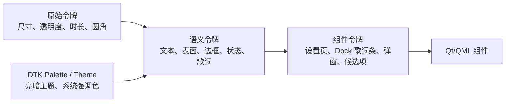

# Deepin Dock Lyrics Design Token 设计

## 1. 目的与边界

本规范定义 Deepin Dock Lyrics 的设置应用、Dock 右侧歌词 Applet 和歌词详情弹窗的视觉令牌。它遵循现有 `brand-tokens` 的三层约定：**原始令牌 → 语义令牌 → 组件令牌**。

本项目不是 Web 应用：最终 UI 由 Qt 6、DTK6 与 `dde-shell` QML 渲染。因此颜色令牌必须优先映射到 DTK 当前主题/调色板，不能复制固定的浅色 Web 色值并假设其在深色主题、系统强调色或高对比度环境中仍可用。



## 2. 命名与实现规则

### 2.1 CSS/文档命名

沿用参考项目的双连字符风格，命名空间换为 `dly`：

```text
--dly--primitive-<分类>-<名称>
--dly--color-<语义>-<状态>
--dly--component-<组件>-<属性>-<状态>
```

示例：

```text
--dly--primitive-space-2
--dly--color-text-primary
--dly--component-dock-lyric-current-color
```

### 2.2 QML/C++ 命名

QML 不直接读取 CSS 变量。建立一个只读单例 `LyricsTokens`，属性名采用 lower camel case；其颜色值由 `D.DTK`、DTK Palette 或 C++ Theme Adapter 绑定。

```qml
color: LyricsTokens.dockLyricCurrentColor
radius: LyricsTokens.dockLyricRadius
Behavior on opacity { NumberAnimation { duration: LyricsTokens.motionFast } }
```

### 2.3 禁止事项

- 业务 QML 中不得出现用于 UI 的裸露色值，例如 `"#1677ff"`、`"#ffffff"`。
- 不得依靠固定白色/黑色透明层模拟系统主题。
- 不得创建与 DTK 主题无关的全局图标路径；普通图标按 DCI/主题图标名称查找。
- 不得让歌词动画改变 Applet 的布局尺寸。Dock 的宽高保持稳定，文本使用省略或裁剪。

## 3. 原始令牌

原始令牌只定义不随主题变化的几何、透明度和时间。数值均使用 4 px 间距基线，避免在紧凑 Dock 中产生不可控的尺寸变化。

| 分类 | Token | 值 | 用途 |
|---|---|---:|---|
| 间距 | `--dly--primitive-space-0` | `0px` | 无间距 |
| 间距 | `--dly--primitive-space-1` | `4px` | 图标与文本、紧凑内边距 |
| 间距 | `--dly--primitive-space-2` | `8px` | 常规内边距、候选项间距 |
| 间距 | `--dly--primitive-space-3` | `12px` | 设置项/弹窗内边距 |
| 间距 | `--dly--primitive-space-4` | `16px` | 设置页区块间距 |
| 圆角 | `--dly--primitive-radius-xs` | `2px` | 进度填充、细小状态点 |
| 圆角 | `--dly--primitive-radius-sm` | `4px` | Dock 歌词视觉容器、图标按钮悬停层 |
| 圆角 | `--dly--primitive-radius-md` | `6px` | 弹窗内部候选项 |
| 圆角 | `--dly--primitive-radius-lg` | `8px` | 详情弹窗；不得用于 Dock 条 |
| 字号 | `--dly--primitive-font-size-dock` | `12px` | 默认 Dock 当前歌词 |
| 字号 | `--dly--primitive-font-size-dock-secondary` | `11px` | Dock 下一句（为未来翻译预留） |
| 字号 | `--dly--primitive-font-size-body` | `14px` | 设置页正文 |
| 字号 | `--dly--primitive-font-size-title` | `16px` | 设置页区域标题 |
| 行高 | `--dly--primitive-line-height-dock` | `16px` | Dock 单行歌词 |
| 行高 | `--dly--primitive-line-height-body` | `20px` | 设置页正文 |
| 字重 | `--dly--primitive-font-weight-regular` | `400` | 默认文本 |
| 字重 | `--dly--primitive-font-weight-medium` | `500` | 当前歌词、操作标签 |
| 动效 | `--dly--primitive-motion-fast` | `120ms` | 悬停、按钮状态 |
| 动效 | `--dly--primitive-motion-standard` | `180ms` | 歌词行切换、弹窗内容变化 |
| 动效 | `--dly--primitive-motion-slow` | `240ms` | 弹窗显示/隐藏 |
| 缓动 | `--dly--primitive-ease-standard` | `OutCubic` | QML 默认进入/更新曲线 |
| 透明度 | `--dly--primitive-opacity-muted` | `0.64` | 次级歌词/状态 |
| 透明度 | `--dly--primitive-opacity-disabled` | `0.42` | 禁用项 |
| 透明度 | `--dly--primitive-opacity-progress-track` | `0.20` | 当前行进度轨道 |
| 尺寸 | `--dly--primitive-icon-size-sm` | `16px` | Dock 关闭、状态图标 |
| 尺寸 | `--dly--primitive-icon-button-size` | `28px` | Dock 图标按钮触控区域 |
| 尺寸 | `--dly--primitive-dock-content-height` | `36px` | Dock 中心视觉容器高度 |
| 尺寸 | `--dly--primitive-dock-width-min` | `220px` | 歌词条最小宽度 |
| 尺寸 | `--dly--primitive-dock-width-max` | `360px` | 歌词条最大宽度 |

动画必须服从系统“减少动态效果”偏好：启用时所有时长解析为 `0ms`，保留状态瞬时切换。

## 4. 语义颜色令牌

以下为**语义名称**，不绑定固定 HEX。实现时优先从 DTK Palette / `D.DTK` 取色；同一令牌在亮暗主题或系统强调色变化时自动更新。

| Token | DTK 映射原则 | 用途 |
|---|---|---|
| `--dly--color-text-primary` | 当前主题主文本色 | 当前歌词、设置页标题 |
| `--dly--color-text-secondary` | 当前主题次级文本色 | 下一句、歌曲元数据（为未来翻译预留） |
| `--dly--color-text-tertiary` | 当前主题弱文本色 | 空状态、时间、辅助说明 |
| `--dly--color-text-inverse` | 反色/实心强调色文本 | 强调按钮内文字 |
| `--dly--color-icon-default` | 当前主题图标常规色 | 静态状态图标 |
| `--dly--color-icon-hover` | 当前主题图标悬停色 | 关闭、刷新、候选选择图标 |
| `--dly--color-surface-dock` | Dock 背景上的低对比表面 | 歌词条视觉底板 |
| `--dly--color-surface-dock-hover` | Dock 表面悬停色 | 歌词条悬停、关闭按钮悬停 |
| `--dly--color-surface-popup` | DTK 弹出层背景 | `PanelPopup` 内容容器 |
| `--dly--color-surface-selected` | 系统强调色的弱背景 | 已选候选歌曲、活动设置项 |
| `--dly--color-border-subtle` | 当前主题弱分割线 | 歌词条边框、弹窗分隔线 |
| `--dly--color-border-focus` | 系统强调色 | 键盘焦点环 |
| `--dly--color-accent` | 系统强调色 | 当前歌词进度、启用状态、活动项 |
| `--dly--color-accent-hover` | 系统强调色 hover | 可点击歌词/按钮 hover |
| `--dly--color-status-success` | DTK 成功色 | 服务已连接、歌词已同步 |
| `--dly--color-status-warning` | DTK 警告色 | 低置信度匹配、无逐行时间戳 |
| `--dly--color-status-error` | DTK 错误色 | 网络失败、播放器不可用 |
| `--dly--color-status-info` | DTK 信息/强调色 | 正在检索、等待播放器 |

### 4.1 歌词专用语义

| Token | 默认绑定 | 用途 |
|---|---|---|
| `--dly--color-lyric-current` | `color-text-primary` | 当前歌词完整文字 |
| `--dly--color-lyric-current-progress` | `color-accent` | 当前行已播放部分的填充/高亮 |
| `--dly--color-lyric-secondary` | `color-text-secondary` | 下一句（为未来翻译预留） |
| `--dly--color-lyric-track` | `color-text-primary` 的低透明度变体 | 当前行进度轨道 |
| `--dly--color-lyric-unavailable` | `color-text-tertiary` | 无歌词或纯音乐提示 |
| `--dly--color-lyric-match-warning` | `color-status-warning` | 低置信度候选/需要确认提示 |

## 5. 组件令牌

### 5.1 Dock 歌词条

| Token | 来源 | 值/约束 |
|---|---|---|
| `--dly--component-dock-lyric-width-min` | primitive | `220px` |
| `--dly--component-dock-lyric-width-max` | primitive | `360px` |
| `--dly--component-dock-lyric-visual-height` | primitive | `36px`，视觉容器垂直居中 |
| `--dly--component-dock-lyric-padding-inline` | primitive | `12px` |
| `--dly--component-dock-lyric-padding-block` | primitive | `4px` |
| `--dly--component-dock-lyric-radius` | primitive | `4px` |
| `--dly--component-dock-lyric-background` | semantic | `color-surface-dock` |
| `--dly--component-dock-lyric-border-color` | semantic | `color-border-subtle` |
| `--dly--component-dock-lyric-current-color` | semantic | `color-lyric-current` |
| `--dly--component-dock-lyric-secondary-color` | semantic | `color-lyric-secondary` |
| `--dly--component-dock-lyric-progress-color` | semantic | `color-lyric-current-progress` |
| `--dly--component-dock-lyric-progress-track-color` | semantic | `color-lyric-track` |
| `--dly--component-dock-lyric-transition` | primitive | `motion-standard` |
| `--dly--component-dock-lyric-close-size` | primitive | `28px`，不可小于该点击区域 |

歌词条必须稳定占用宽度。歌曲名或歌词过长时，文本省略/裁切而非动态拉宽 Dock；右侧托盘与时钟始终优先。

### 5.2 Dock 状态

| 状态 | 主文案令牌 | 辅助/图标令牌 | 行为 |
|---|---|---|---|
| 已同步 | `color-lyric-current` | `color-status-success` | 显示当前歌词和下一句 |
| 正在检索 | `color-text-secondary` | `color-status-info` | 使用小型活动指示，不反复闪烁 |
| 无歌词 | `color-lyric-unavailable` | `color-text-tertiary` | 单行提示，不显示进度填充 |
| 低置信度 | `color-lyric-current` | `color-lyric-match-warning` | 显示歌词，同时在弹窗提供候选纠错 |
| 错误 | `color-text-secondary` | `color-status-error` | 短提示，错误详情仅在弹窗/设置页显示 |
| 已隐藏 | 无 | 无 | Applet 不占用可见歌词空间 |

### 5.3 设置应用

| Token | 来源 | 用途 |
|---|---|---|
| `--dly--component-settings-page-padding` | `space-6` | 窗口主内容内边距 |
| `--dly--component-settings-section-gap` | `space-6` | 设置区块间距 |
| `--dly--component-settings-row-gap` | `space-3` | 单项设置行间距 |
| `--dly--component-settings-card-radius` | `radius-md` | 仅用于独立候选/状态卡片，不嵌套卡片 |
| `--dly--component-settings-status-background` | `color-surface-selected` | 运行状态摘要 |
| `--dly--component-settings-candidate-hover` | `color-surface-dock-hover` | 候选歌曲悬停 |
| `--dly--component-settings-candidate-selected` | `color-surface-selected` | 已确认候选 |
| `--dly--component-settings-focus-outline` | `color-border-focus` | 键盘焦点可见性 |

设置页应使用 DTK 原生控件，包括 `DSwitchButton`/开关、`DComboBox`、`DSpinBox`、状态图标与列表，不重新绘制类似 Web 按钮的控件。

### 5.4 歌词详情弹窗

| Token | 值/来源 | 用途 |
|---|---|---|
| `--dly--component-popup-width` | `360px`，最大不超过当前屏幕可用宽度 | `PanelPopup` 宽度 |
| `--dly--component-popup-padding` | `space-4` | 内边距 |
| `--dly--component-popup-radius` | `radius-lg` | 弹窗容器圆角 |
| `--dly--component-popup-background` | `color-surface-popup` | 背景 |
| `--dly--component-popup-border` | `color-border-subtle` | 描边 |
| `--dly--component-popup-current-color` | `color-lyric-current` | 当前行 |
| `--dly--component-popup-context-color` | `color-text-secondary` | 前后上下文行 |
| `--dly--component-popup-match-warning` | `color-lyric-match-warning` | 候选匹配提示 |

## 6. Token 映射示例

以下示例是文档中的 CSS 表达方式；在产品中由 `LyricsTokens` 单例承担相同语义。

```css
:root {
  --dly--primitive-space-1: 4px;
  --dly--primitive-space-2: 8px;
  --dly--primitive-space-3: 12px;
  --dly--primitive-radius-sm: 4px;
  --dly--primitive-font-size-dock: 12px;
  --dly--primitive-motion-standard: 180ms;
  --dly--primitive-dock-content-height: 36px;
  --dly--primitive-dock-width-min: 220px;
  --dly--primitive-dock-width-max: 360px;

  --dly--color-lyric-current: var(--dly--color-text-primary);
  --dly--color-lyric-secondary: var(--dly--color-text-secondary);
  --dly--color-lyric-current-progress: var(--dly--color-accent);
  --dly--color-lyric-track: color-mix(in srgb, var(--dly--color-text-primary) 20%, transparent);

  --dly--component-dock-lyric-visual-height: var(--dly--primitive-dock-content-height);
  --dly--component-dock-lyric-width-min: var(--dly--primitive-dock-width-min);
  --dly--component-dock-lyric-width-max: var(--dly--primitive-dock-width-max);
  --dly--component-dock-lyric-padding-inline: var(--dly--primitive-space-3);
  --dly--component-dock-lyric-radius: var(--dly--primitive-radius-sm);
  --dly--component-dock-lyric-current-color: var(--dly--color-lyric-current);
  --dly--component-dock-lyric-progress-color: var(--dly--color-lyric-current-progress);
}
```

QML 的最小消费示例：

```qml
Rectangle {
    width: LyricsTokens.dockLyricWidth
    height: LyricsTokens.dockVisualHeight
    radius: LyricsTokens.dockLyricRadius
    color: LyricsTokens.dockLyricBackground
    border.color: LyricsTokens.dockLyricBorder

    Text {
        anchors.left: parent.left
        anchors.leftMargin: LyricsTokens.dockPaddingInline
        anchors.verticalCenter: parent.verticalCenter
        color: LyricsTokens.dockLyricCurrentColor
        font.pixelSize: LyricsTokens.dockCurrentFontSize
        elide: Text.ElideRight
    }
}
```

## 7. 实施顺序

1. 建立 `LyricsTokens.qml` 单例与其 C++ Theme Adapter，只实现原始和语义令牌。
2. 使用令牌改造现有 `dock-left-demo`，验证亮/暗主题与不同 Dock 尺寸。
3. 实现 Dock 歌词条、状态和详情弹窗的组件令牌。
4. 实现 DTK6 设置页令牌映射，优先复用 DTK 控件视觉，不做额外主题覆盖。
5. 加入最小截图回归：亮/暗主题、Dock 四边位置、最窄/最宽歌词、无歌词和错误状态。

## 8. 验收标准

- 所有业务 QML 使用 `LyricsTokens`，没有用于界面的裸露 HEX 色值。
- 切换 DTK 亮暗主题后，Dock 歌词条、弹窗、设置页的文本、边框、表面和状态色都有足够对比度。
- 改变 Dock 尺寸后，歌词条始终垂直居中，关闭按钮保持 `28px` 点击区域，托盘/时钟不重叠。
- 启用减少动态效果后，歌词、状态和弹窗的过渡为瞬时。
- LRC 行进度只使用 `color-lyric-current-progress`，不将行级时间伪装为逐字动画。
