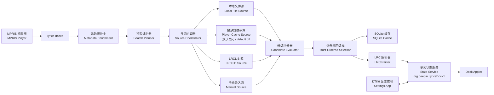
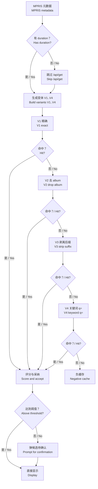
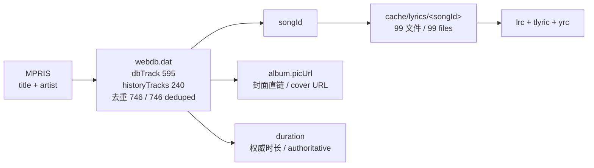
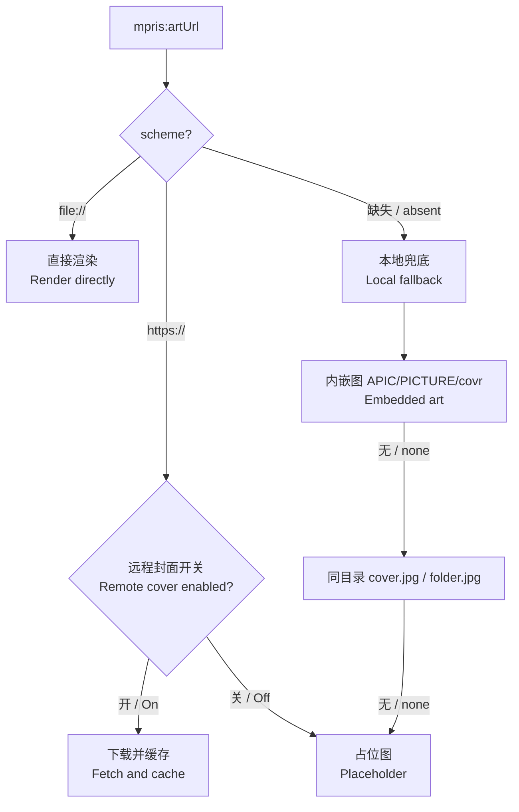

# Deepin Dock 歌词多源技术方案 / Dock Lyrics Multi-Source Technical Plan

> 中英双语。每章先中文后英文。
> Bilingual. Each section presents Chinese first, then English.

本文件替代 `DOCK_LYRICS_TECHNICAL_PLAN_ZH.md` 第 6 章「歌词源设计」及第 13 章决策 3/4，其余章节继续有效。
This document supersedes section 6 and decisions 3/4 of `DOCK_LYRICS_TECHNICAL_PLAN_ZH.md`. All other sections remain in force.

---

## 1. 背景与动机 / Background

**中文**

V1 以 LRCLIB 为唯一在线歌词源。实测发现命中率不足，但根因不全在歌词源本身——本机匹配层存在三个可量化缺陷，且部分播放器提供的元数据不足以触发查询。本方案同时修复匹配层、引入多源架构，并明确哪些源可用、哪些不可用及其原因。

**English**

V1 used LRCLIB as its only online source. Measured hit rates are low, but the source is not the whole cause: the local matching layer has three quantifiable defects, and some players supply metadata too sparse to trigger a query at all. This plan fixes the matching layer, introduces a multi-source architecture, and states explicitly which sources are in scope and why.

### 1.1 实测证据 / Measured Evidence

本机 2026-08-13 实测，非推断。
Measured on this machine on 2026-08-13; not inferred.

| 观测项 / Observation | 结果 / Result |
|---|---|
| CJK 标题打分 / CJK title scoring | `夜曲` vs `夜曲(Live)` = **0.000**；`周杰伦` vs `周杰倫` = **0.000** |
| 拉丁标题打分 / Latin title scoring | `Runaway` vs `Runaway (Live)` = 0.667 |
| 繁简归一 / Script normalization | OpenCC 仅作用于显示层，查询与打分未归一 / display layer only |
| QQ音乐元数据 / QQ Music metadata | 仅 `xesam:title`/`artist`/`album`(空)；**无 `mpris:length`** |
| 网易云元数据 / NetEase metadata | 六字段齐全，`mpris:artUrl` = 有效 PNG 150×150 |
| LRCLIB `q=` 关键词检索 / keyword search | 可用，当前代码未使用 / available, currently unused |
| 网易云本地歌词缓存 / local lyric cache | 99 文件，36% 带翻译，31% 带逐字 |
| 该缓存对曲库覆盖率 / coverage of library | **99 / 746 ≈ 13%** |

**关键推论 / Key inferences**

- CJK 打分恒为 0 的根因：`textScore` 按空白与标点切词后计算 Dice 系数。中文标题无空格，整体为单一 token，"差一字"与"完全不相干"同为 0 分。
  Root cause: `textScore` computes a Dice coefficient over whitespace/punctuation-delimited tokens. A CJK title has no spaces, so it is a single token; "off by one character" and "unrelated" both score 0.
- QQ音乐当前**完全不发起请求**：`searchable` 要求 `durationMs > 0`，缺 `mpris:length` 即短路。这不是匹配不准，是功能不工作。
  QQ Music currently issues **no request at all**: `searchable` requires `durationMs > 0`, so a missing `mpris:length` short-circuits. This is not poor matching; it is a non-functional path.
- 两个播放器均无 `xesam:url`，本地文件源对流媒体客户端无效。
  Neither player exposes `xesam:url`; a local-file source is inert for streaming clients.

---

## 2. 目标与非目标 / Goals and Non-Goals

**中文**

目标：

1. 修复匹配层，使 CJK 与繁简差异不再导致误判。
2. 引入 `ILyricsSource` 接口与协调器，支持多源并行与信任排序。
3. 补齐元数据缺失路径，使无 `duration` 的播放器也能查询。
4. 支持封面显示（`mpris:artUrl` 及本地兜底）。
5. 保持隐私承诺：无遥测、缓存不上传、联网行为受配置约束。

非目标：

1. 不实现任何平台私有歌词接口的逆向调用。
2. 不实现 QRC/KRC 等加密格式的解密。
3. 不宣称真实逐字同步，除非来源确实提供音节时间戳。
4. 不修改 Dock 源码。

**English**

Goals:

1. Fix the matching layer so CJK text and Traditional/Simplified variance no longer cause misses.
2. Introduce an `ILyricsSource` interface and coordinator supporting parallel lookup and trust ordering.
3. Close the sparse-metadata path so players without `duration` can still be queried.
4. Support cover art (`mpris:artUrl` plus local fallback).
5. Preserve privacy commitments: no telemetry, no cache upload, network access gated by configuration.

Non-goals:

1. No reverse-engineered calls to any platform's private lyric API.
2. No decryption of encrypted formats such as QRC or KRC.
3. No claim of true word-level sync unless a source genuinely provides syllable timings.
4. No modification of Dock source code.

---

## 3. 源清单与准入依据 / Source Inventory and Admission Basis

**中文**

准入标准：公开且有条款的接口、用户本机上用户自己的数据、或用户显式提供的内容。排除标准：需要绕过访问控制或解密私有格式。

**English**

Admission criteria: publicly documented interfaces with terms, the user's own data on the user's own machine, or content the user supplies explicitly. Exclusion criteria: anything requiring bypass of access controls or decryption of proprietary formats.

| 源 / Source | 类型 / Type | 状态 / Status | 依据 / Basis |
|---|---|---|---|
| 本地 `.lrc` 文件 / Local `.lrc` | 离线 / Offline | 采用 / Adopt | 用户文件 / User's files |
| 内嵌标签 / Embedded tags (`USLT`,`SYLT`,`LYRICS`,`©lyr`) | 离线 / Offline | 采用 / Adopt | 用户文件，TagLib / User's files via TagLib |
| LRCLIB | 在线 / Online | 采用（现有）/ Adopt (existing) | 开放社区库，有公开条款 / Open community DB with public terms |
| 自托管 LRCLIB / Self-hosted LRCLIB | 在线 / Online | 采用 / Adopt | 开源可自建，复用 `setBaseUrl` / Open source, reuses `setBaseUrl` |
| 用户手动录入 / Manual entry | 离线 / Offline | 采用 / Adopt | 用户显式提供 / Explicitly user-supplied |
| 播放器本机缓存 / Player local cache | 离线 / Offline | 可选，默认关闭 / Optional, default off | 用户本机数据，见 §7 / User-local data, see §7 |
| Musixmatch | 在线 / Online | 待核 / Unverified | 有官方 API，但免费档对完整歌词的限制需自行核对当前条款 / Official API exists; free-tier limits on full lyrics must be verified against current terms |
| 网易云/QQ/酷狗私有接口 / NetEase, QQ, Kugou private APIs | — | **排除 / Excluded** | 无公开接口；需逆向与解密 / No public API; requires reverse engineering and decryption |

> Musixmatch 一项标注为"待核"，因为其免费层级对完整歌词展示的限制我们尚未核实。落地前必须自行确认条款，不得依据本文件推定可用。
> Musixmatch is marked unverified: we have not confirmed its free-tier restrictions on displaying full lyrics. Confirm terms independently before implementing; do not treat this document as clearance.

---

## 4. 架构 / Architecture

### 4.1 运行时总览 / Runtime Overview



### 4.2 分层职责 / Layer Responsibilities

**中文**

协调器只做编排，不含任何平台细节。每个源自行处理其检索与获取，返回统一的候选与载荷类型。评分与选择集中在协调器，避免各源各自定义"好匹配"。

**English**

The coordinator orchestrates only; it holds no platform specifics. Each source handles its own search and fetch, returning unified candidate and payload types. Scoring and selection are centralised in the coordinator so no source defines "good match" for itself.

| 层 / Layer | 组件 / Component | 职责 / Responsibility |
|---|---|---|
| 采集 / Capture | `MprisPlayerDiscovery` | 订阅元数据、进度、`artUrl` / Subscribe to metadata, position, `artUrl` |
| 补全 / Enrichment | `TrackEnricher` | 补 duration、剥离版本后缀、繁简归一 / Fill duration, strip version suffixes, normalise script |
| 规划 / Planning | `LyricSearchPlanner` | 生成检索词变体 / Generate query variants |
| 编排 / Orchestration | `LyricSourceCoordinator` | 并行调度、超时、限流、选择 / Parallel dispatch, timeout, throttle, selection |
| 源 / Sources | `ILyricsSource` 实现 / implementations | 各自检索与获取 / Per-source search and fetch |
| 评分 / Scoring | `LyricIdentityEvaluator` | 统一候选评分 / Unified candidate scoring |
| 解析 / Parsing | `LrcParser` | LRC 转结构化行 / LRC to structured lines |

---

## 5. 匹配层修复 / Matching Layer Fixes

**中文**

这是收益最大且完全自包含的一项，不依赖任何新源。对所有播放器与所有用户生效。

**English**

This is the highest-yield and fully self-contained item. It depends on no new source and benefits every player and every user.

### 5.1 CJK 相似度 / CJK Similarity

**中文**

按脚本分派相似度算法：CJK 段落使用字符二元组（bigram）Dice 系数，拉丁段落保留现有词集 Dice。混合标题分段处理后加权合并。

**English**

Dispatch the similarity algorithm by script: use a character-bigram Dice coefficient for CJK runs and retain the existing token-set Dice for Latin runs. Mixed titles are segmented, scored per run, and combined by weight.

```cpp
// 期望行为 / Expected behaviour
textScore("夜曲",   "夜曲(Live)")   // 0.000 → ≈0.80
textScore("周杰伦", "周杰倫")        // 0.000 → 1.000 (归一后 / after normalisation)
textScore("Runaway", "Runaway (Live)") // 0.667 保持 / unchanged
```

### 5.2 归一化前置 / Normalisation Before Scoring

**中文**

OpenCC `t2s` 当前只转显示文本。须在构造检索词与打分**之前**归一化：繁→简、全角→半角、去音调符号、括号与 `feat.` 后缀剥离。LRCLIB 中文条目繁简混存，此项直接决定命中。

**English**

OpenCC `t2s` currently converts display text only. Normalise **before** building queries and scoring: Traditional to Simplified, full-width to half-width, diacritic stripping, and removal of bracketed or `feat.` suffixes. LRCLIB's Chinese entries mix scripts, so this directly determines hit rate.

### 5.3 时长由硬门改为软权重 / Duration From Hard Gate to Soft Weight

**中文**

现行 `score >= 0.85 && abs(Δduration) <= 2000` 是硬 AND。实测 LRCLIB 同曲不同版本时长差 3–6 秒常见（`夜曲` 同时返回 229s 与 223s）。改为参与加权评分，并按有无 duration 分档设定阈值。

**English**

The current `score >= 0.85 && abs(Δduration) <= 2000` is a hard AND. Measurements show 3–6 second differences between versions of the same track are common on LRCLIB (`夜曲` returns both 229s and 223s). Fold duration into the weighted score and set thresholds by whether duration is available at all.

| 元数据完整度 / Metadata completeness | 自动采纳阈值 / Auto-accept | 行为 / Behaviour |
|---|---|---|
| 含 duration / With duration | 0.85 | 自动采纳 / Auto-accept |
| 无 duration / Without duration | 0.92 | 提高阈值，否则弹候选 / Raise bar, else prompt |
| 无 album / Without album | 权重重分配 / Reweight | album 权重转移至 title 与 artist / Shift album weight to title and artist |

### 5.4 缓存键修复 / Cache Key Fix

**中文**

`makeTrackKey` 将原始 `durationMs` 写入键。播放器上报时长抖动 1 ms 即导致缓存穿透。改为按 1 秒粒度取整。

**English**

`makeTrackKey` embeds raw `durationMs` in the key, so a 1 ms jitter in the reported duration causes a cache miss. Round to one-second granularity.

---

## 6. 检索计划与降级 / Search Plan and Degradation



**中文**

变体串行短路，命中即停，避免放大请求量。`album_name` 为空时不发送该参数——实测带空 album 与不带 album 命中不同记录。`q=` 关键词检索为最后一级，专门服务缺 duration 的播放器。

**English**

Variants run serially with short-circuit on hit, so request volume is not amplified. When `album_name` is empty, omit the parameter entirely: measurements show an empty album and an absent album match different records. The `q=` keyword search is the final tier, serving players that lack duration.

| 变体 / Variant | 构造 / Construction | 适用 / Applies to |
|---|---|---|
| V1 | title + artist + album + duration → `/api/get` | 元数据完整 / Complete metadata |
| V2 | title + artist + duration，省略 album / omit album | album 为空或含版本标记 / Empty or version-tagged album |
| V3 | 剥离 `(Live)`、`(Remix)`、`feat.` 后缀 / strip suffixes | 标题含版本标记 / Version-tagged titles |
| V4 | `q=title artist` → `/api/search` | 无 duration，如 QQ音乐 / No duration, e.g. QQ Music |

---

## 7. 播放器本机缓存源 / Player Local Cache Source

**中文**

此源读取用户本机上、由用户自己的播放器写入的文件。不访问任何远端接口，不绕过访问控制。但因其依赖第三方应用的私有布局，须默认关闭并可配置。

**English**

This source reads files on the user's own machine written by the user's own player. It contacts no remote endpoint and bypasses no access control. Because it depends on a third-party application's private layout, it must default to off and remain configurable.

### 7.1 实测结构 / Measured Structure



| 路径 / Path | 内容 / Content | 用途 / Use |
|---|---|---|
| `webdb.dat` → `dbTrack` | 595 行 / rows | songId → 曲名/艺人/时长/封面 / title, artist, duration, cover |
| `webdb.dat` → `historyTracks` | 240 行 / rows | 同上，补充 / same, supplementary |
| `cache/lyrics/<songId>` | 99 文件 / files | `lrc` 97、`tlyric` 36、`yrc` 31 |
| `http.db` | 2332 行 / rows | **纯图片缓存，无用 / image cache only, unusable** |
| `library.dat` → `track` | 2 行 / rows | 本地音乐库文件路径 / local library file paths |

### 7.2 覆盖率与定位 / Coverage and Positioning

**中文**

歌词缓存对曲库覆盖率仅 **99/746 ≈ 13%**，且与音频缓存目录几乎不相交（交集 1）。这是补充源，不是主力。真正高价值的是 `webdb.dat` 的元数据索引：746 条，覆盖面远大于歌词缓存，且能提供权威 duration（补 QQ音乐缺失）与封面直链。

**English**

The lyric cache covers only **99/746 ≈ 13%** of the library and barely intersects the audio cache directory (intersection of 1). It is a supplement, not a primary source. The higher-value asset is the `webdb.dat` metadata index: 746 entries, far broader coverage, supplying authoritative duration (closing QQ Music's gap) and a direct cover URL.

### 7.3 约束 / Constraints

**中文**

- 只读打开（`mode=ro`）。客户端运行时存在 WAL，禁止写入、禁止 vacuum。
- 路径与 schema 属第三方私有实现，随版本变化。做成 DConfig 路径列表，默认关闭，用户显式启用。
- 歌词与封面内容有版权。沿用现有标准：不导出、不上传、不再分发。
- 仅覆盖网易云。QQ音乐缓存布局未验证，不假定存在对应结构。

**English**

- Open read-only (`mode=ro`). A WAL exists while the client runs; never write, never vacuum.
- Paths and schema are a third party's private implementation and change across versions. Express them as a DConfig path list, default off, enabled explicitly by the user.
- Lyric and cover content is copyrighted. Apply existing standards: no export, no upload, no redistribution.
- Covers NetEase only. QQ Music's cache layout is unverified; assume no equivalent structure exists.

---

## 8. 接口设计 / Interface Design

```cpp
// 检索词变体 / Search query variant
struct SearchQueryVariant {
    QString      id;          // "exact" | "no-album" | "relaxed" | "keyword"
    QString      title;
    QStringList  artists;
    QString      album;       // 空则不发送 / omit when empty
    qint64       durationMs;  // -1 表示未知 / -1 when unknown
    QStringList  reasons;     // 诊断用 / for diagnostics
};

struct LyricSearchPlan {
    TrackIdentity              originalTrack;
    QList<SearchQueryVariant>  variants;
};

// 统一源接口 / Unified source interface
class ILyricsSource : public QObject {
    Q_OBJECT
public:
    virtual QString sourceId()    const = 0;   // "local-file" | "lrclib" | ...
    virtual QString displayName() const = 0;
    virtual bool    isOffline()   const = 0;   // 决定是否受联网开关约束 / gated by network switch
    virtual TimingCapability timingCapability() const = 0;

    virtual void searchAsync(const LyricSearchPlan &plan,
                             std::function<void(QList<SourceCandidate>)> done) = 0;
    virtual void fetchAsync(const SourceCandidate &candidate,
                            std::function<void(RawLyricPayload)> done) = 0;
};
```

**中文**

`isOffline()` 使协调器无需硬编码源名即可判断是否受联网开关约束。`timingCapability()` 沿用现有枚举并新增 `Word`——仅当来源确实提供音节时间戳时返回。

**English**

`isOffline()` lets the coordinator apply the network switch without hard-coding source names. `timingCapability()` reuses the existing enum with a new `Word` value, returned only when a source genuinely provides syllable timings.

### 8.1 信任顺序 / Trust Order

| 顺位 / Rank | 源 / Source | 理由 / Rationale |
|---|---|---|
| 1 | 手动录入 / Manual entry | 用户显式指定，无歧义 / Explicit, unambiguous |
| 2 | 本地文件与内嵌标签 / Local file and embedded tags | 与音频同源，身份确定 / Same origin as audio, identity certain |
| 3 | 播放器缓存 / Player cache | 高质量但覆盖窄 / High quality, narrow coverage |
| 4 | LRCLIB | 覆盖广，需评分 / Broad coverage, requires scoring |

**中文**

顺位 1–3 无身份歧义，命中即采纳。顺位 4 须经评分与阈值。此顺序仅为默认值，用户可在设置中调整。

**English**

Ranks 1–3 carry no identity ambiguity and are accepted on hit. Rank 4 passes through scoring and thresholds. This order is a default; users may adjust it in settings.

---

## 9. 封面 / Cover Art



**中文**

网易云已实测可用：`artUrl` 指向 `/tmp/.org.chromium.Chromium.*`，为真实 PNG 150×150、约 34 KB，权限 `rw-------`（同 uid 可读）。直接交给 QML `Image.source`，无需解码代码。

要点：

- 换歌会更换文件名，`artUrl` 须随 `PropertiesChanged` 更新，不可缓存路径。
- 播放器不清理旧文件，我方也不得删除他人文件。
- **D-Bus 只传路径，不传图片字节。** 传 base64 会使每次切歌在 session bus 上搬运数百 KB。
- 内嵌图须先抽取到本方缓存目录落盘，再传路径；按修正后的 `trackKey` 命名。
- 远程 `https://` 封面新增出站请求，会向 CDN 暴露收听内容，性质同 LRCLIB 查询，须受独立配置开关约束。
- Dock 条内可用尺寸约 16–24 px，须做好缩略图；大图展示放在 `LyricsPopup`。

**English**

Verified working for NetEase: `artUrl` points at `/tmp/.org.chromium.Chromium.*`, a real PNG of 150×150 at roughly 34 KB, mode `rw-------` (readable by the same uid). Hand it straight to QML `Image.source`; no decoding code required.

Key points:

- The filename changes on track change, so `artUrl` must follow `PropertiesChanged`; never cache the path.
- The player does not clean up stale files, and we must not delete another application's files.
- **Pass paths over D-Bus, never image bytes.** Base64 would move hundreds of KB across the session bus on every track change.
- Embedded art must be extracted to our own cache directory first, then referenced by path, named by the corrected `trackKey`.
- Remote `https://` covers add an outbound request that reveals listening activity to a CDN. This is equivalent in kind to an LRCLIB query and must sit behind its own configuration switch.
- Usable width in the Dock strip is roughly 16–24 px, so thumbnails matter; show larger art in `LyricsPopup`.

---

## 10. 配置 / Configuration

```json
{
  "lyricSources": {
    "order": ["manual", "local-file", "player-cache", "lrclib"],
    "localFileEnabled": true,
    "playerCacheEnabled": false,
    "playerCachePaths": [],
    "lrclibEnabled": true,
    "lrclibBaseUrl": "https://lrclib.net",
    "sourceTimeoutMs": 5000
  },
  "coverArt": {
    "localEnabled": true,
    "remoteEnabled": false
  }
}
```

**中文**

`playerCacheEnabled` 默认 `false`，`playerCachePaths` 默认为空——用户须显式填写路径。`remoteEnabled` 默认 `false`，与现有隐私承诺一致。`lrclibBaseUrl` 暴露现有 `setBaseUrl`，支持自托管实例。

**English**

`playerCacheEnabled` defaults to `false` and `playerCachePaths` defaults to empty: the user must supply paths explicitly. `remoteEnabled` defaults to `false`, consistent with existing privacy commitments. `lrclibBaseUrl` exposes the existing `setBaseUrl` for self-hosted instances.

---

## 11. 交付阶段 / Delivery Phases

| 阶段 / Phase | 内容 / Scope | 工期 / Effort | 退出标准 / Exit Criteria |
|---|---|---|---|
| M1 | 匹配层修复 §5 / Matching fixes §5 | 1–2 天 / days | CJK 打分用例通过；缓存键抖动不再穿透 / CJK cases pass; jitter no longer misses cache |
| M2 | 检索变体与降级 §6 / Variants and degradation §6 | 1 天 / day | QQ音乐能发起请求并显示歌词 / QQ Music issues requests and displays lyrics |
| M3 | `artUrl` 封面 §9 / Cover via `artUrl` §9 | 0.5 天 / day | 网易云显示封面；QQ音乐优雅留空 / NetEase shows art; QQ Music degrades cleanly |
| M4 | 接口与协调器 §8 / Interface and coordinator §8 | 2–3 天 / days | LRCLIB 收敛为一个源实现，行为不回退 / LRCLIB becomes one source with no regression |
| M5 | 本地文件与内嵌 / Local file and embedded | 2–3 天 / days | TagLib 集成；`.lrc` 与内嵌歌词生效 / TagLib integrated; both paths work |
| M6 | 播放器缓存源 §7 / Player cache source §7 | 2 天 / days | 默认关闭；只读；开启后命中率可验证 / Off by default, read-only, measurable hit rate |
| M7 | 手动录入与设置 / Manual entry and settings | 2 天 / days | 可粘贴、导入、微调偏移并持久化 / Paste, import, adjust offset, persist |

**中文**

M1–M3 互不依赖且不改架构，可并行。M4 是 M5–M7 的前置。M1 与 M2 触及同一处代码，建议合并提交。

**English**

M1 through M3 are mutually independent and architecture-neutral, so they can proceed in parallel. M4 gates M5 through M7. M1 and M2 touch the same code region and are best landed together.

---

## 12. 测试与验收 / Testing and Acceptance

**中文**

新增用例，沿用现有 `ctest` 框架与假传输（不消耗 LRCLIB 配额）：

**English**

New cases reuse the existing `ctest` framework and fake transports, so no LRCLIB quota is consumed:

| 类别 / Category | 用例 / Cases |
|---|---|
| CJK 匹配 / CJK matching | 繁简、版本后缀、日文假名与括号中译名 / Script variance, version suffixes, kana with bracketed Chinese |
| 稀疏元数据 / Sparse metadata | 无 duration、空 album、无 artist / Missing duration, empty album, absent artist |
| 变体降级 / Variant degradation | V1→V4 逐级短路，请求数不超上限 / Serial short-circuit, request count bounded |
| 多源选择 / Source selection | 信任顺序、离线优先、超时降级 / Trust order, offline priority, timeout fallback |
| 播放器缓存 / Player cache | 只读、路径缺失、schema 变化、WAL 竞争 / Read-only, absent paths, schema drift, WAL contention |
| 封面 / Cover art | `file://`、`https://` 关闭态、缺失、换歌更名 / `file://`, remote disabled, absent, rename on track change |
| 隐私 / Privacy | 离线源不触发网络；开关关闭时无出站请求 / Offline sources issue no network calls; no egress when switches are off |

---

## 13. 决策记录 / Decision Record

**中文**

1. 保留 LRCLIB 为默认在线源，并支持自托管实例。
2. 引入多源架构，但仅纳入 §3 准入标准内的源。
3. 网易云、QQ音乐、酷狗私有接口永久排除。理由是需绕过访问控制并解密私有格式，与项目是否收费、是否开源、采用何种许可证无关。
4. 播放器本机缓存源默认关闭且路径可配置，因其依赖第三方私有布局。
5. 匹配层修复优先于新增源。前者对全部用户生效，后者仅对特定播放器用户生效。
6. 本地源与在线源覆盖不相交的用户群体，不构成主力与备用关系。本地源命中时精度更高，但命中取决于用户是否持有相应文件；流媒体客户端不提供 `xesam:url`，本地源对其无效。

**English**

1. Retain LRCLIB as the default online source and support self-hosted instances.
2. Adopt a multi-source architecture, admitting only sources meeting the §3 criteria.
3. Permanently exclude the private APIs of NetEase, QQ Music, and Kugou. The reason is that they require bypassing access controls and decrypting proprietary formats; this is independent of whether the project charges money, is open source, or which licence it uses.
4. Keep the player local cache source off by default with configurable paths, because it depends on a third party's private layout.
5. Prioritise matching-layer fixes over new sources. The former benefits all users; the latter benefits only users of particular players.
6. Local and online sources serve non-overlapping user populations and are not a primary/backup pair. Local sources are more precise when they hit, but hitting depends on the user holding the relevant files; streaming clients expose no `xesam:url`, leaving local sources inert for them.

---

## 14. 未解决项 / Open Items

**中文**

1. Musixmatch 免费层级对完整歌词展示的限制未核实。落地前须自行确认条款。
2. QQ音乐是否存在可读的本机歌词缓存未验证。
3. 逐字时间轴（`yrc`）需要 `TimingCapability::Word` 与新的渲染路径，本方案未涵盖。README 现有的"不宣称逐字同步"表述在实现前不得修改。
4. 播放器缓存源的 schema 稳定性无保证，需要版本探测与优雅降级策略。

**English**

1. Musixmatch's free-tier restrictions on displaying full lyrics are unverified. Confirm terms independently before implementing.
2. Whether QQ Music maintains a readable local lyric cache is unverified.
3. Word-level timing (`yrc`) requires `TimingCapability::Word` and a new rendering path, which this plan does not cover. The README's existing "no word-level sync" claim must not change before that work lands.
4. The player cache source's schema stability is not guaranteed and needs version probing with graceful degradation.
