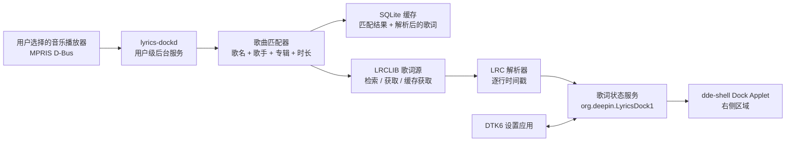
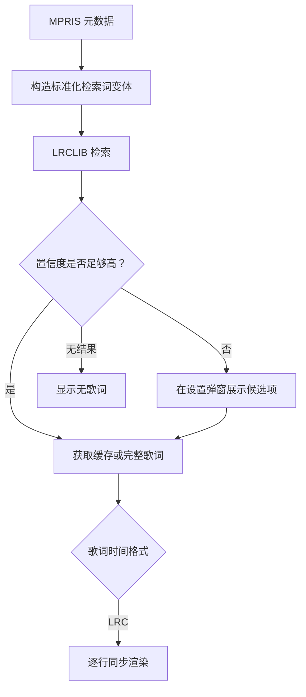
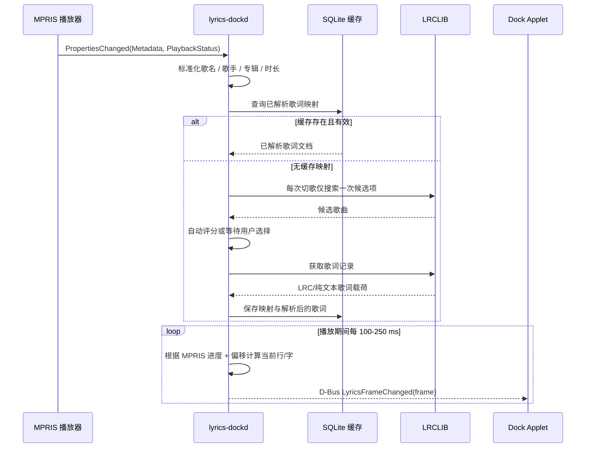

# Deepin Dock 歌词工具技术方案（中文版）

## 1. 目标

交付一个适用于 deepin/UOS v25 的 Debian 安装包。用户选择一个正在运行的 Linux 音乐播放器后，工具跟随其播放状态获取在线歌词，并在 Dock 右侧显示当前歌词。

本产品不播放音乐，不管理用户音乐库。第一期仅支持通过用户会话 D-Bus 暴露 MPRIS 协议的播放器。

## 2. 范围

### MVP 范围

- 一个 DTK6 设置应用：启用开关、播放器选择、当前歌曲状态、歌词偏移量。
- 一个用户级后台服务：监听已选择的 MPRIS 播放器。
- 通过 LRCLIB 获取在线歌词；具备本地缓存和低置信度候选歌词手动选择能力。
- 一个 `dde-shell` Dock Applet，使用 `dockOrder: 24` 显示在右侧区域。
- 当前行、下一句歌词与隐藏按钮；数据模型为未来经过单独合规审查的翻译能力预留字段。
- 逐行歌词滚动与当前行进度填充效果。

### MVP 明确不做

- Windows/Wine 播放器兼容。
- 音乐播放控制、账号登录、歌单或音乐库管理。
- 保证每一首歌都能检索到歌词。
- 在来源仅提供 LRC 时，宣称或模拟真实逐字时间戳动画。

## 3. 核心限制：逐行同步与逐字同步

LRCLIB 可返回 `syncedLyrics`，其格式通常为 LRC。LRC 的时间戳表示每一行歌词开始的时间，不包含每个字或每个单词的真实起止时间。因此 MVP 可以准确判断当前行，但不能得到真实的逐字进度。

MVP 将以当前行开始时间到下一行开始时间之间的区间，绘制平滑的行内进度填充。这是视觉进度效果，不能称为真实逐字同步。

真实逐字高亮需要提供字词/音节时间戳的来源，例如 YRC、QRC 或 KRC。它不属于当前仅使用 LRCLIB 的产品范围。

## 4. 运行时架构



`lyrics-dockd` 负责网络请求、歌曲匹配、解析、缓存和播放时间计算。Dock Applet 只负责渲染后台服务发布的状态。这样网络请求缓慢、歌词源异常或解析错误都不会阻塞桌面 Shell。

## 5. 组件划分

| 组件 | 技术 | 职责 |
|---|---|---|
| 设置应用 | Qt 6 + DTK6 Widgets 或 QML | 选择播放器、启停服务、设置偏移、查看匹配结果、手动选择候选歌词 |
| `lyrics-dockd` | Qt 6/C++ 用户级服务 | MPRIS 订阅、限流、HTTP、解析、缓存、D-Bus 接口 |
| 歌词源适配器 | C++ 接口 | 检索、候选标准化、歌词下载、声明时间戳能力 |
| Dock Applet | `dde-shell` QML Applet，必要时增加很小的 C++ 桥接 | 右侧显示、悬停提示/弹窗、隐藏操作、主题适配 |
| 持久化配置 | DConfig | 启用状态、已选 MPRIS 总线名、歌词偏移、渲染偏好 |
| 缓存 | XDG 缓存目录下的 SQLite | 检索结果、用户选择、原始歌词、解析歌词、过期信息 |

## 6. 歌词源设计



### 6.1 歌词源接口

```cpp
struct TrackIdentity {
    QString title;
    QStringList artists;
    QString album;
    std::chrono::milliseconds duration;
    QString sourcePlayer;
};

class LyricProvider {
public:
    virtual QList<Candidate> search(const TrackIdentity &) = 0;
    virtual LyricPayload fetch(const Candidate &) = 0;
    virtual TimingCapability timingCapability() const = 0;
};
```

`TimingCapability` 的枚举值为 `Line`、`Word` 或 `None`。当歌词源声明为 `Line` 时，渲染器不得伪造逐字时间。

### 6.2 LRCLIB 作为唯一在线歌词来源

- LRCLIB 是本产品唯一的在线歌词来源，不调用网易云、QQ 音乐、酷狗或其他歌词接口。
- 每个请求必须使用 `User-Agent: <应用名称> <版本> (<项目地址或联系方式>)` 标识客户端。
- 所有请求串行执行，请求间隔保持 200-500 ms。收到 HTTP `429` 时严格按 `Retry-After` 等待；收到 `5xx` 或网络错误时使用指数退避。
- 优先使用 `GET /api/get`，传入 `track_name`、`artist_name`、`album_name` 和整数秒 `duration`。时长至关重要：LRCLIB 仅匹配时长差在 +/-2 秒内的记录。
- `GET /api/get` 返回 `404` 后，使用 `GET /api/search` 的结构化参数查找候选项。该接口最多返回 20 条且不支持分页；客户端本地评分后，用 `GET /api/get/{id}` 获取确认记录。
- 只有已确认过的缓存映射才走精确/缓存查询；首次匹配先搜索候选项。
- 通过标准化歌名、歌手重合度、专辑和时长容差对候选项评分。
- 仅自动采用高置信度匹配；低置信度结果交由用户确认。
- 缓存成功、无结果和用户手动选择结果；负缓存避免重复查询确实不存在歌词的歌曲。
- 有 `syncedLyrics` 时按 LRC 解析；只有 `plainLyrics` 时显示非同步歌词。`lyricsfile` 可以作为原始诊断数据缓存，MVP 渲染无需依赖它。
- 同一首歌持续播放时绝不重复轮询网络接口。仅在稳定切歌时执行一次有上限的查询，之后所有显示帧均从缓存的解析歌词计算。

实现以 2026-08-12 时公开的 LRCLIB 文档为准。发布前必须再次检查其最新 API 条款、频率限制、署名要求和许可证。GitHub 仓库许可证不等同于托管数据服务的使用授权。

## 7. MPRIS 与歌曲匹配流程



后台服务按需采样 MPRIS 播放进度，而不是只根据本地经过时间推算。暂停、拖动进度、切换播放器、元数据变化时重置推算。默认偏移量为 `0 ms`，用户可按播放器调整以校正轻微的时间误差。

## 8. Dock Applet 交互与视觉

Applet 固定使用 Dock 右侧区（`dockOrder: 24`），不修改 Dock 源码布局。

- 宽度限制在 220-360 px，文本超出时省略，不能挤压托盘和时钟。
- Applet 高度跟随 `Panel.rootObject.dockSize`，歌词视觉区域垂直居中。
- 默认显示一行当前歌词，并使用填充/高亮层表示进度。
- 第二行固定显示下一句。LRCLIB 当前不提供翻译歌词，MVP 不进行机器翻译或显示虚构翻译。
- 悬停显示歌曲名和歌词来源；点击打开 `PanelPopup`，展示前一句/当前句/下一句与候选纠错入口。
- 隐藏按钮仅在当前桌面会话隐藏歌词；设置页可重新启用。
- 使用 DTK 调色板、主题和 DCI 图标名称，不硬编码图标绝对路径。
- 为当前歌词和隐藏操作提供无障碍名称。

## 9. D-Bus 契约

后台服务在用户会话中导出一个对象：

```text
服务名: org.deepin.LyricsDock1
对象路径: /org/deepin/LyricsDock1
接口名: org.deepin.LyricsDock1
```

方法：

- `GetState() -> LyricsState`
- `SetEnabled(bool)`
- `SetPlayer(string mprisBusName)`
- `SetOffsetMs(int)`
- `SearchCandidates()`
- `SelectCandidate(string providerId, string candidateId)`

信号：

- `StateChanged(LyricsState)`：启用状态、播放器和匹配错误变化。
- `FrameChanged(LyricFrame)`：当前行/逐字显示帧更新。
- `CandidatesChanged(array<Candidate>)`：候选歌词变化。

`LyricFrame` 包含歌曲信息、当前/下一行、预留的翻译字段、当前行索引、行进度、来源和时间戳能力。MVP 中翻译字段必须为空；LRC 仅提供行级时间，不能提供逐字进度。UI 只显示经处理的状态文本，不显示原始服务端错误响应。

## 10. 包结构

```text
deepin-lyrics-dock/
  apps/lyrics-settings/                 DTK6 设置应用
  daemon/lyrics-dockd/                  MPRIS、歌词源、缓存、D-Bus 服务
  dock-applet/                          dde-shell 包 org.deepin.ds.lyrics-dock
  config/org.deepin.lyrics-dock/        DConfig 元数据与默认值
  systemd/lyrics-dockd.service          用户级服务
  debian/                               Debian 打包元数据与安装规则
```

安装产物：

```text
/usr/bin/deepin-lyrics-settings
/usr/libexec/lyrics-dockd
/usr/share/dde-shell/org.deepin.ds.lyrics-dock/
/usr/lib/*/dde-shell/plugins/             仅 Applet 有 C++ 桥接时安装
/usr/lib/systemd/user/lyrics-dockd.service
/usr/share/dsg/configs/org.deepin.LyricsDock/ DConfig 元数据
```

依赖包含 `dde-shell`、`libdde-shell`、Qt 6 DBus/Network/Sql、DTK6 和 `sqlite3`。安装脚本不能修改 `/usr/share/dde-shell/org.deepin.ds.dock/main.qml`；插件发现和运行时子插件激活必须使用 dde-shell 支持的配置路径。

## 11. 交付阶段

| 阶段 | 交付物 | 退出标准 |
|---|---|---|
| 0 | 技术验证 | 识别两个 MPRIS 播放器，读取元数据/进度，在 Dock 渲染模拟歌词 |
| 1 | 核心 MVP | 已选 MPRIS 播放器、LRCLIB 检索/缓存/LRC 解析、Dock 当前行显示 |
| 2 | 稳定性 | 候选选择、偏移量、负缓存、离线/错误状态、用户服务自启动 |
| 3 | 产品打包 | DTK6 设置页、`.deb`、升级/卸载测试、翻译字符串 |
| 4 | 后续评估 | 评估是否需要逐字时间来源；它不属于仅使用 LRCLIB 的产品范围 |

## 12. 测试与验收标准

- 原生 MPRIS 播放器：播放、暂停、拖动进度、切歌、播放器退出，以及同时运行两个播放器。
- 无元数据、网络电台元数据、纯音乐、无歌词、匹配歧义、仅纯文本歌词和网络错误。
- 缓存：重复播放同一首歌，在缓存过期前不产生额外网络请求。
- 时间：逐行切换误差在用户配置偏移范围内；拖动进度后 250 ms 内更新当前行。
- Shell：Dock 位于上/下/左/右、亮/暗主题、不同 Dock 尺寸、多显示器；歌词 UI 不与托盘和时钟重叠。
- 包：全新安装、用户服务启用、升级、卸载，不遗留后台进程。
- 隐私：明确说明歌词启用时会向选定在线来源发送歌曲元数据，并提供清理本地缓存的操作。

## 13. 已确认的产品决策

1. 第一版仅支持 MPRIS，并明确 Wine 不在本阶段支持范围内。
2. 在完成 LRCLIB 的 API 条款、调用频率、署名和许可证审查后，将其作为默认在线歌词来源。
3. LRCLIB 是唯一在线歌词来源；由于其当前接口不提供翻译歌词，紧凑第二行固定显示下一句。翻译能力需另行完成数据源与合规审查后再规划。
4. 项目是非营利、MIT 协议开源的小工具，所有在线歌词检索仅限 LRCLIB。网易云和其他歌词来源均不在范围内。
