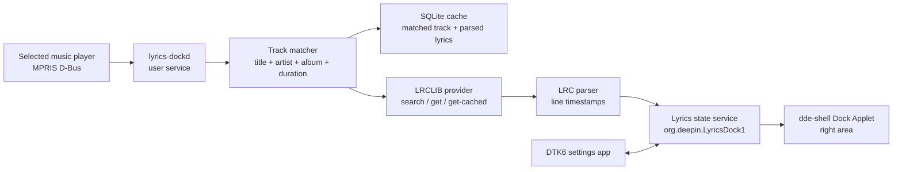
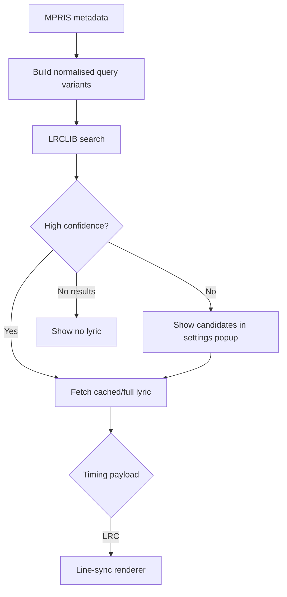
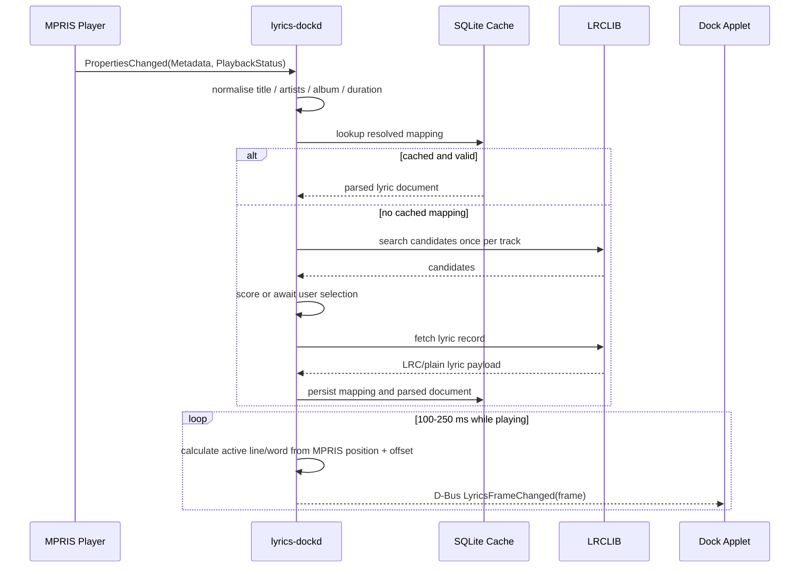

# Deepin Dock Lyrics Technical Plan

## 1. Goal

Deliver a Debian package for deepin/UOS v25 that lets a user select a running Linux music player, follows its playback state, resolves online lyrics, and displays the current lyric in the Dock right area.

The product does not play music and does not control a music library. Its first supported player protocol is MPRIS over the user D-Bus session.

## 2. Scope

### MVP

- A DTK6 settings application with an enable switch, player selector, current-track status, and lyric offset.
- A user background service that listens to the selected MPRIS player.
- Online lyrics through LRCLIB, with local cache and a manual candidate picker for ambiguous matches.
- A `dde-shell` Dock Applet placed in the right area using `dockOrder: 24`.
- Current line, next line, and a close/hide button; the data contract reserves a translation field for a separately reviewed future capability.
- Line-synchronised scrolling and a per-line progress fill.

### Explicitly not in MVP

- Windows/Wine player support.
- Music playback controls, login, playlists, or library management.
- Guaranteed coverage for every song.
- True word-timestamp animation when the source only returns LRC.

## 3. Important Constraint: Line Sync vs Word Sync

LRCLIB can return `syncedLyrics` in LRC format. LRC timestamps mark the beginning of a line, not each word. Therefore the MVP can determine the active line exactly, but cannot know the real start/end time of every character.

The MVP will animate a line progress fill from the current line timestamp to the next line timestamp. This is visually smooth, but must not be described as true word-level timing.

True word-level highlighting requires a source that returns word/syllable timing, for example YRC, QRC, or KRC. It is outside this product's current LRCLIB-only scope.

## 4. Runtime Architecture



`lyrics-dockd` owns all network access, matching, parsing, caching, and playback timing. The Dock Applet only renders published state. This keeps a slow request, provider failure, or parser bug from blocking the desktop shell.

## 5. Components

| Component | Technology | Responsibility |
|---|---|---|
| Settings app | Qt 6 + DTK6 Widgets or QML | Select player, enable service, set offset, inspect match, manually choose candidate |
| `lyrics-dockd` | Qt 6/C++ user service | MPRIS subscription, rate limiting, HTTP, parsing, caching, D-Bus API |
| Lyrics provider adapters | C++ interfaces | Search, candidate normalisation, lyric download, declared timing capability |
| Dock Applet | `dde-shell` QML Applet + small C++ bridge | Right-area display, hover tooltip/popup, hide action, theme-aware rendering |
| Persistent configuration | DConfig | Enabled state, chosen MPRIS bus name, lyric offset, rendering preferences |
| Cache | SQLite under XDG cache directory | Search result, selected candidate, raw payload, parsed lyrics, expiry metadata |

## 6. Provider Design



### 6.1 Provider interface

```cpp
struct TrackIdentity {
    QString title;
    QStringList artists;
    QString album;
    std::chrono::milliseconds duration;
    QString sourcePlayer;
};

class LyricProvider {
public:
    virtual QList<Candidate> search(const TrackIdentity &) = 0;
    virtual LyricPayload fetch(const Candidate &) = 0;
    virtual TimingCapability timingCapability() const = 0;
};
```

`TimingCapability` is `Line`, `Word`, or `None`. The renderer never guesses word timing when the provider declares `Line`.

### 6.2 LRCLIB as the only online provider

- LRCLIB is the only online lyrics provider for this product. No 网易云, QQ Music, Kugou, or other lyrics endpoint is called.
- Identify every request with `User-Agent: <app name> <version> (<project URL or contact>)`.
- Send requests sequentially, and leave a 200-500 ms interval between requests. On HTTP `429`, obey `Retry-After` exactly; use exponential backoff for `5xx` and network failures.
- First use `GET /api/get` with `track_name`, `artist_name`, `album_name`, and integer duration in seconds. Duration is critical: LRCLIB accepts only records within +/-2 seconds.
- On `404`, query `GET /api/search` with structured fields. It returns at most 20 records and has no pagination. Score returned candidates locally before fetching a record by `GET /api/get/{id}`.
- Prefer an exact/cached lookup only after a prior confirmed match; otherwise search candidates.
- Score candidates using normalised title, artist overlap, album, and duration tolerance.
- Automatically accept only high-confidence results. Lower-confidence matches are shown for user confirmation.
- Cache success, no-result, and user-selected mappings. A negative cache avoids repeatedly querying unavailable songs.
- Parse `syncedLyrics` as LRC when present; otherwise show `plainLyrics` without synchronisation. `lyricsfile` may be stored as raw diagnostic data but is not needed by the MVP renderer.
- Do not poll while a song continues playing. One bounded lookup happens on a stable track change, then the cached parsed document drives all frame updates.

The implementation is based on the published LRCLIB documentation as of 2026-08-12. Before release, recheck the current API terms, rate limits, attribution requirements, and licence from its official documentation. Do not assume the GitHub repository licence alone covers the hosted data service.

## 7. MPRIS and Matching Flow



MPRIS position is sampled on demand rather than trusting only elapsed wall-clock time. The daemon resets its extrapolation on pause, seek, player switch, and metadata change. A user-configurable offset, default `0 ms`, corrects small player-specific timing differences.

## 8. Dock Applet UX

The Applet remains in the right Dock region (`dockOrder: 24`) and does not modify the Dock's source layout.

- Width: constrained range, initially 220-360 px; clipped/ellipsised rather than pushing the tray and clock off-screen.
- Height: follows `Panel.rootObject.dockSize`; lyric visual is vertically centred.
- Default: one current line with a fill/highlight progress layer.
- The compact second line displays the next lyric. LRCLIB currently provides no translation field, so the MVP neither machine-translates nor presents a fabricated translation.
- Hover: tooltip with track title and provider; click opens a `PanelPopup` with previous/current/next lines and candidate correction action.
- Close button: hides lyrics for the current desktop session; settings can re-enable it.
- Theme: use DTK palette/theme values and DCI icon names, not hard-coded icon paths.
- Accessibility: expose current lyric and close action names.

## 9. D-Bus Contract

The daemon exports one user-session object:

```text
Service: org.deepin.LyricsDock1
Path:    /org/deepin/LyricsDock1
Iface:   org.deepin.LyricsDock1
```

Methods:

- `GetState() -> LyricsState`
- `SetEnabled(bool)`
- `SetPlayer(string mprisBusName)`
- `SetOffsetMs(int)`
- `SearchCandidates()`
- `SelectCandidate(string providerId, string candidateId)`

Signals:

- `StateChanged(LyricsState)` for enabled/player/match errors
- `FrameChanged(LyricFrame)` for line/word display updates
- `CandidatesChanged(array<Candidate>)`

`LyricFrame` includes track identity, current/next text, a reserved translation field, active line index, line progress, provider, and timing capability. The translation field is empty in the MVP, and LRC does not provide word-level progress. The UI displays errors as status text, never raw provider responses.

## 10. Package Layout

```text
deepin-lyrics-dock/
  apps/lyrics-settings/                 DTK6 settings application
  daemon/lyrics-dockd/                  MPRIS, providers, cache, D-Bus service
  dock-applet/                          dde-shell package org.deepin.ds.lyrics-dock
  config/org.deepin.lyrics-dock/        DConfig metadata/defaults
  systemd/lyrics-dockd.service          user service
  debian/                               package metadata and installation rules
```

Installed artifacts:

```text
/usr/bin/deepin-lyrics-settings
/usr/libexec/lyrics-dockd
/usr/share/dde-shell/org.deepin.ds.lyrics-dock/
/usr/lib/*/dde-shell/plugins/             only if the Applet has a C++ bridge
/usr/lib/systemd/user/lyrics-dockd.service
/usr/share/dsg/configs/org.deepin.LyricsDock/ DConfig metadata
```

Dependencies include `dde-shell`, `libdde-shell`, Qt 6 DBus/Network/Sql, DTK6, and `sqlite3`. Package scripts must not edit `/usr/share/dde-shell/org.deepin.ds.dock/main.qml`; plugin discovery and runtime child activation must use the supported dde-shell configuration path.

## 11. Delivery Phases

| Phase | Deliverable | Exit criteria |
|---|---|---|
| 0 | Technical spike | Detect two MPRIS players, read metadata/position, render mock lyric in Dock |
| 1 | Core MVP | Selected MPRIS player, LRCLIB search/cache/LRC parser, current line in Dock |
| 2 | Reliability | Candidate picker, offsets, negative cache, offline/error states, auto-start service |
| 3 | Product package | DTK6 settings page, `.deb`, upgrade/uninstall tests, translated strings |
| 4 | Future evaluation | Re-evaluate whether a word-timed source is needed; it is not part of the LRCLIB-only product scope |

## 12. Tests and Acceptance Criteria

- Native MPRIS players: play, pause, seek, track change, player exit, and two simultaneously running players.
- No metadata, stream/radio metadata, instrumental track, no lyric, ambiguous match, plain-only lyric, and network failure.
- Cache: repeated playback of the same song makes no additional network request before expiry.
- Timing: line change error remains within the configured player offset; seek updates current line within 250 ms.
- Shell: Dock at bottom/top/left/right, light/dark themes, different Dock sizes, multiple displays, and tray/clock do not overlap lyric UI.
- Package: fresh install, user-service enablement, upgrade, uninstall, and no orphan user processes.
- Privacy: document that track metadata is sent to the selected online provider only while lyrics are enabled; provide a local-cache clear action.

## 13. Confirmed Product Decisions

1. The first release supports MPRIS only. Wine is explicitly unsupported in this phase.
2. LRCLIB becomes the default online provider after its API terms, rate limits, attribution, and licence requirements pass review.
3. LRCLIB is the sole online provider. Because its current API does not provide translated lyrics, the compact second line displays the next lyric. Translation needs a separate provider and compliance review before it can be planned.
4. The project is a non-commercial MIT-licensed open-source tool, and all online lyric retrieval is limited to LRCLIB. 网易云 and other lyrics providers are out of scope.
