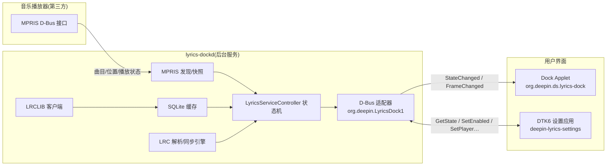

# Deepin Dock Lyrics(deepin 任务栏歌词)

`deepin-dock-lyrics` 是一个面向 deepin/UOS v25 的 Dock 歌词显示工具,采用 MIT 协议开源。
它跟随用户选中的原生 Linux MPRIS 音乐播放器,在 Dock(任务栏)右侧渲染逐行同步的歌词。
本产品不播放音乐、不管理音乐库、不要求登录,也不采集任何遥测数据。

> [!WARNING]
> **开发环境兼容性预警（开发机实测）**：安装构建依赖中的 `libdde-shell-dev` 时，apt 可能会同时升级
> `dde-shell`、`libdde-shell` 和 `libdde-shell-dock` 的运行时包。开发机从 `2.0.42` 升级至 `2.0.52`
> 后，出现“个性化已切换深色/浅色，但 Dock 不再跟随主题”的系统级问题；移除本项目的 `.deb` 后问题仍存在。
> 该现象由 `dde-shell` 运行时升级引起，**不是歌词插件写入或覆盖 Dock 主题**。请优先在虚拟机或测试设备安装开发依赖，
> 并在升级前记录可回退的 `dde-shell`、`libdde-shell`、`libdde-shell-dock` 同版本安装包；不要只降级其中一个包。
>
> 已验证的开发机环境：**Deepin 25（crimson）**、Wayland，`dde-shell` / `libdde-shell` /
> `libdde-shell-dock` **2.0.52**，DTK6 Core **6.7.47.1**、Gui/Widget **6.7.47**。
> 发布的 `deepin-dock-lyrics` `.deb` 仅依赖这些运行时包，不会安装 `libdde-shell-dev` 等开发包。

> 🏆 **参赛信息**:本项目参加 deepin 社区「10亿 Token 奖池,写出属于你的 deepin 桌面插件!」主题开发大赛,
> 报名方向为 **方向四:扩展 DDE Shell 的桌面能力**(基于 `dde-shell-development`)+
> **方向三:DTK 创新原生应用**(设置应用基于 `dtk-development`)的组合。
> 开发全程基于 [deepin Skills](https://github.com/linuxdeepin/deepin-skills) 完成,
> Skills 使用说明见下文[AI 辅助开发工作流](#ai-辅助开发工作流deepin-skills)。

- 源码仓库:<https://github.com/PIN-HE/Deepin-Dock-Lyrics>
- 当前版本:`v1.0.0.1`(发布说明见 [CHANGELOG.md](CHANGELOG.md))

---

## 功能特性

- 🎵 **MPRIS 播放器发现与选择**:自动枚举用户会话中支持 MPRIS 的原生 Linux 播放器,
  跟踪播放/暂停/拖动/切歌,已知播放器显示友好中文名(如"网易云音乐""端闱乐部")。
- 🎤 **逐行同步歌词**:跟随当前歌曲,在 Dock 右侧渲染当前行与下一行,
  支持行内平滑进度、长句自动滚动与卡拉OK/经典两种布局。
- 📡 **在线歌词检索与缓存**:以 LRCLIB 为唯一在线歌词源,请求序列化、限流,
  本地 SQLite 缓存查询结果(含负结果冷却),支持候选歌词确认;另支持本地 LRC 文件与播放器缓存歌词。
- 🧩 **多源歌词提供**:本地文件、播放器缓存、LRCLIB 三级来源按优先级自动协调。
- 📖 **繁体转简体**:通过 OpenCC `t2s.json` 在解析前将繁体歌词转为简体,缓存保留来源原文。
- 🎚️ **MPRIS 定向音频可视化**(可选,依赖 PipeWire):仅从选中播放器精确匹配的音频流做内存级实时可视化,
  绝不录音、不保存、不上传;无法精确匹配时不读取系统音频。
- ⚙️ **DTK6 设置应用**:启用开关、播放器选择、同步偏移、可视化开关、布局选择、候选歌词确认、关于对话框。
- 📌 **系统托盘**:daemon 提供 QSystemTrayIcon 托盘菜单(启用/设置/退出)。
- 🔒 **隐私保护**:日志采用 allowlist 过滤,曲名、歌词、查询串、D-Bus 原始载荷一律不进日志;无任何遥测上传。

## 系统架构

### 平台架构

本项目基于 deepin/UOS v25 的 DDE 桌面体系构建:

| 层 | 技术 |
|---|---|
| 操作系统 | deepin 25 / UOS v25(Wayland),用户会话 D-Bus |
| GUI 框架 | Qt 6(QML + Widgets 双栈) |
| 桌面组件库 | DTK6(Core/Gui/Widget + DConfig 配置中心) |
| Shell 集成 | `dde-shell` 2.x 插件体系(DApplet / Panel / Dock QML API) |
| 歌词来源 | MPRIS D-Bus 接口、LRCLIB 在线服务、本地 LRC 文件 |
| 音频可视化 | PipeWire(可选,编译期自动探测) |
| 中文处理 | OpenCC(繁转简) |
| 构建 | CMake ≥ 3.16 + C++17,CTest 单元测试 |

### 进程与数据流

系统由三个独立进程组成,全部通过会话 D-Bus 名称 `org.deepin.LyricsDock1` 通信:



- **`lyrics-dockd`**:用户会话后台服务,由 systemd 用户服务管理(`Type=dbus`,可被 D-Bus 自动激活)。
  承担全部网络、缓存与歌词解析逻辑,Shell 进程只做渲染。
- **`deepin-lyrics-settings`**:DTK6 设置应用,通过 D-Bus 读写 daemon 状态并持久化到 DConfig。
- **`org.deepin.ds.lyrics-dock`**:dde-shell Dock Applet,挂载于 `org.deepin.ds.dock`,
  固定 `dockOrder: 24`(Dock 右侧区域),不修改 Dock 源码。

### 代码架构(daemon 内部)

daemon 采用**六边形架构(端口-适配器)**:

- `ports/` 定义纯虚接口(端口):播放器、歌词提供、HTTP 传输、歌词缓存、设置、繁简转换、音频可视化、外部帧源。
- `infrastructure/` 实现各端口适配器(LRCLIB、SQLite、MPRIS、DConfig、OpenCC、PipeWire、QtNetwork 等)。
- `application/` 的 `LyricsServiceController` 面向端口编写业务状态机,不依赖任何具体外部实现,
  因此所有外部依赖都能在测试中以假传输替换(测试不接触真实 LRCLIB、不消耗其配额)。

---

## 目录结构

```text
deepin-dock-lyrics/
├── CMakeLists.txt              顶层构建脚本(目标、依赖探测、子目录)
├── cmake/                      版本注入模板(version.h.in)
├── common/
│   ├── lyrics-core/            公共数据类型与纯逻辑库
│   │   ├── include/lyricscore/ TrackIdentity、LyricLine、候选等类型;LRC 解析器;同步引擎;归一化
│   │   └── src/                对应实现
│   ├── lyrics-logging/         隐私过滤日志引擎(allowlist 白名单,拒收敏感字段)
│   └── lyrics-ui/              主题感知设计令牌(LyricsTokens 单例,供 QML 使用)
├── daemon/
│   └── lyrics-dockd/           用户会话后台服务
│       ├── main.cpp            入口;命令行选项 --check / --player <bus-name>
│       ├── application/        LyricsServiceController:服务状态机与多源歌词协调
│       ├── infrastructure/     端口适配器实现:
│       │                        dconfigsettingsadapter(DConfig 设置)
│       │                        lrclibprovider / lrcliblyricsadapter(LRCLIB 在线歌词)
│       │                        sqlitelyricscache(SQLite 缓存)
│       │                        locallyricsprovider(本地 LRC)
│       │                        playercachelyricsprovider(播放器缓存歌词)
│       │                        multisourcelyricprovider(多源协调)
│       │                        mprisplayeradapter(选中播放器适配)
│       │                        openccchinesescriptconverter(繁转简)
│       │                        pipewireaudiovisualizeradapter /
│       │                        pipewirestreammatcher(PipeWire 定向可视化)
│       │                        termusicframesource(ter-music 帧源)
│       │                        qtnetworktransport(HTTP 传输)
│       │                        lyricsdbusadapter(D-Bus 接口 org.deepin.LyricsDock1)
│       │                        audiospectrumanalyzer(频谱分析)
│       ├── ports/              六边形架构端口(纯头文件抽象接口)
│       ├── mprisplayerdiscovery.*  独立静态库 lyrics-mpris:播放器发现、曲目/位置快照
│       └── systemtrayicon.*    Qt 原生 QSystemTrayIcon 托盘菜单
├── apps/
│   └── lyrics-settings/        DTK6 设置应用(DApplication / DAboutDialog)
│       ├── main.cpp            入口
│       ├── settingsviewmodel.* D-Bus 客户端视图模型(服务监听、状态拉取、重试)
│       ├── settingswindow.*     设置窗口与全部设置项 UI
│       ├── translations/       简体中文翻译(zh_CN)
│       ├── icons/              应用图标(128x128)
│       └── org.deepin.LyricsDock.desktop  桌面入口
├── dock-applet/                dde-shell Dock Applet
│   ├── lyricsdockapplet.*      DApplet 插件桥接(导出 viewModel 给 QML)
│   ├── lyricsdockviewmodel.*   D-Bus 状态视图模型(状态文本、帧、隐藏控制)
│   ├── package/
│   │   ├── metadata.json       插件元数据(Id: org.deepin.ds.lyrics-dock,Parent: org.deepin.ds.dock)
│   │   ├── main.qml            Applet 根 QML(dockOrder: 24)
│   │   └── qml/                LyricBar / LyricsPopup / MarqueeText 组件
│   └── translations/           简体中文翻译
├── config/
│   └── org.deepin.LyricsDock.json   DConfig 配置元数据(enabled/playerBusName/offsetMs/…)
├── systemd/
│   └── lyrics-dockd.service    systemd 用户服务(Type=dbus,DBus 激活)
├── debian/
│   └── org.deepin.LyricsDock1.service  D-Bus 服务激活文件
├── tests/                       CTest 测试套件(约 20 个测试目标)
│   ├── fixtures/               测试夹具(假传输、样本 LRC 等)
│   ├── dbus-test-wrapper.sh    D-Bus 测试隔离包装
│   └── README.md               测试运行方式与隔离策略
├── dock-left-demo/             独立的最小 dde-shell Applet 演示工程(早期验证 Dock 右侧区域布局)
├── specs/                      实施规格(S00–S09 分阶段规格与验收标准)
├── design/                     设计图(系统架构、时序、状态机、数据流、测试数据;与实际代码一致)
├── issues/                     已确认缺陷记录与修复方案
└── docs(根目录 Markdown)
    ├── CHANGELOG.md            双语变更记录
    ├── DOCK_LYRICS_DESIGN_TOKENS_ZH.md     设计令牌规范
    ├── DOCK_LYRICS_TECHNICAL_PLAN_ZH.md / LYRICS_DOCK_TECHNICAL_PLAN.md  技术方案
    ├── DOCK_LYRICS_MULTISOURCE_PLAN.md     多源歌词架构演进方案
    └── API_LYRICS_en_US.md     ter-music 歌词 D-Bus API 说明
```

## 依赖

### 构建依赖(deepin 25 上可直接 `apt install`)

```text
cmake(≥ 3.16)
g++(C++17)
qt6-base-dev
qt6-declarative-dev
libdtk6core-dev
libdtk6gui-dev
libdtk6widget-dev
libdde-shell-dev(dde-shell 2.x,提供 DDEShell / ds_install_package)
libopencc-dev
libpipewire-0.3-dev(可选;缺失时音频可视化自动禁用,其余功能不受影响)
```

### 运行时依赖

- deepin 25 / UOS v25(dde-shell 2.x、用户会话 D-Bus)
- Qt 6、DTK6 运行库
- DConfig 配置中心(`/usr/share/dsg/configs/`)
- PipeWire(可选,仅音频可视化需要)

### 架构支持

- 已在 **amd64** 上完成构建、安装、运行与卸载验证;
- 代码为纯 C++/Qt,无平台相关汇编,**arm64 理论可构建**(赛事加分项),但尚未在 arm64 环境实测。

---

## 编译与测试

```bash
# 配置(默认构建测试;系统级安装建议加 -DCMAKE_INSTALL_PREFIX=/usr)
cmake -S . -B build
# 编译
cmake --build build -j"$(nproc)"
# 运行全部单元测试
ctest --test-dir build --output-on-failure
```

常用选项:

| 选项 | 默认 | 说明 |
|---|---|---|
| `-DCMAKE_INSTALL_PREFIX=/usr` | `/usr/local` | 系统级安装前缀(dde-shell 插件路径为绝对路径,不受前缀影响) |
| `-DDEEPIN_DOCK_LYRICS_BUILD_TESTS=OFF` | `ON` | 关闭测试构建 |
| `-DDEEPIN_DOCK_LYRICS_ENABLE_PIPEWIRE=OFF` | `ON` | 禁用 PipeWire 音频可视化 |

测试隔离策略:测试使用假 HTTP 传输与内存缓存,**不会访问真实 LRCLIB、不消耗其配额**;
涉及 D-Bus 的测试通过 `tests/dbus-test-wrapper.sh` 使用私有 bus 会话隔离运行。详见 [tests/README.md](tests/README.md)。

## 安装

### 第 1 步:编译并安装 CMake 目标(设置应用 + Dock Applet + DConfig 元数据)

```bash
cmake -S . -B build -DCMAKE_INSTALL_PREFIX=/usr
cmake --build build -j"$(nproc)"
sudo cmake --install build
```

该步安装:`deepin-lyrics-settings`、桌面入口与图标、Dock Applet 插件包
(`/usr/share/dde-shell/org.deepin.ds.lyrics-dock/` 与 `/usr/lib/x86_64-linux-gnu/dde-shell/org.deepin.ds.lyrics-dock.so`)、
DConfig 元数据(`/usr/share/dsg/configs/org.deepin.LyricsDock/`)。

### 第 2 步:安装 daemon 与 systemd/D-Bus 服务文件(手动)

```bash
sudo mkdir -p /usr/lib/deepin-dock-lyrics
sudo cp build/daemon/lyrics-dockd/lyrics-dockd /usr/lib/deepin-dock-lyrics/lyrics-dockd
sudo cp systemd/lyrics-dockd.service /usr/lib/systemd/user/
sudo cp debian/org.deepin.LyricsDock1.service /usr/share/dbus-1/services/
systemctl --user daemon-reload
```

> 覆盖正在运行的 daemon 时如遇"文本文件忙",先用临时名复制再 `mv` 覆盖,或先停服务。

### 第 3 步:启动服务

```bash
systemctl --user enable --now lyrics-dockd.service
```

## 使用说明

1. **启动歌词**:打开"Deepin Dock Lyrics"设置应用,点击"启用 Dock 歌词";
   或在 Dock 歌词区域/托盘菜单中选择启用。
2. **选择播放器**:在设置应用中选择一个正在运行的 MPRIS 播放器
   (未运行的播放器不会出现在列表中)。
3. **播放歌曲**:切歌后 daemon 自动检索歌词(在线查询一次并缓存);
   若存在多个候选,设置应用会提示选择确认。
4. **微调同步**:歌词与歌声不同步时,在设置应用调整"同步偏移"(正=提前,负=延后)。
5. **布局切换**:设置应用可在"经典/卡拉OK"两种 Dock 布局间切换;
   Dock 上也可临时隐藏歌词区域(托盘菜单恢复)。
6. **重置数据**:设置应用"清除歌词缓存"按钮可清空 SQLite 缓存。

Dock Applet 由 dde-shell 自动发现并加载;更新插件后如未生效,重启 Shell
(`killall dde-shell`,它会自动重启)或注销重登。

## 卸载

通过发布的 `.deb` 安装时，使用包管理器卸载，不能套用下方的手工删除命令：

```bash
sudo apt remove deepin-dock-lyrics
# 连同系统级配置文件一起移除时：
sudo apt purge deepin-dock-lyrics
```

下方命令仅适用于按“安装”章节手动执行 `cmake --install` 和复制 daemon 文件的开发环境。

```bash
# 1. 停用并移除服务
systemctl --user disable --now lyrics-dockd.service
sudo rm -f /usr/lib/systemd/user/lyrics-dockd.service
sudo rm -f /usr/share/dbus-1/services/org.deepin.LyricsDock1.service
# 2. 移除 daemon 与 DConfig 元数据
sudo rm -rf /usr/lib/deepin-dock-lyrics
sudo rm -rf /usr/share/dsg/configs/org.deepin.LyricsDock
# 3. 移除 Dock Applet
sudo rm -rf /usr/share/dde-shell/org.deepin.ds.lyrics-dock
sudo rm -f /usr/lib/x86_64-linux-gnu/dde-shell/org.deepin.ds.lyrics-dock.so
# 4. 移除设置应用
sudo rm -f /usr/bin/deepin-lyrics-settings
sudo rm -f /usr/share/applications/org.deepin.LyricsDock.desktop
sudo rm -f /usr/share/icons/hicolor/128x128/apps/deepin-lyrics-dock.png
# 5. 刷新 systemd 并重启 Shell 使变更生效
systemctl --user daemon-reload
killall dde-shell
```

## 玲珑包说明

本项目的核心能力是安装到宿主机 `/usr/share/dde-shell/` 的 Dock Applet，并注册宿主机用户级
systemd 与 D-Bus 服务。玲珑应用运行在隔离容器中，不能安全地向宿主 dde-shell 安装插件或注册
这些服务，因此不发布功能不完整的玲珑原生安装包。请使用本项目提供的 `.deb` 包安装完整功能。

## AI 辅助开发工作流(deepin Skills)

本项目全程基于 [deepin Skills](https://github.com/linuxdeepin/deepin-skills) 与 AI 编程 Agent 协作开发,
Skills 安装于 `~/.agents/skills/`(与 AI 编程工具通过 skill 机制集成)。实际用到的 Skill 模块:

| Skill 模块 | 用于本项目的部分 | 对应赛事方向 |
|---|---|---|
| `dde-shell-development` | Dock Applet:`dock-applet/` 的 DApplet 桥接、Shell QML API(AppletItem/Panel/Dock)、`ds_install_package` 插件打包与 `dockOrder` 布局 | 方向四:扩展 DDE Shell 桌面能力 |
| `dtk-development` | DTK6 设置应用:`apps/lyrics-settings/` 的 DApplication、DAboutDialog、DTK 控件与主题调色板;`common/lyrics-ui/` 设计令牌 | 方向三:DTK 创新原生应用 |
| `dde-tray-development` | 托盘交互约定参考:`daemon/lyrics-dockd/systemtrayicon.*` 采用 Qt 原生 `QSystemTrayIcon` 实现 | —(参考) |
| `dde-control-center-development` | DConfig 配置规范参考:`config/org.deepin.LyricsDock.json` 按 DDE 配置中心规范编写 | —(参考) |
| `codebase-memory` | 开发过程中用代码库知识图谱做结构查询、调用链追踪与影响分析 | —(工具) |

开发过程说明:各模块的实现规格见 [specs/](specs/),运行时行为图见 [design/](design/)。
按赛事要求,AI 编程工具中调用上述 deepin Skills 的对话记录截图,随参赛帖子一并提交。

## 产品边界(不在范围内)

- 仅支持 Linux 原生 MPRIS 播放器;Wine/Windows 播放器不在范围内。
- LRCLIB 是唯一在线歌词源;不接入网易云、QQ、酷狗等私有歌词接口。
- LRC 提供行级时间戳,产品只承诺逐行同步与行内进度,不承诺逐字同步。
- LRCLIB 暂不提供翻译歌词,第二行固定显示下一句;数据契约保留 `translationText` 字段但值为空。

## 开源协议

本项目采用 **MIT 协议**(OSI 批准的开源协议),全文见 [LICENSE](LICENSE)。
产品不播放音乐、不要求用户登录、无遥测上传。

## 生态联动

本项目与 deepin 社区终端音乐播放器 [**Ter-Music**](https://github.com/YXZL985/ter-music)
实现了协议联动，感谢作者 [@YXZL985](https://github.com/YXZL985) 提供歌词 D-Bus API 支持。

## 相关文档

| 文档 | 说明 |
|---|---|
| [specs/README.md](specs/README.md) | 实施顺序(S00–S09)与验收标准 |
| [design/README.md](design/README.md) | 设计图索引(架构/时序/状态机/数据流,与代码一致) |
| [issues/README.md](issues/README.md) | 已确认缺陷与修复方案 |
| [tests/README.md](tests/README.md) | 测试运行方式与隔离策略 |
| [CHANGELOG.md](CHANGELOG.md) | 双语变更记录 |
| [DOCK_LYRICS_MULTISOURCE_PLAN.md](DOCK_LYRICS_MULTISOURCE_PLAN.md) | 多源歌词架构演进方案 |
| [API_LYRICS_en_US.md](API_LYRICS_en_US.md) | ter-music 歌词 D-Bus API 说明 |
