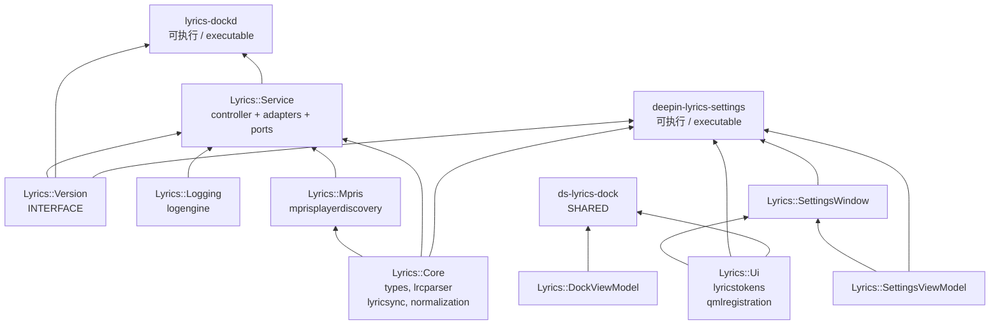
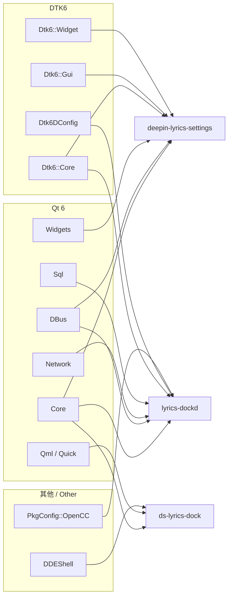
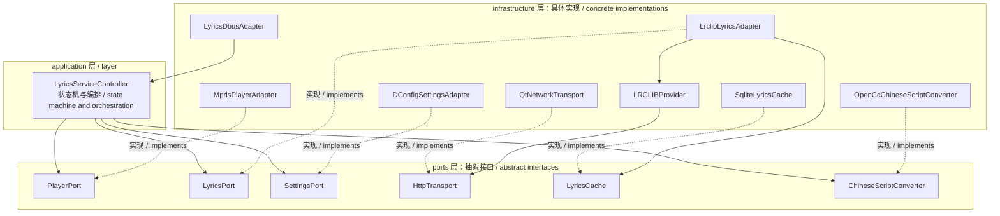
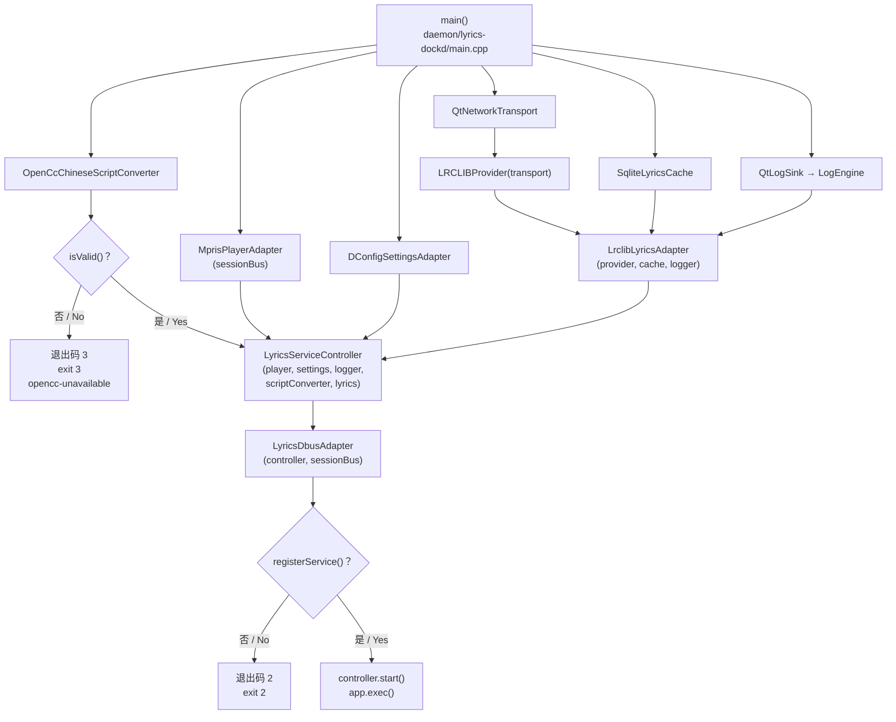
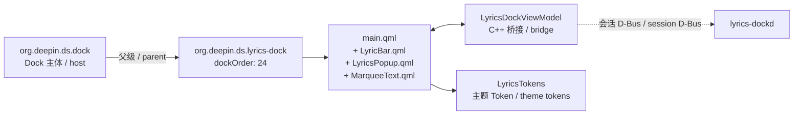

# 01 系统架构 / System Architecture

本文描述 V1 已实现的模块边界与依赖关系。
This document describes module boundaries and dependencies as implemented in V1.

## 1. 构建目标依赖图 / Build Target Dependency Graph

**中文**

`Lyrics::Core` 是唯一被三个可执行目标共享的库，因此其公共头文件构成事实上的跨进程契约。`Lyrics::Service` 只被 daemon 使用，Applet 与设置应用不链接它——这保证 Shell 进程不会意外引入网络或 SQLite 依赖。

**English**

`Lyrics::Core` is the only library shared by all three executables, so its public headers form the de facto cross-process contract. `Lyrics::Service` is used solely by the daemon; neither the applet nor the settings app links against it, which guarantees the Shell process cannot accidentally pull in network or SQLite dependencies.

## 2. 外部依赖 / External Dependencies

**中文**

依赖分布体现进程职责：只有 daemon 依赖 `Network`、`Sql` 与 `OpenCC`；只有 Applet 依赖 `DDEShell` 与 `Quick`；只有设置应用依赖 `Widgets`。三者交集仅 `Qt6::Core` 与 `Qt6::DBus`。

**English**

The dependency spread mirrors process responsibility: only the daemon needs `Network`, `Sql`, and `OpenCC`; only the applet needs `DDEShell` and `Quick`; only the settings app needs `Widgets`. Their intersection is just `Qt6::Core` and `Qt6::DBus`.

## 3. Daemon 内部分层 / Daemon Internal Layering

**中文**

控制器只依赖 ports 层的抽象，不直接引用任何 infrastructure 类型。这使测试可以注入假实现——现有 15 项测试正是依此运作，`tests/` 中的假传输不会消耗 LRCLIB 配额。

注意 `LRCLIBProvider` 不是一个 port 实现，而是被 `LrclibLyricsAdapter` 组合使用的具体协议客户端。它依赖 `HttpTransport` port，故其本身也可测。

**English**

The controller depends only on port abstractions and references no infrastructure type directly. This is what lets tests inject fakes — the existing 15 tests work exactly this way, and the fake transports under `tests/` consume no LRCLIB quota.

Note that `LRCLIBProvider` is not a port implementation but a concrete protocol client composed into `LrclibLyricsAdapter`. It depends on the `HttpTransport` port, so it is itself testable.

## 4. 依赖注入装配 / Dependency Injection Wiring

**中文**

两处启动门禁值得注意：

- **OpenCC 不可用即退出（码 3）。** 繁简转换被视为必需能力，不降级运行。
- **D-Bus 服务名注册失败即退出（码 2）。** 避免出现无法被调用的僵尸进程。

此外 `serviceOwnershipLost` 信号连接到 `QCoreApplication::quit`，即服务名被抢占时主动退出，不与新实例竞争。

**English**

Two startup gates are notable:

- **Exit code 3 when OpenCC is unavailable.** Script conversion is treated as a required capability with no degraded mode.
- **Exit code 2 when D-Bus name registration fails.** This avoids a zombie process nothing can call.

Additionally, the `serviceOwnershipLost` signal is connected to `QCoreApplication::quit`, so the daemon exits voluntarily if its name is taken rather than competing with a new instance.

## 5. Applet 与 Shell 集成 / Applet and Shell Integration

**中文**

Applet 通过 `ds_install_package` 安装为独立包，父级为 `org.deepin.ds.dock`，不修改 Dock 源码或其 `main.qml`。C++ 桥接层 `LyricsDockViewModel` 承担 D-Bus 通信与重试，QML 只消费属性。

`LyricsDockViewModel` 内含单次重试定时器（`m_stateRetryTimer`），用于 daemon 尚未就绪时重新获取状态——Applet 随 Shell 启动，可能早于 daemon。

**English**

The applet installs as its own package via `ds_install_package` with `org.deepin.ds.dock` as parent, modifying neither the Dock source nor its `main.qml`. The C++ bridge `LyricsDockViewModel` owns D-Bus communication and retry; the QML merely consumes properties.

`LyricsDockViewModel` holds a single-shot retry timer (`m_stateRetryTimer`) to re-fetch state when the daemon is not yet up — the applet starts with the Shell and may well precede the daemon.

## 6. 已知架构偏差 / Known Architectural Divergences

| 偏差 / Divergence | 现状 / Current | 相关问题 / Related Issue |
|---|---|---|
| 歌词源为单实现 / Single source implementation | `LyricsPort` 仅有 `LrclibLyricsAdapter` 一个实现 / only one implementation | [多源方案 §4](../DOCK_LYRICS_MULTISOURCE_PLAN.md) |
| 繁简转换位置 / Script conversion placement | 仅作用于显示副本，查询与打分未归一 / display copy only, not queries or scoring | [issues/001](../issues/001-cjk-text-score-always-zero.md) |
| 封面未接入 / Cover art absent | `mpris:artUrl` 未读取，无相关字段 / not read, no field exists | [多源方案 §9](../DOCK_LYRICS_MULTISOURCE_PLAN.md) |
| 候选无正文 / Candidates lack body | `LyricCandidate` 丢弃 payload / discards payload | [issues/007](../issues/007-candidate-list-lacks-lyric-preview.md) |
