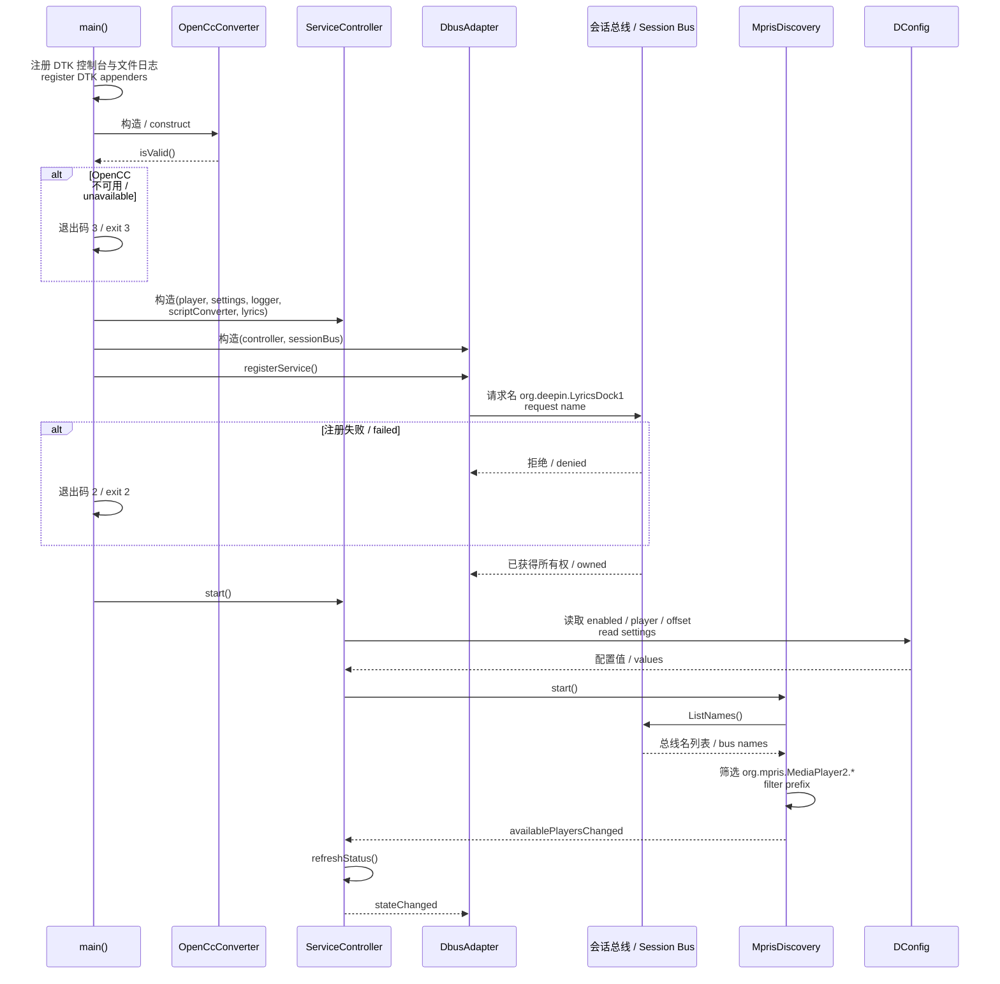
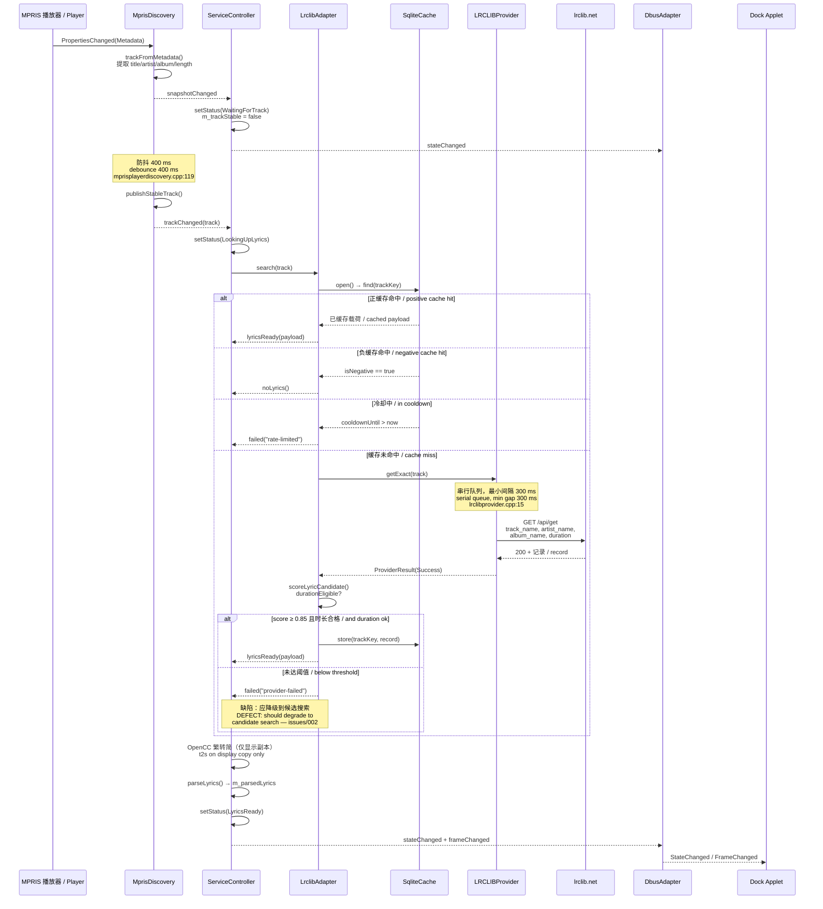
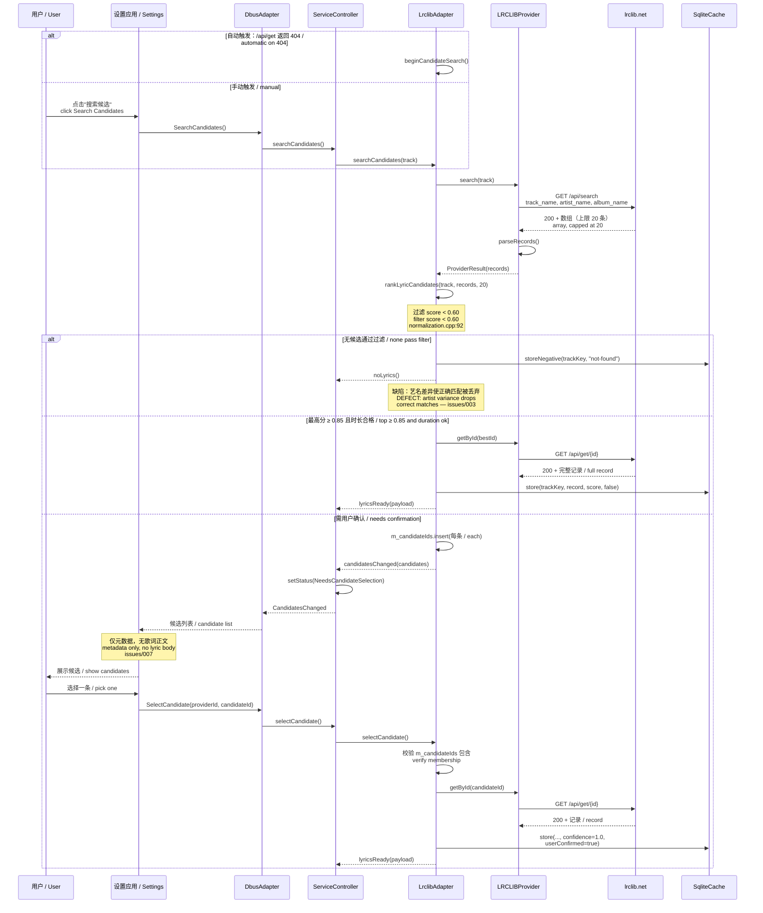
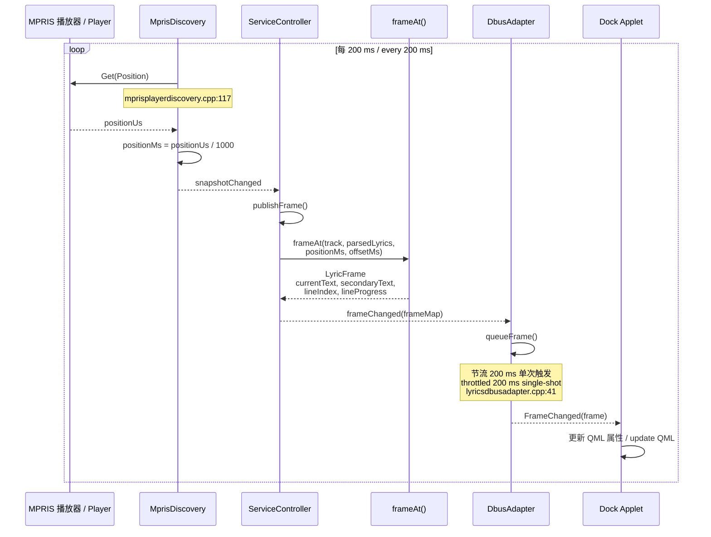
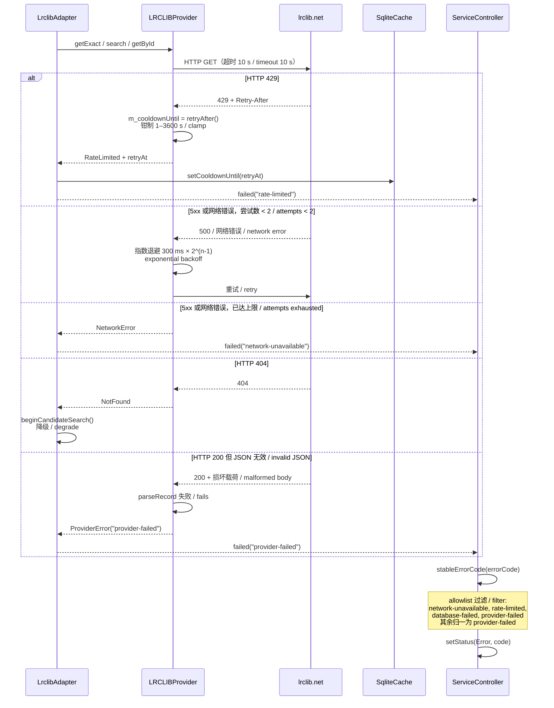
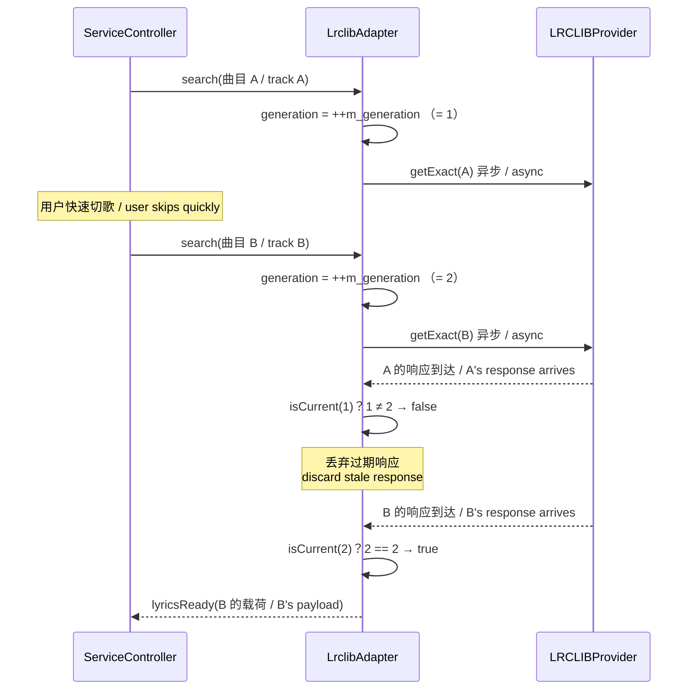

# 02 运行时时序 / Runtime Sequences

本文的时序图对应 V1 已实现的调用链，常量取自源码。
The sequences here reflect call chains as implemented in V1, with constants taken from source.

## 1. Daemon 启动 / Daemon Startup

**中文**

启动顺序的关键约束是**先注册 D-Bus 名再启动 MPRIS 发现**。若顺序颠倒，发现过程产生的状态变更会在服务名尚未就绪时发出信号，Applet 无法接收。

**English**

The critical ordering constraint is **register the D-Bus name before starting MPRIS discovery**. Reversed, state changes produced by discovery would emit signals before the service name exists, and the applet would miss them.

## 2. 切歌与歌词检索 / Track Change and Lyric Lookup

**中文**

图中标注了 [issues/002](../issues/002-exact-match-failure-reported-as-error.md) 的缺陷位置：`/api/get` 成功返回歌词但评分未达阈值时，当前实现发出 `failed` 而非降级到候选搜索。降级路径仅在 HTTP 404 时触发。

**English**

The diagram marks where [issues/002](../issues/002-exact-match-failure-reported-as-error.md) sits: when `/api/get` returns lyrics successfully but the score falls short, the current implementation emits `failed` instead of degrading to candidate search. The degradation path fires only on HTTP 404.

## 3. 候选搜索与用户确认 / Candidate Search and User Confirmation

**中文**

`selectCandidate` 以 `confidence = 1.0` 与 `userConfirmed = true` 写入缓存，绕过评分门槛。这是用户手动搜索能成功而自动路径失败的直接原因。

`m_candidateIds` 成员用于校验用户提交的 `candidateId` 确实来自最近一次搜索结果，防止任意 ID 注入。

**English**

`selectCandidate` writes to the cache with `confidence = 1.0` and `userConfirmed = true`, bypassing the score gate. This is precisely why manual search succeeds where the automatic path fails.

The `m_candidateIds` member verifies that a user-submitted `candidateId` genuinely came from the most recent search, preventing arbitrary ID injection.

## 4. 播放中的帧发布 / Frame Publication During Playback

**中文**

位置采样与帧节流均为 200 ms，但两者不同步：`m_frameTimer` 是单次定时器，仅在有待发布帧时启动，因此暂停时不产生总线流量。

`frameAt()` 是纯函数，不含状态。行内进度 `lineProgress` 由当前行起始时间到下一行起始时间的区间线性插值得出——这是视觉进度，非真实逐字时间戳。

**English**

Position sampling and frame throttling are both 200 ms but are not synchronised: `m_frameTimer` is single-shot and starts only when a frame is pending, so a paused player generates no bus traffic.

`frameAt()` is a pure function with no state. The intra-line `lineProgress` is linearly interpolated between the current line's start and the next line's start — a visual progress indicator, not a real word-level timestamp.

## 5. 错误与限流路径 / Error and Rate-Limit Paths

**中文**

`stableErrorCode` 的 allowlist（[lyricsservicecontroller.cpp:56-65](../daemon/lyrics-dockd/application/lyricsservicecontroller.cpp#L56-L65)）确保对外暴露的错误码是有限枚举，不泄漏服务端原始响应。未在清单内的错误码统一归一为 `provider-failed`。

注意 `track-not-searchable` 与 `invalid-candidate` 不在 allowlist 内，会被归一为 `provider-failed`——这使设置应用中针对前者的专门文案（[settingswindow.cpp:536](../apps/lyrics-settings/settingswindow.cpp#L536)）在此路径下无法触达。该文案仅在设置应用直接调用失败时可见。

**English**

The `stableErrorCode` allowlist ([lyricsservicecontroller.cpp:56-65](../daemon/lyrics-dockd/application/lyricsservicecontroller.cpp#L56-L65)) keeps externally visible error codes to a bounded enumeration and never leaks raw server responses. Codes outside the list collapse to `provider-failed`.

Note that `track-not-searchable` and `invalid-candidate` are absent from the allowlist and collapse to `provider-failed`, which means the dedicated message for the former ([settingswindow.cpp:536](../apps/lyrics-settings/settingswindow.cpp#L536)) is unreachable along this path. That message appears only when a direct settings-app call fails.

## 6. 请求代次守卫 / Request Generation Guard

**中文**

`m_generation` 单调递增，每次新检索递增一次。回调中通过 `isCurrent(generation)` 判断响应是否仍然相关，过期响应静默丢弃。这防止快速切歌时旧响应覆盖新歌词。

同一机制也用于 `clearCache()`（[lrcliblyricsadapter.cpp:87](../daemon/lyrics-dockd/infrastructure/lrcliblyricsadapter.cpp#L87)）——清缓存时递增代次，使所有在途响应失效。

**English**

`m_generation` increases monotonically, once per new lookup. Callbacks check `isCurrent(generation)` to decide whether a response is still relevant, silently dropping stale ones. This prevents an older response from overwriting newer lyrics during rapid skipping.

The same mechanism serves `clearCache()` ([lrcliblyricsadapter.cpp:87](../daemon/lyrics-dockd/infrastructure/lrcliblyricsadapter.cpp#L87)): bumping the generation invalidates every in-flight response.
