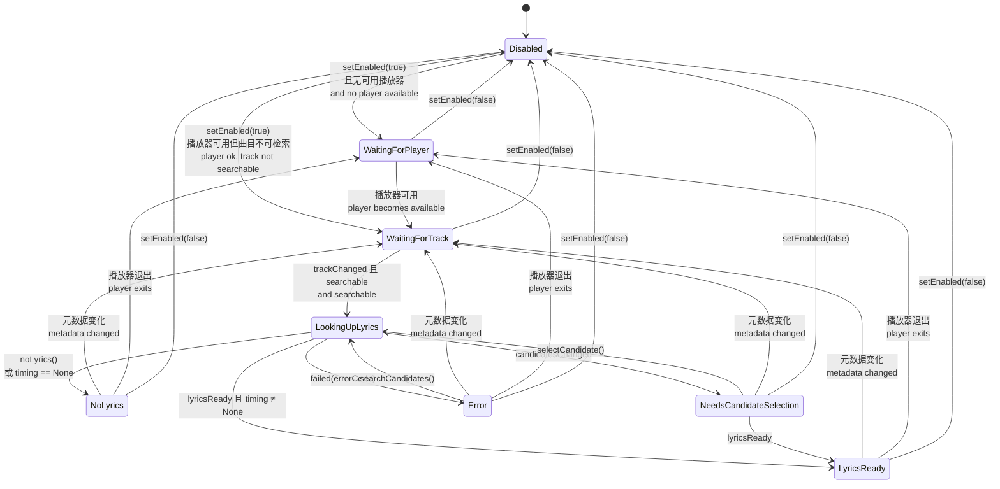
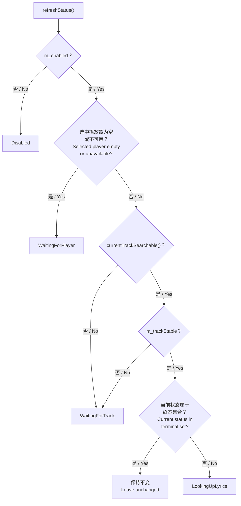
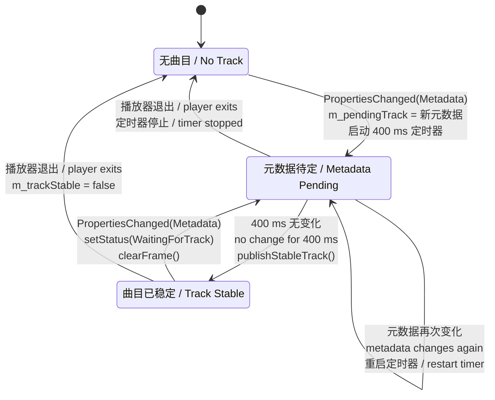
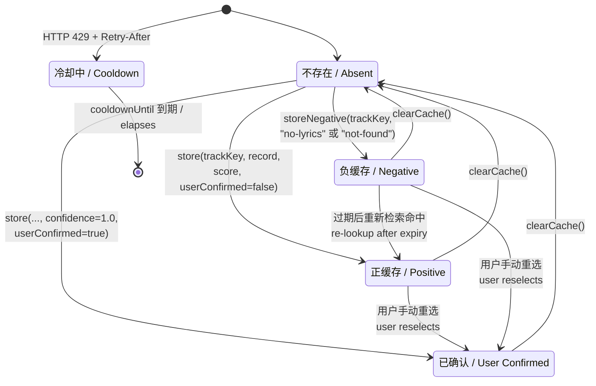
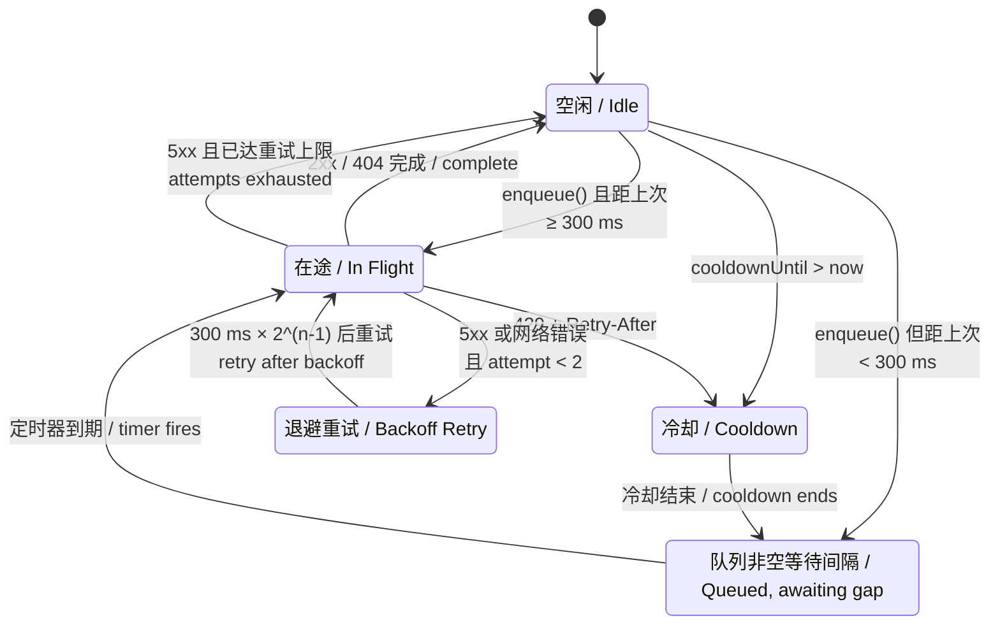
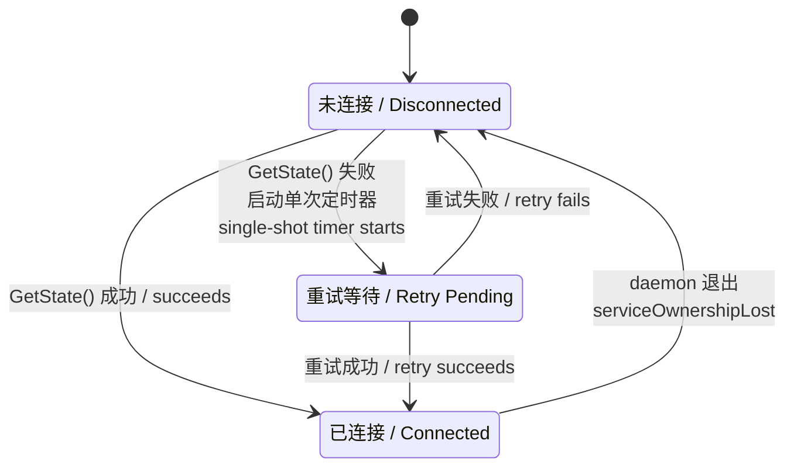

# 03 状态机 / State Machines

本文的状态机对应 V1 已实现的转移逻辑。
The state machines here reflect transition logic as implemented in V1.

## 1. 服务状态机 / Service Status Machine

**中文**

`ServiceStatus` 定义于 [lyricsservicecontroller.h:16-25](../daemon/lyrics-dockd/application/lyricsservicecontroller.h#L16-L25)，共八个状态。

**English**

`ServiceStatus` is defined at [lyricsservicecontroller.h:16-25](../daemon/lyrics-dockd/application/lyricsservicecontroller.h#L16-L25) with eight states.

## 2. refreshStatus 的优先级判定 / Priority Logic in refreshStatus

**中文**

`refreshStatus()`（[lyricsservicecontroller.cpp:375-392](../daemon/lyrics-dockd/application/lyricsservicecontroller.cpp#L375-L392)）不是自由转移，而是按固定优先级重算状态。理解这个顺序对理解状态机至关重要。

**English**

`refreshStatus()` ([lyricsservicecontroller.cpp:375-392](../daemon/lyrics-dockd/application/lyricsservicecontroller.cpp#L375-L392)) does not perform free transitions; it recomputes status by fixed priority. Understanding this order is essential to understanding the machine.

**中文**

第 5 步的「终态集合」为 `{LookingUpLyrics, LyricsReady, NoLyrics, NeedsCandidateSelection, Error}`。这个判断是一个**保护性条件**：一旦进入这五个状态之一，`refreshStatus` 不再覆盖它，避免异步检索过程中的状态抖动。

**English**

The "terminal set" in step 5 is `{LookingUpLyrics, LyricsReady, NoLyrics, NeedsCandidateSelection, Error}`. This check acts as a **guard**: once in one of those five, `refreshStatus` will not overwrite it, preventing status thrash during an asynchronous lookup.

**中文**

这一保护的副作用是：`Error` 状态不会因 `refreshStatus` 自动清除，必须由新的 `trackChanged` 或显式 `searchCandidates()` 才能离开。这与 [issues/002](../issues/002-exact-match-failure-reported-as-error.md) 叠加，使用户看到"歌词暂时不可用"后必须手动操作才能恢复。

**English**

A side effect: the `Error` state is never cleared by `refreshStatus` and can only be left via a new `trackChanged` or an explicit `searchCandidates()`. Combined with [issues/002](../issues/002-exact-match-failure-reported-as-error.md), this means a user who sees "Lyrics are temporarily unavailable" must act manually to recover.

## 3. 曲目稳定性状态 / Track Stability State

**中文**

`m_trackStable` 与 MPRIS 元数据变化配合，构成防抖机制。`MprisPlayerDiscovery` 侧有独立的 400 ms 防抖定时器。

**English**

`m_trackStable` works with MPRIS metadata changes to form a debounce mechanism. On the `MprisPlayerDiscovery` side there is an independent 400 ms debounce timer.

**中文**

`publishStableTrack()` 发出 `trackChanged` 前会再次校验 `sameTrack(m_pendingTrack, m_snapshot.track)`（[mprisplayerdiscovery.cpp:299](../daemon/lyrics-dockd/mprisplayerdiscovery.cpp#L299)）。若定时器触发时元数据已再次变化，则不发出信号——这是双重保护。

防抖的目的是避免部分播放器切歌时分多次上报元数据字段（先 title 后 artist）导致重复检索。

**English**

Before emitting `trackChanged`, `publishStableTrack()` re-checks `sameTrack(m_pendingTrack, m_snapshot.track)` ([mprisplayerdiscovery.cpp:299](../daemon/lyrics-dockd/mprisplayerdiscovery.cpp#L299)). If metadata changed again by the time the timer fired, no signal is emitted — a second layer of protection.

The debounce exists because some players report metadata fields in several steps on track change (title first, then artist), which would otherwise trigger duplicate lookups.

## 4. 缓存条目状态 / Cache Entry States

**中文**

三点值得注意：

- **负缓存有两种原因码**：`no-lyrics`（记录存在但为纯音乐或无时间轴）与 `not-found`（检索无匹配）。二者在 UI 上都显示"未找到歌词"，但语义不同。
- **`userConfirmed` 标记会保护条目不被自动结果覆盖。** 用户手动选定后，后续自动检索不会推翻该选择。
- **冷却状态是全局的，不属于任何单条目。** `cooldownUntil` 存于缓存元数据，任何检索在冷却期内都会立即失败并返回 `rate-limited`。

**English**

Three points are notable:

- **Negative entries carry one of two reason codes**: `no-lyrics` (a record exists but is instrumental or untimed) and `not-found` (the search matched nothing). Both surface as "No lyrics found" in the UI despite differing in meaning.
- **The `userConfirmed` flag protects an entry from being overwritten by automatic results.** Once the user has chosen, later automatic lookups will not override it.
- **Cooldown is global, not per entry.** `cooldownUntil` lives in cache metadata, and any lookup during the cooldown fails immediately with `rate-limited`.

## 5. HTTP 请求队列状态 / HTTP Request Queue State

**中文**

`LRCLIBProvider` 内部维护严格串行的请求队列，保证任意时刻最多一个在途请求。

**English**

`LRCLIBProvider` maintains a strictly serial request queue, guaranteeing at most one in-flight request at any time.

**中文**

`m_inFlight` 布尔标记在退避等待期间**保持为真**（[lrclibprovider.cpp:187](../daemon/lyrics-dockd/infrastructure/lrclibprovider.cpp#L187)），防止退避窗口内其他请求插队。重试通过 `m_queue.prepend()` 插回队首，保持顺序。

**English**

The `m_inFlight` flag **stays true** throughout the backoff wait ([lrclibprovider.cpp:187](../daemon/lyrics-dockd/infrastructure/lrclibprovider.cpp#L187)), preventing other requests from jumping the queue during that window. Retries re-enter via `m_queue.prepend()` to preserve ordering.

## 6. Applet 连接状态 / Applet Connection State

**中文**

Applet 随 dde-shell 启动，可能早于 `lyrics-dockd`。`m_stateRetryTimer` 为单次定时器，提供一次重试机会。若 daemon 长期不可用，Applet 停留在未连接状态并显示占位内容，不反复轮询总线。

**English**

The applet starts with dde-shell and may precede `lyrics-dockd`. `m_stateRetryTimer` is single-shot, granting exactly one retry. If the daemon stays unavailable, the applet remains disconnected and shows placeholder content rather than polling the bus repeatedly.

## 7. 状态到 UI 文案映射 / Status to UI Text Mapping

**中文**

映射位于 [settingswindow.cpp:513-524](../apps/lyrics-settings/settingswindow.cpp#L513-L524)。

**English**

The mapping lives at [settingswindow.cpp:513-524](../apps/lyrics-settings/settingswindow.cpp#L513-L524).

| 状态 / Status | 中文文案 | English text |
|---|---|---|
| `Disabled` | Dock 歌词已暂停 | Dock Lyrics is paused |
| `WaitingForPlayer` | 等待音乐播放器 | Waiting for a music player |
| `WaitingForTrack` | 等待歌曲 | Waiting for a song |
| `LookingUpLyrics` | 正在查找歌词… | Looking up lyrics... |
| `LyricsReady` | 歌词已就绪 | Lyrics are ready |
| `NoLyrics` | 未找到歌词 | No lyrics found |
| `NeedsCandidateSelection` | 选择歌词匹配 | Choose a lyric match |
| `Error` | 歌词暂时不可用 | Lyrics are temporarily unavailable |
| 未知 / unknown | 正在连接歌词服务… | Connecting to the lyrics service... |

**中文**

`Error` 的文案措辞暗示外部故障，但该状态实际最常由本地评分未达阈值触发，见 [issues/002](../issues/002-exact-match-failure-reported-as-error.md)。修复后此文案的触发频率应显著下降。

**English**

The `Error` wording implies an external fault, yet the state is most often triggered by a local score falling short — see [issues/002](../issues/002-exact-match-failure-reported-as-error.md). Once fixed, this message should appear far less often.
