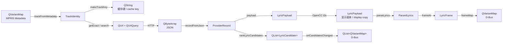
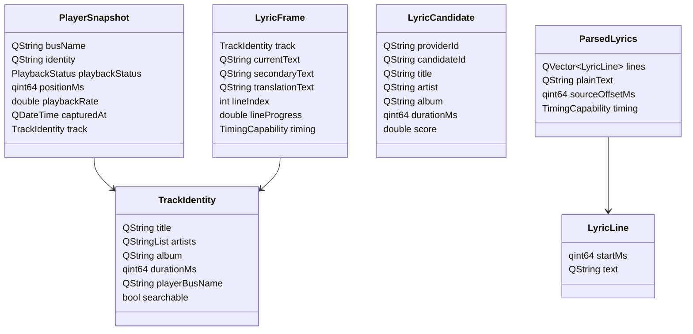
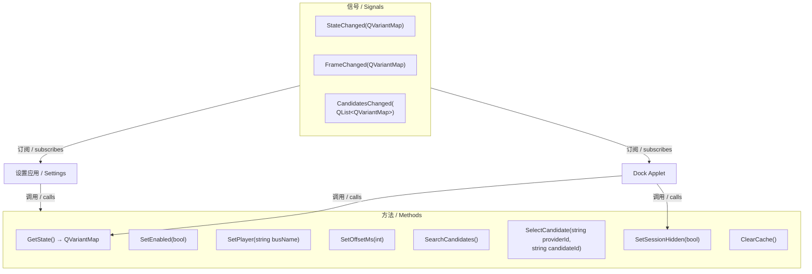
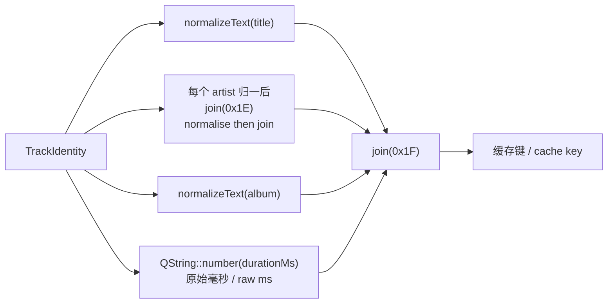
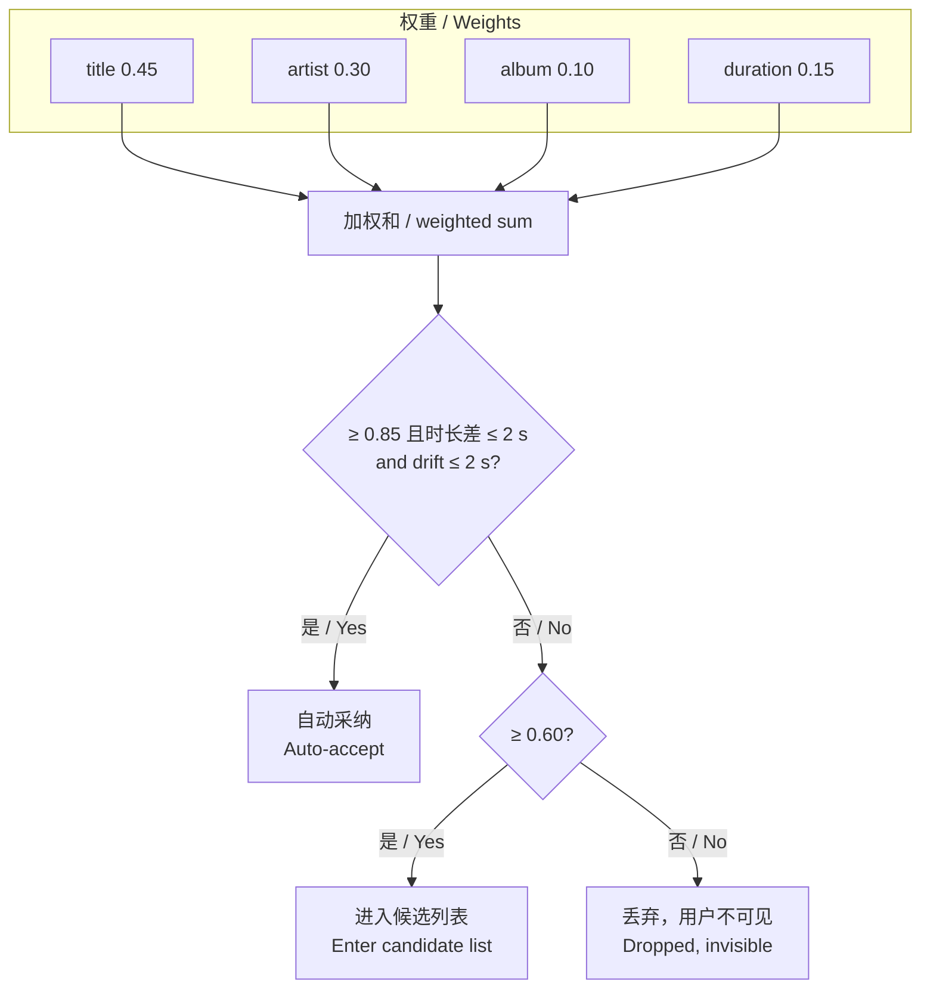
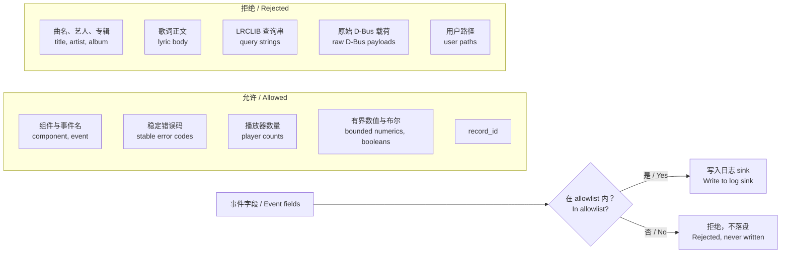

# 04 数据流与契约 / Data Flow and Contracts

本文描述数据类型的转换链与跨进程契约，对应 V1 已实现结构。
This document describes the type transformation chain and cross-process contracts as implemented in V1.

## 1. 类型转换链 / Type Transformation Chain



**中文**

两处值得注意的分叉：

- **`ProviderRecord` 同时产出候选与载荷。** `rankLyricCandidates` 只取元数据字段构造 `LyricCandidate`，丢弃 `payload`——这是 [issues/007](../issues/007-candidate-list-lacks-lyric-preview.md) 的根因。
- **OpenCC 只作用于显示副本。** 缓存保存的是来源原文，转换发生在 `parseLyrics` 之前。因此查询与打分使用的仍是未归一文本，见 [issues/001](../issues/001-cjk-text-score-always-zero.md)。

**English**

Two forks are notable:

- **`ProviderRecord` yields both candidates and payload.** `rankLyricCandidates` takes only metadata fields to build `LyricCandidate` and discards `payload` — the root cause of [issues/007](../issues/007-candidate-list-lacks-lyric-preview.md).
- **OpenCC applies only to the display copy.** The cache stores source text, and conversion happens just before `parseLyrics`. Queries and scoring therefore still use unnormalised text — see [issues/001](../issues/001-cjk-text-score-always-zero.md).

## 2. 核心数据结构 / Core Data Structures

**中文**

定义位于 [common/lyrics-core/include/lyricscore/types.h](../common/lyrics-core/include/lyricscore/types.h)。

**English**

Defined in [common/lyrics-core/include/lyricscore/types.h](../common/lyrics-core/include/lyricscore/types.h).



**中文**

`LyricFrame.translationText` 是预留字段，V1 中必须为空——LRCLIB 不提供翻译歌词。若未来接入带翻译的源，此字段可直接使用，无需改动契约。

`ParsedLyrics.sourceOffsetMs` 承载 LRC 文件内的 `[offset:]` 标签，与用户配置的 `m_offsetMs` 是两个独立量，在 `frameAt()` 中共同参与计算。

**English**

`LyricFrame.translationText` is a reserved field that must stay empty in V1, since LRCLIB provides no translations. Should a translating source arrive later, the field is ready without a contract change.

`ParsedLyrics.sourceOffsetMs` carries the LRC file's own `[offset:]` tag and is distinct from the user-configured `m_offsetMs`; both feed into `frameAt()`.

## 3. D-Bus 契约 / D-Bus Contract

```text
服务名 / Service:    org.deepin.LyricsDock1
对象路径 / Path:     /org/deepin/LyricsDock1
接口 / Interface:    org.deepin.LyricsDock1
错误前缀 / Errors:   org.deepin.LyricsDock1.Error.*
```



**中文**

方法调用权限无区分——Applet 与设置应用使用同一接口。实践中 Applet 只调用 `GetState()` 与 `SetSessionHidden()`，其余为设置应用使用。

错误码经 `dbusErrorName()` 转换为驼峰式 D-Bus 错误名，例如 `network-unavailable` → `org.deepin.LyricsDock1.Error.NetworkUnavailable`。

**English**

Method access is undifferentiated — the applet and settings app share one interface. In practice the applet calls only `GetState()` and `SetSessionHidden()`; the rest belong to the settings app.

Error codes pass through `dbusErrorName()` into camel-case D-Bus error names, e.g. `network-unavailable` becomes `org.deepin.LyricsDock1.Error.NetworkUnavailable`.

## 4. 帧载荷字段 / Frame Payload Fields

**中文**

`frameMap()` 构造，位于 [lyricsservicecontroller.cpp:42-54](../daemon/lyrics-dockd/application/lyricsservicecontroller.cpp#L42-L54)。

**English**

Built by `frameMap()` at [lyricsservicecontroller.cpp:42-54](../daemon/lyrics-dockd/application/lyricsservicecontroller.cpp#L42-L54).

| 键 / Key | 类型 / Type | 说明 / Description |
|---|---|---|
| `currentText` | QString | 当前行文本 / Current line text |
| `secondaryText` | QString | 下一行文本 / Next line text |
| `translationText` | QString | V1 中恒为空 / Always empty in V1 |
| `lineIndex` | int | 当前行索引，-1 表示无 / Current line index, -1 for none |
| `lineProgress` | double | 行内进度 0.0–1.0 / Intra-line progress |
| `timingCapability` | QString | `none` / `plain` / `line` |
| `source` | QString | 歌词源 ID，如 `lrclib` / Source ID |
| `trackKey` | QString | 源为空时置空 / Empty when source is empty |

**中文**

`trackKey` 由 `makeTrackKey` 生成，含原始毫秒时长——这是 [issues/005](../issues/005-cache-key-duration-jitter.md) 的影响范围之一。该字段供 Applet 判断帧是否属于同一曲目。

**English**

`trackKey` comes from `makeTrackKey` and embeds the raw millisecond duration, one of the surfaces affected by [issues/005](../issues/005-cache-key-duration-jitter.md). The applet uses it to tell whether a frame belongs to the same track.

## 5. 缓存键构造 / Cache Key Construction



**中文**

使用 ASCII 控制字符作为分隔符：`0x1F`（单元分隔符）分隔字段，`0x1E`（记录分隔符）分隔多艺人。这避免了曲名或艺人名中出现分隔符导致的键碰撞。

`normalizeText` 执行 NFKC 归一化、`simplified()` 与 `toCaseFolded()`，但**不含繁简转换**——这使繁简写法不同的同一曲目产生不同键。

**English**

ASCII control characters serve as separators: `0x1F` (unit separator) between fields and `0x1E` (record separator) between multiple artists. This avoids key collisions when a title or artist name itself contains a separator.

`normalizeText` performs NFKC normalisation, `simplified()`, and `toCaseFolded()`, but **no script conversion** — so the same track written in different scripts yields different keys.

## 6. 评分权重构成 / Score Weight Composition

**中文**

`scoreLyricCandidate` 位于 [normalization.cpp:70-83](../common/lyrics-core/src/normalization.cpp#L70-L83)。

**English**

`scoreLyricCandidate` lives at [normalization.cpp:70-83](../common/lyrics-core/src/normalization.cpp#L70-L83).



**中文**

时长得分本身是分段函数：差值 ≤ 2000 ms 得 1.0，超出后按 `1.0 - (差值 - 2000) / 8000` 线性衰减至 0。因此时长差 10 s 以上得 0 分。

关键观察：`0.45 (title 满分) + 0.15 (duration 满分) = 0.60`，恰好等于候选过滤线。这意味着艺名与专辑全不匹配时，正确匹配的得分精确落在过滤边界上，任何额外扣分都会使其消失。详见 [issues/003](../issues/003-artist-name-variance-drops-candidates.md)。

**English**

The duration term is itself piecewise: a drift within 2000 ms scores 1.0, beyond which it decays linearly as `1.0 - (drift - 2000) / 8000` down to zero. A drift over 10 s therefore scores nothing.

The key observation: `0.45` (perfect title) plus `0.15` (perfect duration) equals `0.60`, exactly the candidate filter line. So when artist and album both fail to match, a correct match lands precisely on the boundary and any further deduction makes it vanish. See [issues/003](../issues/003-artist-name-variance-drops-candidates.md).

## 7. 日志隐私过滤 / Log Privacy Filtering



**中文**

过滤在 `LogEngine::write` 内以 allowlist 方式实施——未列入的字段被拒绝，而非尝试脱敏。这是「默认拒绝」而非「默认允许」的设计。

若新增字段（如 [issues/007](../issues/007-candidate-list-lacks-lyric-preview.md) 的歌词预览），须验证其被 allowlist 拒绝，而非意外通过。

**English**

Filtering happens inside `LogEngine::write` as an allowlist — unlisted fields are rejected rather than redacted. This is deny-by-default, not allow-by-default.

When a new field appears, such as the lyric preview in [issues/007](../issues/007-candidate-list-lacks-lyric-preview.md), verify that the allowlist rejects it rather than letting it slip through.

## 8. 契约变更影响面 / Contract Change Impact

**中文**

修改 `LyricCandidate` 或 `LyricFrame` 时需同步更新的位置：

**English**

Locations requiring synchronised updates when `LyricCandidate` or `LyricFrame` changes:

| 层 / Layer | 文件 / File |
|---|---|
| 类型定义 / Type definition | [common/lyrics-core/include/lyricscore/types.h](../common/lyrics-core/include/lyricscore/types.h) |
| 构造 / Construction | [common/lyrics-core/src/normalization.cpp](../common/lyrics-core/src/normalization.cpp)（候选 / candidates）、[lyricsync.cpp](../common/lyrics-core/src/lyricsync.cpp)（帧 / frames） |
| 序列化 / Serialisation | [daemon/lyrics-dockd/application/lyricsservicecontroller.cpp](../daemon/lyrics-dockd/application/lyricsservicecontroller.cpp) |
| D-Bus 传输 / Transport | [daemon/lyrics-dockd/infrastructure/lyricsdbusadapter.cpp](../daemon/lyrics-dockd/infrastructure/lyricsdbusadapter.cpp) |
| 设置端反序列化 / Settings deserialisation | [apps/lyrics-settings/settingsviewmodel.cpp](../apps/lyrics-settings/settingsviewmodel.cpp) |
| Applet 端反序列化 / Applet deserialisation | [dock-applet/lyricsdockviewmodel.cpp](../dock-applet/lyricsdockviewmodel.cpp) |
| 契约文档 / Contract docs | [DOCK_LYRICS_TECHNICAL_PLAN_ZH.md](../DOCK_LYRICS_TECHNICAL_PLAN_ZH.md) §9、[LYRICS_DOCK_TECHNICAL_PLAN.md](../LYRICS_DOCK_TECHNICAL_PLAN.md) §9 |
