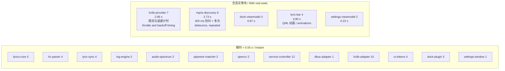
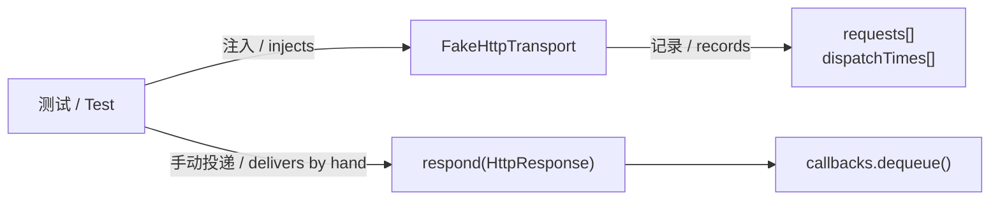
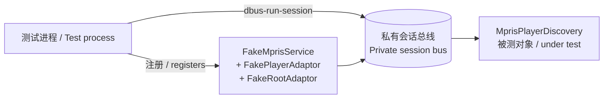
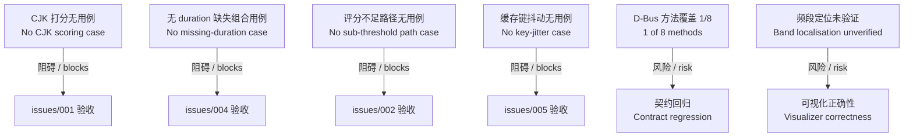

# 05 模块测试数据 / Module Test Data

本文记录各模块的测试用例、实际断言值与覆盖缺口。所有数值取自 `HEAD`（`acfd1ed`）源码与实测运行。
This document records per-module test cases, actual assertion values, and coverage gaps. All figures come from `HEAD` (`acfd1ed`) source and measured runs.

运行方式与隔离策略见 [tests/README.md](../tests/README.md)。
For how to run the suite and its isolation strategy, see [tests/README.md](../tests/README.md).

## 1. 总览 / Overview

| 指标 / Metric | 值 / Value |
|---|---|
| 测试目标 / Targets | 18 |
| 测试用例 / Cases | 73 |
| 全套耗时 / Suite duration | 约 7.7 s / approx 7.7 s |
| 最慢目标 / Slowest target | `lrclib-provider-test` 约 2.85 s / approx |
| 次慢目标 / Second slowest | `mpris-player-discovery-test` 约 2.73 s / approx |



**中文**

两个慢目标的耗时来自**真实时间等待**而非低效实现：`lrclib-provider-test` 验证 300 ms 最小请求间隔与 300/600 ms 指数退避；`mpris-player-discovery-test` 多次触发 400 ms 曲目防抖。这些计时不可用假时钟替代，否则测的就不是真实行为。

**English**

Both slow targets spend their time on **genuine waits**, not inefficiency: `lrclib-provider-test` verifies the 300 ms minimum request gap and the 300/600 ms exponential backoff; `mpris-player-discovery-test` triggers the 400 ms track debounce several times. Substituting a fake clock would stop testing the real behaviour.

## 2. Lyrics::Core — 纯逻辑 / Pure Logic

### 2.1 `lyrics-core-test` — 3 用例 / cases

| 用例 / Case | 输入 / Input | 断言 / Assertion |
|---|---|---|
| `normalizesWhitespaceUnicodeAndCase` | `"  Ａ�Ｂ  "`（全角 + 表意空格 / full-width plus ideographic space） | `== "a b"` |
| | `"  MÜSIC\tPlayer  "` | `== "müsic player"` |
| `makesStableTrackKeys` | 全角标题 `"  Ｍｙ Song "` vs `"my song"`，不同总线名 / different bus names | 两者键相同 / keys identical |
| | 同上 | 键不含 `playerBusName` / key excludes bus name |
| `scoresAndRanksCandidates` | 标题 `"Example Track"` vs 记录 `" example   track "`，时长 213000 vs 214000 | `score >= 0.85` |
| | 时长 220000（差 7 s / 7 s drift） | 分数低于精确匹配 / scores below exact |
| | 完全不相干记录 / unrelated record | 不出现在排序结果中 / absent from ranking |

**中文**

`scoresAndRanksCandidates` 的精确用例时长差为 **1000 ms**，在 2000 ms 容差内，故 `durationScore = 1.0`。这解释了为何该用例能过 0.85 而实际中文曲目常常不能——测试数据全为拉丁字符，恰好避开了 [issues/001](../issues/001-cjk-text-score-always-zero.md) 的 CJK 分词缺陷。

**English**

The exact case in `scoresAndRanksCandidates` uses a **1000 ms** duration delta, within the 2000 ms tolerance, so `durationScore = 1.0`. This explains why the case clears 0.85 while real Chinese tracks often cannot: the test data is entirely Latin and therefore sidesteps the CJK tokenisation defect in [issues/001](../issues/001-cjk-text-score-always-zero.md).

### 2.2 `lrc-parser-test` — 4 用例 / cases

**中文**

`parsesTimedFixture` 使用 `fixtures/complex.lrc`，断言解析后的精确结果：

**English**

`parsesTimedFixture` uses `fixtures/complex.lrc` and asserts the exact parse result:

| 索引 / Index | `startMs` | `text` | 覆盖的边界 / Edge case |
|---|---|---|---|
| 0 | 1250 | `中文歌词` | 单行多时间戳中较早者 / earlier of two timestamps on one line |
| 1 | 2345 | `English lyric` | 三位毫秒 / three-digit ms |
| 2 | 3000 | `日本語 한국어` | 无小数部分 + 日韩 / no fraction, Japanese and Korean |
| 3 | 4000 | `last duplicate` | 重复时间戳取后者 / later of duplicates wins |
| 4 | 5500 | `中文歌词` | 同行第二个时间戳 / second timestamp of same line |

```
其余断言 / Other assertions:
  timing         == TimingCapability::Line
  sourceOffsetMs == 120          （来自 [offset:+120] / from the tag）
  lines.size()   == 5            （元信息行与裸文本被剔除 / metadata and bare text excluded）
```

**中文**

另三个用例：`removesControlCharacters` 断言控制符被剥离但 Unicode 保留（结果 `"保留Unicode 日本語"`）；`fallsBackToPlainLyrics` 断言无时间戳时 `timing == Plain` 且 `lines` 为空；`returnsNoneForEmptyLyrics` 断言空输入得 `timing == None`。

**English**

The other three: `removesControlCharacters` asserts control characters are stripped while Unicode survives (yielding `"保留Unicode 日本語"`); `fallsBackToPlainLyrics` asserts `timing == Plain` with empty `lines` when no timestamps exist; `returnsNoneForEmptyLyrics` asserts empty input yields `timing == None`.

### 2.3 `lyric-sync-test` — 4 用例 / cases

**中文**

固定输入为三行歌词：`{1000: "First", 3000: "Second", 5000: "Last"}`。

**English**

The fixed input is three lines: `{1000: "First", 3000: "Second", 5000: "Last"}`.

| 位置 ms / Position ms | `lineIndex` | `currentText` | `secondaryText` | `lineProgress` |
|---|---|---|---|---|
| 0（首行前 / before first） | -1 | `""` | `"First"` | 0.0 |
| 2000 | 0 | `"First"` | `"Second"` | 0.5 |
| 末行后 / after last | 2 | `"Last"` | `""` | 1.0 |
| 5200 | 2 | — | — | — |
| 回退至 1500 / rewind to 1500 | 0 | `"First"` | — | 0.25 |
| 2500 → 加偏移 / with offset | 1 | — | — | 0.0 |

**中文**

`lineProgress = 0.5` 于位置 2000 ms 处：当前行起于 1000、下一行起于 3000，故 `(2000-1000)/(3000-1000) = 0.5`。这验证了行内进度是**线性插值**，非真实逐字时间。

首行之前 `lineIndex == -1` 但 `secondaryText` 已填充 `"First"`，即前奏期间 Dock 显示下一句而当前句为空。

**English**

`lineProgress = 0.5` at position 2000 ms: the current line starts at 1000 and the next at 3000, so `(2000-1000)/(3000-1000) = 0.5`. This confirms intra-line progress is **linear interpolation**, not real word timing.

Before the first line, `lineIndex == -1` yet `secondaryText` already holds `"First"` — during an intro the Dock shows the upcoming line with the current one empty.

## 3. Lyrics::Service — 服务层 / Service Layer

### 3.1 `lrclib-provider-test` — 7 用例 / cases



| 用例 / Case | 验证内容 / Verifies |
|---|---|
| `buildsExactRequestAndParsesRecord` | URL 参数构造与 JSON 解析 / URL parameter construction and JSON parsing |
| `serializesRequestsWithMinimumInterval` | 相邻请求间隔 ≥ 300 ms / adjacent requests at least 300 ms apart |
| `retriesServerFailureThenReportsNetworkError` | 5xx 重试 2 次后报 `network-unavailable` / retries twice then reports |
| `retryBackoffPreservesQueueOrder` | 退避期间队列顺序不乱 / queue order preserved during backoff |
| `honorsRetryAfterCooldown` | 429 + `Retry-After` 秒数 / seconds form |
| `acceptsRetryAfterHttpDate` | 429 + RFC 2822 日期格式 / HTTP-date form |
| `rejectsUnknownDurationAndInvalidId` | 无 duration 得 `track-not-searchable`；非数字 ID 得 `invalid-candidate` |

**中文**

最后一个用例正是 [issues/004](../issues/004-missing-duration-blocks-all-queries.md) 的现行行为被**测试固化**的地方：`rejectsUnknownDurationAndInvalidId` 断言无 duration 时返回 `track-not-searchable`。修复 004 时必须同步修改该用例——它当前锁定的是缺陷行为。

**English**

The last case is where the behaviour described in [issues/004](../issues/004-missing-duration-blocks-all-queries.md) is **locked in by a test**: `rejectsUnknownDurationAndInvalidId` asserts that a missing duration returns `track-not-searchable`. Fixing 004 requires changing this case, since it currently pins the defective behaviour in place.

### 3.2 `lrclib-lyrics-adapter-test` — 10 用例 / cases

**中文**

每个用例创建独立 `QTemporaryDir`，SQLite 库随用例销毁。

**English**

Each case creates its own `QTemporaryDir`; the SQLite database is destroyed with the case.

| 用例 / Case | 验证内容 / Verifies |
|---|---|
| `exactHitCachesAndReplaysOffline` | 精确命中写缓存，二次播放不联网 / caches on hit, no network on replay |
| `exact404SearchesAndFetchesHighConfidenceRecord` | 404 降级到候选搜索 / degrades to candidate search on 404 |
| `exactProviderErrorDoesNotSearch` | 提供方错误不触发候选搜索 / provider error does not trigger search |
| `publishesAmbiguousCandidatesForUserSelection` | 低置信度发布候选列表 / publishes candidates when confidence is low |
| `instrumentalResultBecomesNegativeCache` | 纯音乐写负缓存 / instrumental becomes a negative entry |
| `negativeCacheBlocksAutomaticButManualBypasses` | 负缓存阻断自动、不阻断手动 / blocks automatic, not manual |
| `persistsRetryAfterCooldown` | 冷却时间持久化 / cooldown persisted |
| `clearsOnlyLyricsDatabase` | 清缓存不影响其他库 / clear touches only the lyrics database |
| `recoversCorruptDatabase` | 损坏库可恢复 / corrupt database recovers |
| `userConfirmedMappingOutranksAutomaticMapping` | 用户选择优先于自动结果 / user choice outranks automatic |

**中文**

`exactProviderErrorDoesNotSearch` 与 [issues/002](../issues/002-exact-match-failure-reported-as-error.md) 相关但**不覆盖**该缺陷：该用例测的是 `ProviderResultKind::ProviderError`（HTTP 层失败）不触发搜索，而 002 说的是 HTTP **成功**但本地评分不足时错误地 `emit failed`。当前无用例覆盖后者——这是修复 002 时必须新增的测试。

**English**

`exactProviderErrorDoesNotSearch` is related to [issues/002](../issues/002-exact-match-failure-reported-as-error.md) but does **not** cover it: the case tests that a `ProviderResultKind::ProviderError` (an HTTP-layer failure) does not trigger a search, whereas 002 concerns an HTTP **success** whose local score falls short and wrongly emits `failed`. No case covers the latter today — a test to add when fixing 002.

### 3.3 `lyrics-service-controller-test` — 12 用例 / cases

| 用例 / Case | 验证内容 / Verifies |
|---|---|
| `followsCoreStateTransitions` | 核心状态机转移 / core state transitions |
| `validatesPublicInputs` | 公开方法参数校验 / public method input validation |
| `sessionHiddenIsNotPersisted` | 会话隐藏不写入 DConfig / session hide not persisted |
| `suppressesPositionOnlyStateUpdates` | 仅位置变化不重发状态 / position-only change suppresses state resend |
| `waitsForStableTrackBeforeLookup` | 稳定曲目事件后才检索 / lookup waits for stable-track event |
| `clearsFrameWhenRawTrackChanges` | 原始元数据变化即清帧 / frame cleared on raw metadata change |
| `publishesFramesForPositionPauseSeekAndOffset` | 播放、暂停、拖动、偏移的帧发布 / frames on play, pause, seek, offset |
| `restartsLookupAfterReenable` | 重新启用后重启检索 / lookup restarts after re-enable |
| `convertsTraditionalLyricsBeforeParsing` | 解析前繁转简 / script conversion precedes parsing |
| `keepsSourceLyricsWhenConversionFails` | 转换失败保留原文 / source text kept when conversion fails |
| `limitsVisualizerToPlayingNoLyricsState` | 可视化仅在播放且无歌词时启用 / visualizer only when playing with no lyrics |
| `keepsVisualizerDisabledByDefault` | 可视化默认关闭 / visualizer off by default |

**中文**

`convertsTraditionalLyricsBeforeParsing` 验证的是**显示副本**的转换，与 [issues/001](../issues/001-cjk-text-score-always-zero.md) 指出的「查询与打分未归一」不冲突——两者是不同位置。该用例通过并不意味着匹配层的繁简问题已解决。

末两个用例来自 S06-1 音频可视化（提交 `acfd1ed`），是本目标从 11 增至 12 个用例的来源。

**English**

`convertsTraditionalLyricsBeforeParsing` verifies conversion of the **display copy** and does not contradict [issues/001](../issues/001-cjk-text-score-always-zero.md), which concerns queries and scoring going unnormalised — different locations. This case passing does not mean the matching layer's script problem is solved.

The last two cases come from the S06-1 visualizer work (commit `acfd1ed`) and account for this target rising from 11 to 12 cases.

### 3.4 `opencc-chinese-script-converter-test` — 2 用例 / cases

```
输入 / Input:  "[00:01.00]後來我總算學會了如何去愛\n[00:03.00]夢想與現實"
输出 / Output: "[00:01.00]后来我总算学会了如何去爱\n[00:03.00]梦想与现实"

输入 / Input:  "繁體中文與夢想"
输出 / Output: "繁体中文与梦想"

输入 / Input:  ""  →  输出为空且 has_value() / empty with has_value()
```

**中文**

关键断言：**时间戳原样保留**。OpenCC 只转换汉字，`[00:01.00]` 不受影响。这是歌词转换的必要性质——若时间戳被改写，同步会失效。

该测试依赖系统安装 OpenCC 字典（`t2s.json`）。若缺失，`isValid()` 返回假、`QVERIFY` 失败，且 daemon 启动会以退出码 3 终止。

**English**

The key assertion: **timestamps pass through untouched**. OpenCC converts only Han characters, leaving `[00:01.00]` intact. This is an essential property for lyric conversion — a rewritten timestamp would break synchronisation.

The test requires OpenCC dictionaries (`t2s.json`) installed system-wide. Without them `isValid()` returns false, `QVERIFY` fails, and the daemon exits with code 3 at startup.

### 3.5 `audio-spectrum-analyzer-test` — 2 用例 / cases

| 用例 / Case | 输入 / Input | 断言 / Assertion |
|---|---|---|
| `returnsZeroForSilence` | 128 个 0.0 样本 / 128 zero samples | 全部 16 个频段为 0.0 / all 16 bands zero |
| `returnsBoundedEnergyForAudio` | `0.8 × sin(2π × 8n/128)`，128 样本 / samples | 每频段 ∈ [0.0, 1.0]；至少一段 > 0.05 / each band in range, at least one above 0.05 |

**中文**

第二个用例只断言「有能量且有界」，**不断言能量落在哪个频段**。8 周期的正弦波理论上应集中在特定频段，但测试未验证频率定位正确性。这是一处覆盖缺口，见 §5。

**English**

The second case asserts only "bounded with some energy" and does **not** assert which band carries it. An 8-cycle sine should concentrate in a specific band, but the test does not verify frequency localisation. This is a coverage gap; see §5.

## 4. 跨进程与 UI / Cross-Process and UI

### 4.1 `mpris-player-discovery-test` — 6 用例 / cases



| 用例 / Case | 验证内容 / Verifies |
|---|---|
| `discoversAndSwitchesPlayers` | 发现两个播放器并切换 / discovers two players and switches |
| `rediscoversRestartedPlayer` | 播放器重启后重新发现 / rediscovers after restart |
| `pollsOnlyWhilePlaying` | 仅播放时轮询位置 / polls position only while playing |
| `debouncesTrackChanges` | 400 ms 防抖生效 / debounce applies |
| `handlesIncompleteMetadataAndExit` | 元数据不全与播放器退出 / incomplete metadata and player exit |
| `resolvesAndClearsSelectedPlayerProcessId` | PID 解析与清除 / PID resolution and clearing |

**中文**

`handlesIncompleteMetadataAndExit` 覆盖元数据缺失，但**未覆盖本机实测的 QQ音乐场景**：缺 `mpris:length` 而 title/artist 齐全。该组合导致 `searchable == false`，是 [issues/004](../issues/004-missing-duration-blocks-all-queries.md) 的触发条件。修复 004 需新增针对此组合的用例。

**English**

`handlesIncompleteMetadataAndExit` covers absent metadata but does **not** cover the QQ Music case measured on this machine: `mpris:length` missing while title and artist are present. That combination drives `searchable == false` and is the trigger for [issues/004](../issues/004-missing-duration-blocks-all-queries.md). Fixing 004 requires a case for it.

### 4.2 `lyric-bar-test` — 4 用例 / cases

| 用例 / Case | 验证内容 / Verifies |
|---|---|
| `smoothsForwardProgressAndResetsBackward` | 前进平滑、回退重置 / smooth forward, reset on rewind |
| `scrollsOnlyOverflowingText` | 仅溢出文本滚动 / scrolls only when text overflows |
| `transitionsLyricsWithAnUpwardBounce` | 换行上弹动画 / upward bounce on line change |
| `showsVisualizerOnlyWhenExplicitlyEnabled` | 可视化需显式启用 / visualizer requires explicit enable |

**中文**

该目标存在已知不稳定：进程在全部用例 PASS 后的退出阶段偶发 SIGSEGV。18 次全套运行中出现 1 次，根因未定位。详见 [tests/README.md §2.1](../tests/README.md#21-已知不稳定--known-flake)。

**English**

This target carries a known flake: the process occasionally segfaults during teardown after all cases pass. Observed once across 18 full-suite runs, root cause unidentified. See [tests/README.md §2.1](../tests/README.md#21-已知不稳定--known-flake).

### 4.3 D-Bus 与 UI 目标 / D-Bus and UI Targets

| 目标 / Target | 用例数 / Cases | 覆盖内容 / Coverage |
|---|---|---|
| `lyrics-dbus-adapter-test` | 1 | 契约导出与第二所有者被拒 / contract export, second owner rejected |
| `lyrics-dock-viewmodel-test` | 3 | 状态跟随、服务重启重连、注册前重试 / state following, reconnect, retry before registration |
| `settings-viewmodel-test` | 2 | 状态跟随与操作调用、服务缺失容错 / state and operations, missing-service tolerance |
| `settings-window-test` | 1 | 可恢复的不可用页面 / recoverable unavailable page |
| `lyrics-ui-test` | 4 | 几何、DTK 调色板映射、QML 绑定刷新、单例注册 / geometry, palette mapping, binding refresh, singleton registration |
| `lyrics-dock-plugin-test` | 3 | Applet 实例化、包契约、中文翻译 / instantiation, package contract, Chinese translations |

**中文**

`lyrics-dbus-adapter-test` 仅 1 个用例，是 18 个目标中覆盖最薄的——D-Bus 契约有 8 个方法与 3 个信号，当前只验证服务名注册与冲突。见 §5。

**English**

`lyrics-dbus-adapter-test` has just one case, the thinnest coverage among the 18 targets: the contract exposes 8 methods and 3 signals, yet only name registration and conflict are verified. See §5.

### 4.4 `log-engine-test` — 2 用例 / cases

**中文**

隐私过滤的核心测试。断言 allowlist 拒绝敏感字段：

**English**

The core privacy-filter test. It asserts the allowlist rejects sensitive fields:

```
允许通过 / Allowed through:
  state_from, error_code, record_id, offset_ms, player_available_count

被拒绝 / Rejected:
  trackTitle, lyrics, result_code（非法值时 / when value is invalid）

被改写为 "redacted" / Rewritten to "redacted":
  component, eventCode（含非法字符时 / when containing invalid characters）
```

**中文**

`offset_ms` 断言值为 `10000`，说明数值字段有上界钳制。`player_available_count` 断言为 `0`，验证计数字段可为零而不被误拒。

**English**

The `offset_ms` assertion value of `10000` indicates numeric fields are clamped to an upper bound. The `player_available_count` assertion of `0` confirms count fields may be zero without being wrongly rejected.

## 5. 覆盖缺口 / Coverage Gaps

**中文**

以下缺口经逐文件审查确认，按影响排序。这些是「有测试目标但覆盖不足」的具体位置，不是「无测试」。

**English**

The gaps below were confirmed by file-by-file review, ordered by impact. They mark where a target exists but coverage is insufficient — not where tests are absent.



| 缺口 / Gap | 现状 / Current | 应新增 / Should Add | 相关 / Related |
|---|---|---|---|
| CJK 文本相似度 / CJK similarity | 全部打分用例使用拉丁字符 / all scoring cases use Latin | 繁简、版本后缀、日文假名用例 / script variance, version suffixes, kana | [001](../issues/001-cjk-text-score-always-zero.md) |
| 评分不足降级 / Sub-threshold degradation | 仅覆盖 HTTP 错误路径 / HTTP error path only | HTTP 成功但评分 < 0.85 应降级而非 `failed` | [002](../issues/002-exact-match-failure-reported-as-error.md) |
| 艺名差异 / Artist variance | 无用例 / none | 艺名不同、标题时长精确的候选应可见 / candidate must stay visible | [003](../issues/003-artist-name-variance-drops-candidates.md) |
| 缺 duration 组合 / Missing-duration combination | 现有用例锁定缺陷行为 / existing case pins defective behaviour | `keywordSearchable` 为真、`exactSearchable` 为假 | [004](../issues/004-missing-duration-blocks-all-queries.md) |
| 缓存键抖动 / Cache key jitter | 仅测归一化等价 / only normalisation equivalence | 时长差 1–999 ms 应同键 / same key within sub-second drift | [005](../issues/005-cache-key-duration-jitter.md) |
| 空 album 参数 / Empty album parameter | 无用例 / none | 空 album 时 URL 不含该参数 / URL omits the parameter | [006](../issues/006-album-param-always-sent.md) |
| D-Bus 方法 / D-Bus methods | 8 方法中仅间接覆盖注册 / only registration, indirectly | 每个方法的参数校验与错误名映射 / per-method validation and error mapping | — |
| 频段定位 / Band localisation | 仅断言有界有能量 / bounded with energy only | 已知频率应落在预期频段 / known frequency lands in expected band | — |
| 帧节流 / Frame throttle | 无用例 / none | 200 ms 内多次变更应合并为一次发布 / coalesced into one publish | — |
| 代次守卫 / Generation guard | 无直接用例 / no direct case | 快速切歌时旧响应被丢弃 / stale response discarded on rapid skip | — |

**中文**

前六项与 [issues/](../issues/) 一一对应。修复对应缺陷时，必须同步补齐用例——否则修复无法被验收，且未来可能回归。

第七项（D-Bus 方法覆盖）不对应任何已知缺陷，但风险实质：契约有 8 个方法，任一参数校验或错误名映射变化都不会被现有测试捕获。

**English**

The first six map one-to-one onto [issues/](../issues/). Fixing each defect requires adding its case; otherwise the fix cannot be accepted and may silently regress later.

The seventh (D-Bus method coverage) maps to no known defect but carries real risk: with 8 methods in the contract, a change to any parameter validation or error-name mapping would escape the current tests.

## 6. 测试与缺陷对应表 / Test-to-Defect Mapping

**中文**

修复 [issues/](../issues/) 中各问题时需改动的测试文件：

**English**

Test files to change when fixing each issue in [issues/](../issues/):

| 问题 / Issue | 需修改 / Modify | 需新增 / Add |
|---|---|---|
| [001](../issues/001-cjk-text-score-always-zero.md) CJK 打分 | — | `test_lyricscore.cpp`：5 个 CJK 用例 / 5 CJK cases |
| [002](../issues/002-exact-match-failure-reported-as-error.md) 误报错误 | — | `test_lrcliblyricsadapter.cpp`：低分降级用例 / degradation case |
| [003](../issues/003-artist-name-variance-drops-candidates.md) 艺名差异 | `test_lyricscore.cpp` 中 `scoresAndRanksCandidates` 的阈值断言 / threshold assertion | 区分度用例 / discrimination case |
| [004](../issues/004-missing-duration-blocks-all-queries.md) 缺 duration | **`test_lrclibprovider.cpp` 的 `rejectsUnknownDurationAndInvalidId`（当前锁定缺陷行为）** | `test_mprisplayerdiscovery.cpp`：能力分级用例 / capability-tier case |
| [005](../issues/005-cache-key-duration-jitter.md) 缓存键 | `test_lyricscore.cpp` 中 `makesStableTrackKeys` | 抖动等价用例 / jitter equivalence case |
| [006](../issues/006-album-param-always-sent.md) 空 album | — | `test_lrclibprovider.cpp`：URL 参数省略用例 / omission case |
| [007](../issues/007-candidate-list-lacks-lyric-preview.md) 歌词预览 | `test_lyricscore.cpp`、`test_lyricsdbusadapter.cpp`、`test_settingsviewmodel.cpp`（契约变更 / contract change） | `test_logengine.cpp`：预览文本须被 allowlist 拒绝 / preview must be rejected |

**中文**

其中 004 一行加粗，因为它是唯一需要**修改现有断言**而非仅新增的：`rejectsUnknownDurationAndInvalidId` 当前断言无 duration 返回 `track-not-searchable`，而修复后该路径应走关键词检索。不改这个用例，修复无法通过测试。

**English**

The 004 row is emphasised because it is the only one requiring an **existing assertion to change** rather than a mere addition: `rejectsUnknownDurationAndInvalidId` currently asserts that a missing duration returns `track-not-searchable`, whereas after the fix that path should fall through to keyword search. Without changing this case, the fix cannot pass the suite.
