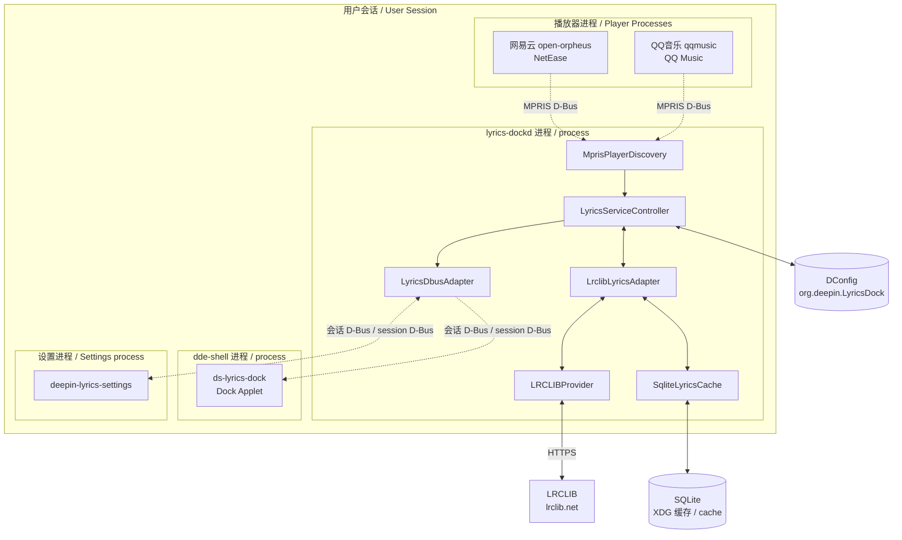

# Deepin Dock Lyrics 设计图索引 / Design Diagram Index

本目录以图为主记录系统的实际结构与运行时行为。所有图对应 V1 已实现的代码，非规划态。
This directory documents the system's actual structure and runtime behaviour, diagram-first. Every diagram reflects code as implemented in V1, not a planned state.

## 与其他目录的分工 / Relationship to Other Directories

| 目录 / Directory | 描述的时态 / Tense | 内容 / Content |
|---|---|---|
| [specs/](../specs/) | 应当如何 / Prescriptive | 实施规格与验收条件 / Implementation specs and acceptance criteria |
| `design/`（本目录 / here） | 当前如何 / Descriptive | 已实现结构、时序、状态机 / Implemented structure, sequences, state machines |
| [issues/](../issues/) | 何处不对 / Defects | 已确认缺陷与修复方案 / Confirmed defects and fix plans |
| [tests/README.md](../tests/README.md) | 如何验证 / Verification | 测试运行方式与隔离策略 / How to run the suite and its isolation strategy |
| [DOCK_LYRICS_MULTISOURCE_PLAN.md](../DOCK_LYRICS_MULTISOURCE_PLAN.md) | 将要如何 / Forward-looking | 多源架构演进方案 / Multi-source evolution plan |

**中文**

本目录的图**必须与代码一致**。修改代码后若图失效，应同步更新或在图上标注偏差。图中标注的常量（超时、轮询间隔、阈值）均从源码读取，附文件行号。

**English**

Diagrams here **must match the code**. When a change invalidates a diagram, update it or annotate the divergence. Every constant shown (timeouts, poll intervals, thresholds) is read from source and cited with a file and line reference.

## 文件 / Files

| 文件 / File | 内容 / Content |
|---|---|
| [01-system-architecture.md](01-system-architecture.md) | 进程边界、模块依赖、构建目标 / Process boundaries, module dependencies, build targets |
| [02-runtime-sequences.md](02-runtime-sequences.md) | 启动、切歌、候选选择、错误路径时序 / Startup, track change, candidate selection, error sequences |
| [03-state-machines.md](03-state-machines.md) | 服务状态机、播放器可用性、缓存状态 / Service status, player availability, cache states |
| [04-data-flow.md](04-data-flow.md) | 数据类型转换链与 D-Bus 契约 / Type transformation chain and D-Bus contract |
| [05-test-data.md](05-test-data.md) | 各模块测试用例、断言值与覆盖缺口 / Per-module cases, assertion values, coverage gaps |

## 系统全景 / System Overview

**中文**

三个进程边界是本设计的核心约束：网络请求、解析与缓存全部留在 `lyrics-dockd`，Shell 进程只做渲染。歌词源异常或网络缓慢不会阻塞桌面。

**English**

The three process boundaries are this design's central constraint: all network access, parsing, and caching stay inside `lyrics-dockd`, while the Shell process only renders. A slow network or misbehaving source cannot block the desktop.

## 关键运行时常量 / Key Runtime Constants

| 常量 / Constant | 值 / Value | 位置 / Location |
|---|---|---|
| 位置轮询间隔 / Position poll interval | 200 ms | [mprisplayerdiscovery.cpp:117](../daemon/lyrics-dockd/mprisplayerdiscovery.cpp#L117) |
| 曲目防抖延迟 / Track debounce delay | 400 ms | [mprisplayerdiscovery.cpp:119](../daemon/lyrics-dockd/mprisplayerdiscovery.cpp#L119) |
| 帧发布节流 / Frame publish throttle | 200 ms | [lyricsdbusadapter.cpp:41](../daemon/lyrics-dockd/infrastructure/lyricsdbusadapter.cpp#L41) |
| HTTP 请求最小间隔 / Minimum request gap | 300 ms | [lrclibprovider.cpp:15](../daemon/lyrics-dockd/infrastructure/lrclibprovider.cpp#L15) |
| HTTP 超时 / HTTP timeout | 10000 ms | [lrclibprovider.cpp:164](../daemon/lyrics-dockd/infrastructure/lrclibprovider.cpp#L164) |
| HTTP 最大重试 / Maximum attempts | 2 | [lrclibprovider.cpp:16](../daemon/lyrics-dockd/infrastructure/lrclibprovider.cpp#L16) |
| 自动采纳阈值 / Auto-accept threshold | 0.85 | [lrcliblyricsadapter.cpp:108](../daemon/lyrics-dockd/infrastructure/lrcliblyricsadapter.cpp#L108) |
| 候选过滤阈值 / Candidate filter threshold | 0.60 | [normalization.cpp:92](../common/lyrics-core/src/normalization.cpp#L92) |
| 时长容差 / Duration tolerance | 2000 ms | [lrcliblyricsadapter.cpp:107](../daemon/lyrics-dockd/infrastructure/lrcliblyricsadapter.cpp#L107) |
| 候选返回上限 / Candidate cap | 20 | [lrclibprovider.cpp:244](../daemon/lyrics-dockd/infrastructure/lrclibprovider.cpp#L244) |

**中文**

其中自动采纳阈值 0.85、候选过滤阈值 0.60 与时长容差 2000 ms 三项已确认存在缺陷，见 [issues/001](../issues/001-cjk-text-score-always-zero.md)、[issues/003](../issues/003-artist-name-variance-drops-candidates.md)。图中保留当前值以反映实际行为。

**English**

Three of these — the 0.85 auto-accept threshold, the 0.60 candidate filter, and the 2000 ms duration tolerance — are confirmed defective; see [issues/001](../issues/001-cjk-text-score-always-zero.md) and [issues/003](../issues/003-artist-name-variance-drops-candidates.md). The diagrams retain current values to reflect actual behaviour.
