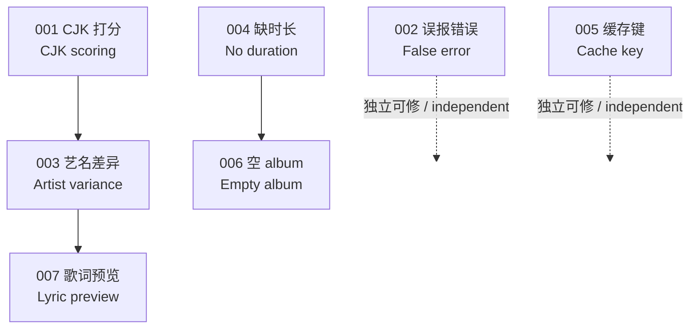

# Deepin Dock Lyrics 问题索引 / Issue Index

本目录记录已确认的缺陷、复现依据与修复方案。每个问题一个文件，编号不复用。
This directory records confirmed defects, reproduction evidence, and fix plans. One file per issue; numbers are never reused.

## 约定 / Conventions

**中文**

- 文件名 `NNN-短横线标题.md`，编号按发现顺序递增。
- 每个问题必须包含：症状、复现依据（实测数据而非推断）、根因定位（文件与行号）、修复方案、验收标准。
- 状态取值：`待修复`、`修复中`、`已修复`、`已关闭（不修）`。
- 已修复的问题保留文件，在状态栏注明修复提交。
- 用实测数字说明影响面。不要写"可能""大概"——没测就标注未验证。

**English**

- Filenames are `NNN-kebab-case-title.md`, numbered in discovery order.
- Each issue must carry: symptom, reproduction evidence (measured, not inferred), root cause with file and line, fix plan, and acceptance criteria.
- Status values: `待修复` (open), `修复中` (in progress), `已修复` (fixed), `已关闭（不修）` (closed, won't fix).
- Fixed issues keep their file; note the fixing commit in the status row.
- Quantify impact with measured numbers. Avoid "probably" — if it is untested, label it unverified.

## 当前问题 / Current Issues

| 编号 / ID | 标题 / Title | 严重度 / Severity | 状态 / Status |
|---|---|---|---|
| [001](001-cjk-text-score-always-zero.md) | CJK 文本相似度恒为 0 / CJK similarity always zero | 高 / High | 待修复 / Open |
| [002](002-exact-match-failure-reported-as-error.md) | 精确匹配未达阈值被报为错误 / Sub-threshold exact match reported as error | 高 / High | 待修复 / Open |
| [003](003-artist-name-variance-drops-candidates.md) | 艺名写法差异导致候选被丢弃 / Artist-name variance drops candidates | 高 / High | 待修复 / Open |
| [004](004-missing-duration-blocks-all-queries.md) | 缺少时长导致完全不发起查询 / Missing duration blocks all queries | 高 / High | 待修复 / Open |
| [005](005-cache-key-duration-jitter.md) | 缓存键含原始时长导致穿透 / Raw duration in cache key causes misses | 中 / Medium | 待修复 / Open |
| [006](006-album-param-always-sent.md) | 空 album 参数仍被发送 / Empty album parameter still sent | 中 / Medium | 待修复 / Open |
| [007](007-candidate-list-lacks-lyric-preview.md) | 候选列表缺少歌词预览 / Candidate list lacks lyric preview | 中 / Medium | 待修复 / Open |

## 依赖关系 / Dependencies

**中文**

001 与 003 同在 `normalization.cpp`，建议合并修复。002 与 005 相互独立，可单独提交。007 需改动 D-Bus 契约，范围最大，建议置后。

**English**

001 and 003 both live in `normalization.cpp` and are best fixed together. 002 and 005 are independent and can land separately. 007 changes the D-Bus contract, has the widest scope, and should come last.

## 建议修复顺序 / Suggested Fix Order

| 批次 / Batch | 包含 / Contains | 理由 / Rationale |
|---|---|---|
| 1 | 002, 005 | 纯逻辑修复，不动算法，风险最低 / Pure logic fixes, no algorithm change, lowest risk |
| 2 | 001, 003 | 同一文件的评分算法改造 / Scoring algorithm rework in one file |
| 3 | 004, 006 | 稀疏元数据路径 / Sparse-metadata path |
| 4 | 007 | 跨 D-Bus 契约与 UI / Spans D-Bus contract and UI |

## 相关文档 / Related Documents

- [DOCK_LYRICS_MULTISOURCE_PLAN.md](../DOCK_LYRICS_MULTISOURCE_PLAN.md) — 多源架构方案，本目录问题 001/003/004/006 对应其 M1/M2 阶段 / Multi-source plan; issues 001/003/004/006 map to its M1/M2 phases
- [specs/04-lrclib-client-and-cache.md](../specs/04-lrclib-client-and-cache.md) — LRCLIB 客户端原始规格 / Original LRCLIB client spec
