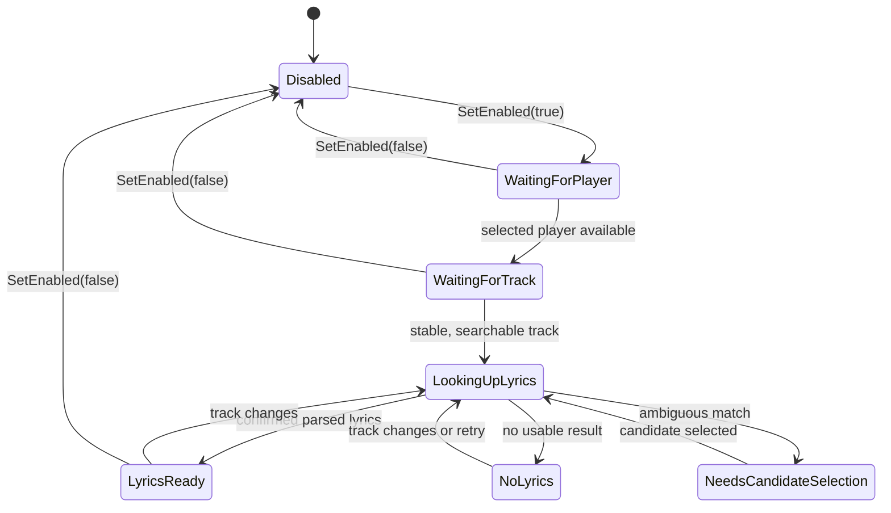

# S03 歌词后台服务与 D-Bus 状态契约

**状态：** 待实施

**前置：** S00、S02
**后续：** S04-S08

## 目标

实现用户会话中的 `lyrics-dockd` 进程，集中管理启用状态、播放器状态、歌词流程和 UI 状态，并通过稳定的 D-Bus 契约向 Dock Applet 与设置应用发布已处理的数据。

## 范围

- 在 session bus 注册服务名 `org.deepin.LyricsDock1`、对象路径 `/org/deepin/LyricsDock1`、接口名 `org.deepin.LyricsDock1`。
- 实现状态机、服务所有权丢失处理和 D-Bus 方法/信号。
- 将 S02 的播放器快照转换为可观察的服务状态；歌词检索与解析由后续规格接入。
- 所有消费者仅通过此服务读取歌曲、歌词帧、候选和错误摘要，不直接访问 MPRIS、SQLite 或 LRCLIB。

## 非范围

- 不在 UI 进程执行 HTTP、数据库写入或 LRC 解析。
- 不通过 D-Bus 发布原始 LRCLIB JSON、歌词全文缓存、请求 URL 或内部异常堆栈。

## 状态机

允许状态：`Disabled`、`WaitingForPlayer`、`WaitingForTrack`、`LookingUpLyrics`、`LyricsReady`、`NoLyrics`、`NeedsCandidateSelection`、`Error`。错误使用稳定机器码，例如 `network-unavailable`、`rate-limited`、`database-failed`；UI 自行映射本地化文案。

## D-Bus 契约

为降低 QML/C++ 跨进程编组风险，首版采用标准 `a{sv}` 和 `aa{sv}`，不传输未经注册的自定义 struct。

| 成员 | 签名 | 约束 |
|---|---|---|
| `GetState` | `() -> a{sv}` | 返回完整当前状态快照 |
| `SetEnabled` | `(b) -> ()` | 持久化总开关 |
| `SetPlayer` | `(s) -> ()` | 参数必须是已发现的 MPRIS 总线名或空字符串 |
| `SetOffsetMs` | `(i) -> ()` | 仅允许 `-10000..10000` |
| `SearchCandidates` | `() -> ()` | 仅当前曲目可检索时触发，受 S04 限流保护 |
| `SelectCandidate` | `(ss) -> ()` | `providerId` 当前仅允许 `lrclib` |
| `SetSessionHidden` | `(b) -> ()` | 仅当前 daemon 生命周期有效，不写入 DConfig |
| `ClearCache` | `() -> ()` | 由设置应用的二次确认后调用 |
| `StateChanged` | `(a{sv})` | 状态、设置、曲目或错误摘要变化时发送 |
| `FrameChanged` | `(a{sv})` | 最多每秒 5 次，只在帧内容实质变化时发送 |
| `CandidatesChanged` | `(aa{sv})` | 当前曲目的候选集替换时发送 |

`GetState` / `StateChanged` 共有的键包括：`status`、`enabled`、`sessionHidden`、`playerBusName`、`availablePlayers`、`trackTitle`、`trackArtists`、`trackAlbum`、`durationMs`、`offsetMs`、`errorCode`、`canSearchCandidates`。`FrameChanged` 包括 `currentText`、`secondaryText`、`translationText`、`lineIndex`、`lineProgress`、`timingCapability`、`source`、`trackKey`。缺失值用空字符串、`-1` 或 `false` 表达，不用未约定的 `null` 变体。

## 行为约束

- 启动后即获取 D-Bus 名称；若名称被其他进程占用，记录错误并退出，不能启动第二个 daemon。
- `FrameChanged` 是增量渲染信号，UI 首次连接或断线重连必须先调用 `GetState`。
- 无可用播放器、无歌词与网络错误是正常可恢复状态，不应导致服务退出。
- 在 `sessionHidden=true` 时仍可更新缓存和状态，但 Applet 不占用可见宽度；daemon 重启时该值恢复为 `false`。
- D-Bus 调用必须校验参数、异步执行耗时操作，并在完成后用信号更新，不能阻塞 session bus 主线程。

## 验收标准

1. `qdbus` 或测试客户端能调用所有方法，并得到与签名一致的返回类型。
2. Dock 与设置应用可在不同启动顺序下连接；服务未启动时 UI 显示可恢复的“等待服务”状态而非崩溃。
3. 暂停期间 10 秒内不超过一次无必要 `FrameChanged`；播放时帧频不高于 5 Hz。
4. 停止、退出和重复启动服务后，旧曲目和旧歌词帧不会残留给新客户端。
