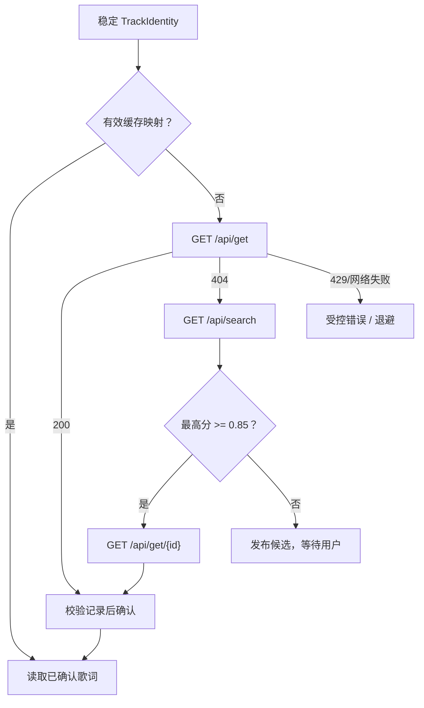
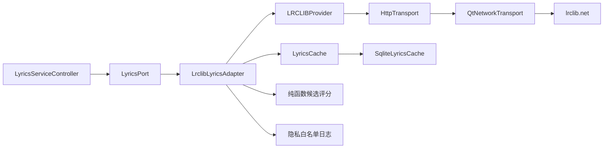

# S04 LRCLIB 客户端、匹配与缓存

**状态：** 已完成（2026-08-12）

**前置：** S00、S03
**后续：** S05、S07

## 目标

实现 LRCLIB 作为唯一在线歌词源的适配器：在遵守其调用规则的前提下，根据 MPRIS 曲目身份取得已确认歌词，并以 SQLite 缓存减少重复请求和隐私暴露。

## 范围

- 实现 `LyricProvider` 的 `LRCLIBProvider`，支持精确查询、候选搜索和按 ID 获取确认记录。
- 实现单一串行请求队列、`User-Agent`、超时、429 退避和可测试的网络传输抽象。
- 实现本地 SQLite 数据库：成功映射、用户手选映射、原始歌词载荷、解析版本、负缓存和限流冷却时间。
- 计算候选本地匹配分数，并只自动选择高置信度记录。

## 非范围

- 不调用任何网易云、QQ、酷狗、Spotify 或非 LRCLIB 的歌词接口。
- 不上传歌词，不使用用户账号、Cookie、令牌或私有 API。
- 不在播放期间按位置、每行或定时器重复查询网络。

## LRCLIB 请求流程

1. 使用 `GET /api/get?track_name=&artist_name=&album_name=&duration=`。`duration` 使用最接近的整数秒；未知时长不调用精确接口。
2. 仅当精确接口返回 `404` 时调用 `GET /api/search`。每次搜索最多接收 20 条候选，不做分页。
3. 搜索候选必须经本地评分；自动匹配后或用户选定后都调用 `GET /api/get/{id}`，以最终记录为准。
4. HTTP 请求全局串行，相邻请求间隔 300 ms。每个请求设置产品名称、版本与 GitHub 项目地址的 `User-Agent`。
5. HTTP `429` 必须严格按 `Retry-After` 阻止后续请求；网络/5xx 使用有上限的指数退避。所有失败均应通知 S03，而非静默无限重试。

## 匹配规则

规范化时去除首尾空白、统一 Unicode、压缩空格、忽略 ASCII 大小写，并分别保存原始字符串。候选分数由标题、艺人交集、专辑和时长构成；时长差超过 2 秒不得自动选择。默认阈值：`>= 0.85` 自动确认，`0.60-0.84` 交给用户，`< 0.60` 不显示为建议。具体权重必须作为纯函数单元测试，不可散落在网络代码中。

## 缓存与隐私

数据库位于 `QStandardPaths::writableLocation(QStandardPaths::CacheLocation)` 对应应用目录，例如 `.../deepin-lyrics-dock/lyrics.sqlite`。至少包含：

| 表 | 内容 | 失效策略 |
|---|---|---|
| `lyrics_records` | LRCLIB ID、同步/纯文本歌词、内容哈希、获取时间 | 30 天后可重新验证 |
| `track_mappings` | 规范化曲目键、记录 ID、置信度、是否用户确认 | 30 天；用户确认映射优先 |
| `negative_results` | 曲目键、原因、创建时间 | 7 天，手动搜索可绕过 |
| `request_cooldown` | 429 的恢复时间 | 到 `Retry-After` 指定时刻 |

- 数据库使用参数化 SQL、事务和 schema version；损坏时先关闭连接，将旧文件改名为带时间戳的 `.corrupt`，再创建新库。
- 日志只记录 LRCLIB 记录 ID、结果类别和错误码；不得记录完整标题、歌手、歌词或 URL 查询串。
- 设置页的“清除本地缓存”仅删除这个数据库；删除前必须二次确认。

## 实现架构

- `LyricProvider` 输出经过校验的 `ProviderRecord` / `LyricPayload`；S04 不解析 LRC，时间轴解析继续由 S05 负责。
- 自动曲目流程使用 `LyricsPort::search()`，优先查成功/负缓存；设置页的显式重试使用 `searchCandidates()`，可绕过负缓存但不能绕过 429 冷却。
- 用户确认只能选择当前一轮已发布的 LRCLIB 候选 ID，旧候选或任意 ID 不会触发下载。
- HTTP 和数据库均位于基础设施层；测试使用 fake transport 与临时 SQLite，不连接真实 LRCLIB。

## 验收标准

1. 单元测试覆盖精确命中、404 后搜索、歧义候选、未知时长、429、网络失败、负缓存和缓存命中。
2. 同一曲目连续播放期间网络请求数为 0；切歌后的单次流程不违反 300 ms 间隔。
3. 每个请求均带有效 `User-Agent`，429 不早于 `Retry-After` 指定时间重试。
4. 缓存命中在离线状态仍可返回已保存歌词；缓存和日志中不出现认证信息或原始完整 HTTP 响应。

## 实现记录

- 扩展 `Lyrics::Core` provider 契约，新增候选评分与排序纯函数；标题、艺人、专辑和时长权重集中实现，`>=0.85` 且时长差不超过 2 秒才自动确认，`0.60-0.84` 发布给用户。
- `LRCLIBProvider` 实现 `/api/get`、`/api/search`、`/api/get/{id}`，请求严格串行且间隔至少 300ms；每次带产品版本与项目地址 `User-Agent`，超时为 10 秒。
- 精确查询仅在 404 时进入搜索；5xx/网络失败最多进行两次指数退避重试，重试期间保持队列顺序；429 同时支持秒数和 HTTP 日期形式的 `Retry-After`，冷却持久化到 SQLite。
- `SqliteLyricsCache` 使用参数化 SQL、事务、WAL、schema version 1、30 天成功缓存、7 天负缓存和用户确认映射。损坏文件改名为带 UTC 时间戳的 `.corrupt-*` 后重建。
- daemon 已组装 `QtNetworkTransport -> LRCLIBProvider -> LrclibLyricsAdapter -> LyricsServiceController`，不接入任何其他歌词源、账号、Cookie 或令牌。
- 日志仅允许数字 LRCLIB 记录 ID、结果类别与稳定错误码；标题、歌手、专辑、歌词、URL 查询和原始 HTTP 响应不会进入日志。
- 验证命令：`cmake -S . -B build-s04-verify -DCMAKE_BUILD_TYPE=Debug`、`cmake --build build-s04-verify -j2`、`ctest --test-dir build-s04-verify --output-on-failure`；8 项测试全部通过。
