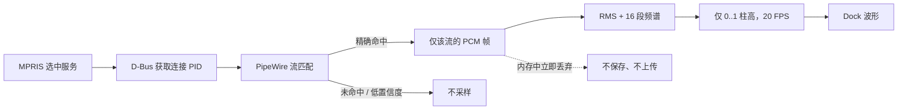

# S06-1 MPRIS 定向音频可视化

**状态：** 已完成（2026-08-13）

**前置：** S02、S03、S06、S07
**后续：** S08、S09

## 目标

当用户选定的 MPRIS 播放器正在播放、歌词正在匹配或未找到歌词时，在 Dock 歌词区域显示实时音频柱状可视化。可视化只分析与该 MPRIS 播放器关联的 PipeWire 音频流，不读取默认输出设备的全局混音。

该能力是可选增强功能，默认关闭。歌词正常可用时仍显示 S06 的歌词 UI。

## 用户体验

| 条件 | Dock 显示 |
|---|---|
| `LyricsReady` | 当前歌词、下一句和行内进度，不显示可视化。 |
| `LookingUpLyrics` 且已精确匹配音频流 | 16 根实时柱状波形和“正在匹配歌词”状态。 |
| `NoLyrics` 且选中播放器仍在播放且已精确匹配音频流 | 16 根实时柱状波形和“未找到歌词”状态。 |
| `Error`（歌词源不可用或请求失败）且已精确匹配音频流 | 16 根实时柱状波形和“歌词暂时不可用”状态。 |
| 暂停、停止、播放器不可用、功能关闭或匹配失败 | 显示原有状态文案；不显示伪造波形。 |

- 柱状图固定在现有 36 px Dock 容器内，不改变 Applet 宽度、Dock 排序或鼠标命中区域。
- 柱数固定为 16，更新频率上限为 20 FPS；峰值衰减平滑但不做逐帧无限动画。
- 设置应用提供“显示当前播放器的音频可视化”开关和简短隐私说明。没有 URL、录音、导出或历史记录选项。

## 非范围

- 不把默认 sink monitor、桌面混音或其他应用的声音作为回退数据源。
- 不录音、不写入 PCM、频谱、音量、歌曲标题或应用 PID 到磁盘，也不通过网络发送这些数据。
- 不控制播放器、音量或 PipeWire 图；不修改 `dde-shell`、PipeWire 或 MPRIS 上游源码。
- 不保证 Wine、浏览器标签页、沙箱多进程播放器或远程音频输出可精确关联。
- 不做专辑封面、声纹识别、音乐识别或歌词来源扩展。

## 架构与数据边界



### 分层

| 层 | 新增职责 |
|---|---|
| `lyrics-core` | 定义 `AudioVisualizerPort`、`VisualizerFrame`、`VisualizerState` 和匹配置信度的纯 C++ 契约。不得引入 PipeWire 头文件。 |
| `lyrics-mpris` | 从 session D-Bus 的 `org.freedesktop.DBus.GetConnectionUnixProcessID` 获取选中 MPRIS 服务的 PID，并在服务所有者变化时失效。 |
| `lyrics-service` | `PipeWireAudioVisualizerAdapter` 枚举音频流、按 PID 匹配、捕获、降采样、FFT/RMS 和帧率限制。 |
| S03 D-Bus 服务 | 发布 `VisualizerStateChanged` 与 `VisualizerFrameChanged`；只传状态和 16 个归一化柱高。 |
| Dock ViewModel / QML | 消费只读可视化状态和柱高，绘制固定尺寸波形；不访问 PipeWire。 |
| 设置应用 / DConfig | 请求开关变更、说明内存处理边界；DConfig 仍只由 daemon 写入。 |

### 核心契约

```cpp
enum class VisualizerState {
    Disabled,
    WaitingForPlayer,
    ResolvingAudioStream,
    Active,
    Unavailable
};

enum class StreamMatchConfidence {
    None,
    ExactPid
};

struct VisualizerFrame {
    std::array<float, 16> levels; // 每项限定在 [0, 1]
};

class AudioVisualizerPort {
public:
    virtual ~AudioVisualizerPort() = default;
    virtual void setEnabled(bool enabled) = 0;
    virtual void setPlayerProcessId(qint64 processId) = 0;
    virtual VisualizerState state() const = 0;
    virtual StreamMatchConfidence matchConfidence() const = 0;
    virtual void stop() = 0;
};
```

契约最终代码沿用项目的命名空间、信号和所有权风格。PipeWire DTO、节点属性和 PCM 缓冲区只能存在于基础设施适配层。

## MPRIS 与 PipeWire 匹配规则

1. 只对已由用户选中的 `playerBusName` 请求 PID；未选择播放器时不猜测当前活跃播放器。
2. 调用 session D-Bus `GetConnectionUnixProcessID(playerBusName)`。服务失去 owner、返回 0 或请求失败时立即停止采样并清空帧。
3. PipeWire 优先接受带有 `application.process.id` 且其值与 MPRIS PID 完全相同的活跃播放流。
4. 对 Electron 等多进程播放器，允许同一用户下、可由 `/proc` 明确证明为 MPRIS PID 后代的进程；该进程树内仍必须只有一个可捕获的输出流。
5. PID 不匹配、后代关系不可证明、元数据缺失、出现多个候选流或目标流不可捕获时，状态为 `Unavailable`；不得按应用名称、媒体标题或默认输出设备作推测匹配。
6. 每次选择播放器、MPRIS owner、播放状态或 PipeWire 节点变化时重新匹配；旧连接必须先断开并将柱高重置为零。

## PipeWire 采集与处理

- 目标环境为 PipeWire 0.3；构建时用 `pkg-config` 探测 `libpipewire-0.3`。缺少开发库时默认构建不含此能力，运行时状态为 `Unavailable`，不阻断歌词功能。
- 使用 PipeWire 原生客户端 API，按精确节点 ID 建立仅该流的 capture；不得连接 `@DEFAULT_AUDIO_SINK@.monitor` 或等价监视源。
- 单声道化后以固定窗口计算 RMS 和 16 段频谱。PCM 仅在回调缓冲区和当前 FFT 窗口存活，处理后立即覆盖/释放。
- 输出帧上限 20 FPS；无声连续 500 ms 后柱高渐退至零。CPU 预算目标：一个流在普通桌面硬件上平均低于一个逻辑 CPU 核心的 1%。
- adapter 断开、PipeWire 重连、权限/格式错误和 node 删除都必须停止 capture、清空帧，并记录不含 PID、标题、原始音频数据的诊断日志。

## 配置、隐私与日志

DConfig 新增私有键：

| 键 | 类型 / 默认值 | 可见性 | 说明 |
|---|---|---|---|
| `audioVisualizerEnabled` | `bool / false` | private | 是否允许只针对选中 MPRIS 播放器进行内存内音频可视化。 |

- 第一次开启时，设置页必须显示中英可翻译说明：仅在内存中处理已选播放器的实时音频数据，不保存、不上传、不录音；未精确匹配时不读取系统全局声音。
- 日志仅允许记录 `Disabled`、`ResolvingAudioStream`、`Active`、`Unavailable` 等状态转换和错误类别。禁止记录 PID、应用名、音轨信息、音量、频谱值或 PCM。
- 停用、切换播放器、暂停/停止、daemon 退出、PipeWire 断开时立即停止 capture 并发布空帧。

## D-Bus 与 UI 契约

- 在现有 S03 状态对象上新增只读 `visualizerState`、`visualizerAvailable` 与 `visualizerLevels`（固定 16 个 `double`，范围 `[0, 1]`）。
- 新增 `VisualizerStateChanged` 与 `VisualizerFrameChanged`。帧信号最大 20 Hz；非 `Active` 状态只在变化时发送一次全零帧。
- `LyricsDockViewModel` 只缓存最新帧；服务 owner 变化或状态不可用时立即清空，不能显示陈旧波形。
- `LyricBar` 新增 `visualizerVisible` 和 `visualizerLevels` 输入。仅在 `LookingUpLyrics` 或 `NoLyrics`、播放器为 `Playing` 且 `visualizerState == Active` 时显示。
- QML 柱高采用 `Rectangle` 列表和轻量 `Behavior`，不使用 `Canvas`、全屏动画、离屏渲染或每帧 JS FFT。

## 实施计划

1. **可行性与构建探测**：确认本机 PipeWire 0.3 库、头文件和 session 权限；新增 CMake 可选特性开关与功能不可用回退。使用一个隔离的 fake/loopback PipeWire 测试环境验证能针对显式目标节点采样，且不会连接默认 sink monitor。
2. **领域契约与 MPRIS PID**：在 core 定义 `AudioVisualizerPort`、状态和 16 柱帧；为已选 MPRIS 服务实现 PID 查询、owner 变化失效和单元测试。
3. **PipeWire 适配器**：实现节点枚举、精确 PID 匹配、独占 capture 生命周期、PCM 到 16 段帧的降采样和 20 FPS 限流。先用可注入 PipeWire facade 测试匹配和资源释放，再做实际运行验证。
4. **服务编排与 D-Bus**：将播放器选择、播放状态、配置开关、PipeWire 生命周期组合到 daemon；只将归一化帧经 D-Bus 暴露。补充 D-Bus 协议和断连回归测试。
5. **Dock 渲染**：实现紧凑 16 柱 QML 组件、状态切换、减少动画偏好和无障碍文本；验证不改变现有歌词过渡、跑马灯与关闭按钮行为。
6. **设置与隐私**：实现默认关闭的开关、双语隐私文案和 DConfig 写入请求；停用后验证音频流立即释放、波形清空。
7. **集成验证与打包**：在 PipeWire 原生播放器、未匹配播放器、暂停、切歌、daemon 重启和缺少 PipeWire 开发库的环境验证；更新 S08/S09 的依赖、隐私文档和发布门禁。

## 验收标准

1. 只有选中 MPRIS 服务 PID 精确匹配的 PipeWire 流可产生非零柱高；启动其他有声应用、系统提示音或未选播放器均不能影响波形。
2. `LookingUpLyrics` 和 `NoLyrics` 下，选中播放器播放时可在 250 ms 内显示实时波形；歌词就绪、暂停或停止后在 250 ms 内隐藏/清空。
3. MPRIS 服务重启、切换选中播放器、PipeWire 节点删除与 daemon 重启均不会泄漏 capture 连接或显示旧帧。
4. 关闭 `audioVisualizerEnabled` 后，PipeWire 不存在活跃 capture，D-Bus 发布空帧，Dock 不显示波形。
5. 缺少 PipeWire 依赖、无法精确匹配或权限受限时，歌词、Dock 和设置应用仍正常工作，只显示原状态文案。
6. 自动测试覆盖 PID 查询、匹配拒绝、帧范围/限流、状态转换、D-Bus 清帧和 Dock 可见性；实际验证确认不连接全局 sink monitor。
