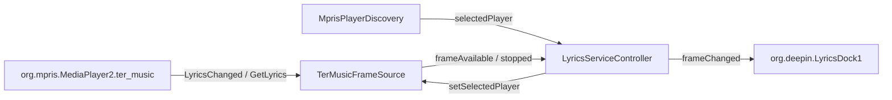

# S10 Ter-Music 外部帧源 / External Frame Source

**状态：** 待实施
**前置：** S03、S06
**后续：** S11

## 目标

接入 Ter-Music（终端音乐播放器）公开的会话 D-Bus 歌词接口 `org.yxzl.ter_music.Lyrics`，将其实时歌词帧直接显示在 Dock，跳过 LRCLIB/多源查询链。Ter-Music 自带歌词与时间轴，身份无歧义，属于"播放器内置歌词源"。

## 范围

- 新增 `ExternalFramePort` 抽象端口与 `TerMusicFrameSource` 实现。
- 订阅 `LyricsChanged`、拉取 `GetLyrics`，解析 A/B 双缓冲 JSON 快照。
- Controller 优先发布外部帧；选中 Ter-Music 时不再发起歌词查询。
- 中英双语注释；不修改 Ter-Music 源码。

## 非范围

- 不实现 Ter-Music 的搜索/歌词获取（它是帧源，不是搜索源）。
- 不支持逐字时间轴（Ter-Music 未提供音节时间戳）。
- 不改变其他播放器的现有查询流程。

## 接口契约（来自 Ter-Music docs/API_LYRICS_en_US.md，已对照 session.c 核实）

| 项 | 值 |
|---|---|
| 总线名 | `org.mpris.MediaPlayer2.ter_music` |
| 对象路径 | `/org/mpris/MediaPlayer2` |
| 接口 | `org.yxzl.ter_music.Lyrics` |
| 方法 | `GetLyrics() -> s`（JSON 快照） |
| 信号 | `LyricsChanged(s)`（仅内容变化时发出） |

JSON 字段：`active_line`、`line_a/line_b{index,timestamp,text}`、`track_id`（= MPRIS `mpris:trackid`，FNV-1a 同源）、`has_lyrics`、`has_timestamps`、`revision`（单调递增）。

## 架构

- `TerMusicFrameSource` 只做：JSON 解析、revision 去重、track 归属。
- `LyricsServiceController` 只做：优先级编排（外部帧 > LRCLIB）、生命周期（切歌/禁用清理）。
- 选中播放器不是 Ter-Music 时，`setSelectedPlayer` 驱动 source 停用并发出 `stopped`，Controller 恢复 LRCLIB 查询链。

## 验收标准

1. 选中 Ter-Music 后，Dock 显示其推送的当前行/下一行；`status` 为 `LyricsReady`，`source` 为 `ter-music`。
2. 双缓冲推进、切歌重置、无时间戳纯文本（A/B 不推进）三种场景帧正确。
3. `revision` 小于等于当前值的重复/乱序信号被丢弃。
4. 选中 Ter-Music 期间不发起 LRCLIB 查询（`canSearchCandidates` 为 false、无网络请求）。
5. 切换回其他播放器后外部帧停止、LRCLIB 查询恢复；禁用歌词后外部帧不显示。
6. 测试使用私有 session bus（`dbus-test-wrapper.sh`）与 fake D-Bus 服务，不依赖真实 Ter-Music。

## 实现记录

- 新增 `ports/externalframeport.h`：`ExternalLyricFrame` 帧结构与 `ExternalFramePort` 抽象端口（`setSelectedPlayer`/`active` + `frameAvailable`/`stopped` 信号）。
- 新增 `infrastructure/termusicframesource.{h,cpp}`：订阅 `LyricsChanged`、启动时 `GetLyrics` 拉快照、JSON 解析 A/B 双缓冲；`revision` 单调去重（≤ 当前值丢弃）；`track_id` 变化时重置帧；`has_lyrics=false` 或切走播放器时发 `stopped`。
- `LyricsServiceController`：`setExternalFramePort()` 注入；`syncExternalFramePlayer()` 在 start/播放器变化时同步选中播放器；外部帧到达 → 锁定 `LyricsReady` 并直接发布（来源 `ter-music`）；`publishFrame()` 轮询路径在外部帧激活期间退出；`onTrackChanged` 在外部源活跃时跳过 LRCLIB 查询链；`clearFrame()` 同步清理外部帧。
- `main.cpp`：组装 `TerMusicFrameSource` 并注入 controller。
- 测试：`test_termusicframesource.cpp`（私有 bus + fake 服务：双缓冲推进、revision 去重、切歌重置、纯文本、stopped 语义）+ controller 2 个集成用例（外部帧发布与查询跳过、停止后恢复查询链）。
- 验证命令：`cmake --build build-fix-verify -j`、`ctest --test-dir build-fix-verify --output-on-failure`；21 项测试全部通过。
