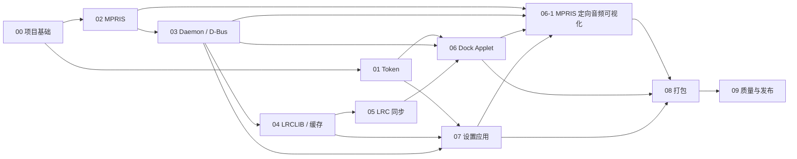

# Deepin Dock Lyrics 实施小规格索引

本目录把 `deepin-dock-lyrics` 的 MVP 拆成可以独立开发、测试和验收的工作单元。仓库采用 MIT 协议；产品不播放音乐、不要求用户登录，也不接入网易云、QQ、酷狗或其他歌词来源。

## V1 归档状态

`v1.0.0` 归档 S00-S07 已完成的功能源码基线。该标签包含可构建、可测试的 daemon、Dock Applet 和 DTK6 设置应用，但不代表可分发的 Debian 安装包；S08 的运行时激活与打包、S09 的最终发布门禁仍作为后续规格保留。

## 已锁定的产品边界

- 目标平台是 deepin/UOS v25，技术栈为 Qt 6、DTK6 和 `dde-shell` 2.x。
- 第一版仅支持 Linux 原生播放器通过 MPRIS 暴露的用户会话 D-Bus 接口；Wine/Windows 播放器不在范围内。
- 唯一在线歌词提供方是 LRCLIB。每次切歌最多触发一次受限查询，播放期间只读取本地已解析歌词。
- LRCLIB 的 `syncedLyrics` 为 LRC 行级时间戳。MVP 只提供逐行同步和行内视觉进度，不将其称为逐字同步。
- LRCLIB 当前接口未提供翻译歌词。因此 MVP 的第二行固定显示下一句；数据契约中保留 `translationText`，但其值必须为空，直到未来引入经过单独合规审查的翻译能力。
- Dock Applet 使用 `org.deepin.ds.lyrics-dock`，父级为 `org.deepin.ds.dock`，固定 `dockOrder: 24`，不修改 Dock 源码。
- 后台服务使用会话 D-Bus 名称 `org.deepin.LyricsDock1`，所有网络和缓存逻辑都留在后台服务，Shell 进程只做渲染。

## 实施顺序

| 顺序 | 小规格 | 交付结果 | 前置 |
|---:|---|---|---|
| 00 | [项目基础与公共契约](00-project-foundation.md) | 可构建的 Qt6 工程、模块边界和公共数据模型 | 无 |
| 01 | [Design Token 与主题适配](01-design-token-theme-adapter.md) | 主题响应式 `LyricsTokens` 单例 | 00 |
| 02 | [MPRIS 播放器发现](02-mpris-player-discovery.md) | 已选播放器的稳定曲目与位置快照 | 00 |
| 03 | [歌词后台服务与 D-Bus](03-daemon-dbus-state.md) | 供 UI 消费的状态服务与状态机 | 00、02 |
| 04 | [LRCLIB 客户端与缓存](04-lrclib-client-and-cache.md) | 合规限流的查询、匹配和 SQLite 缓存 | 00、03 |
| 05 | [LRC 解析与同步引擎](05-lrc-parser-sync-engine.md) | 逐行时间轴、当前行与行内进度 | 00、03、04 |
| 06 | [Dock 歌词 Applet](06-dock-lyrics-applet.md) | Dock 右侧歌词呈现与会话隐藏 | 00、01、03、05 |
| 06-1 | [MPRIS 定向音频可视化](06-1-mpris-audio-visualizer.md) | 仅选中播放器的实时音频柱状可视化 | 02、03、06、07 |
| 07 | [DTK6 设置应用](07-settings-application.md) | 启用、选播放器、偏移和候选确认界面 | 00、01、03、04 |
| 08 | [配置、用户服务与 Debian 打包](08-runtime-config-and-packaging.md) | 可安装、可启动、可卸载的 `.deb` | 00-07 |
| 09 | [测试、隐私与发布](09-quality-privacy-and-release.md) | 自动测试、手工测试矩阵和发布门禁 | 00-08 |

## 通用完成定义

一个小规格只有在以下条件都满足后才算完成：

1. 只实现该规格所列范围，并记录任何有意偏离。
2. 为新增的非平凡逻辑增加自动测试；网络、D-Bus 和 MPRIS 依赖用可控替身测试。
3. 执行本规格列出的验收项，保留命令和结果摘要。
4. 不把歌词原始响应、完整搜索关键词或用户曲目历史写入调试日志。
5. 中文界面字符串使用可翻译的 `tr()` / `qsTr()`；代码、D-Bus 名称和配置键使用英文稳定标识。
6. 新增或修改的非自明代码注释使用简洁的中英双语对照；只解释代码本身无法表达的约束或决策。

## 首个可见里程碑

完成 00、02、03、05、06 后，即使尚未接入 LRCLIB，也可用固定的 LRC fixture 从一个真实 MPRIS 播放器驱动 Dock 歌词。这个纵向切片用于最早验证 Dock 布局、D-Bus、暂停和拖动进度行为。
