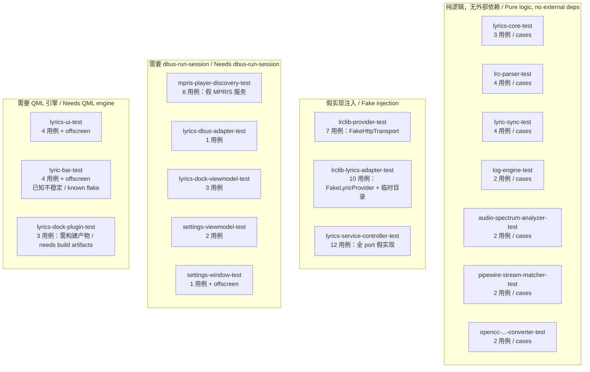
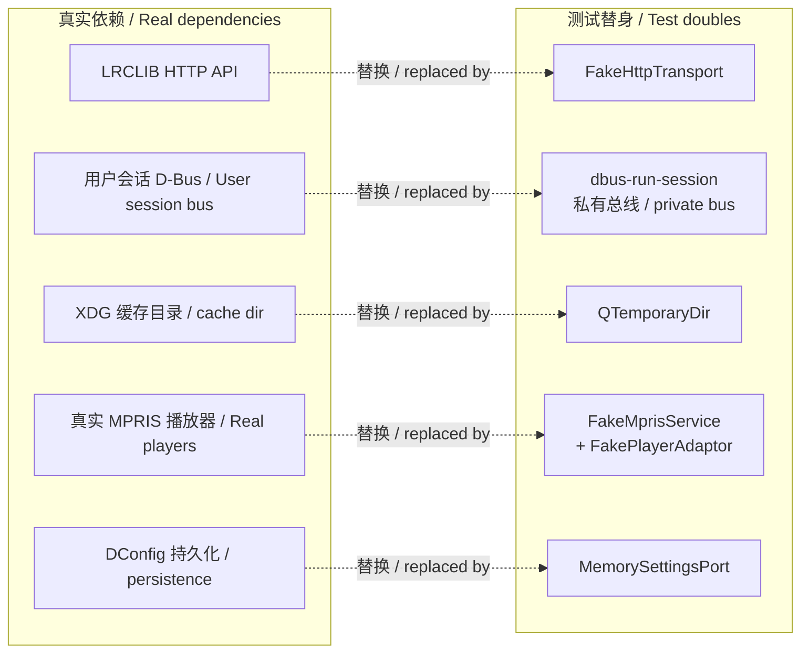
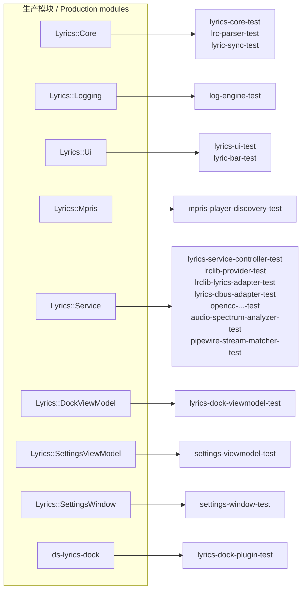

# 测试说明 / Test Guide

本文档描述 `tests/` 目录的测试目标、隔离策略与运行方式。
This document describes the test targets, isolation strategy, and how to run them.

## 1. 快速开始 / Quick Start

```bash
cmake -S . -B build -DCMAKE_BUILD_TYPE=Debug
cmake --build build -j"$(nproc)"
ctest --test-dir build --output-on-failure
```

**中文**

单独运行一个目标：

**English**

Run a single target:

```bash
ctest --test-dir build -R lrclib-provider-test --output-on-failure
ctest --test-dir build -R "lyrics-.*" --output-on-failure   # 正则匹配 / regex match
./build/tests/lyrics-core-test                              # 直接执行 / run directly
./build/tests/lyrics-core-test -functions                   # 列出用例 / list cases
./build/tests/lyrics-core-test makesStableTrackKeys         # 只跑一个用例 / one case
```

**中文**

关闭测试构建：`cmake -S . -B build -DDEEPIN_DOCK_LYRICS_BUILD_TESTS=OFF`

**English**

Disable test builds with `cmake -S . -B build -DDEEPIN_DOCK_LYRICS_BUILD_TESTS=OFF`.

## 2. 基线测量结果 / Measured Baseline

**中文**

以下为 2026-08-13 在 `HEAD`（`acfd1ed`）上的实测结果，非估算。

**English**

Measured on `HEAD` (`acfd1ed`) on 2026-08-13; not estimated.

| 指标 / Metric | 值 / Value |
|---|---|
| 测试目标数 / Test targets | 18 |
| 测试用例数 / Test cases | 73 |
| 全套耗时 / Full suite duration | 约 7.7 s / approx 7.7 s |
| 通过率 / Pass rate | 18/18，100% |
| 需要 D-Bus 的目标 / Targets needing D-Bus | 5 |
| 需要离屏渲染的目标 / Targets needing offscreen | 3 |
| 网络请求数 / Network requests | 0 |

> **注 / Note**：README 根文档称「15 项自动测试」，实测为 18 个目标 73 个用例。差异源于 S06-1 音频可视化新增的目标（`audio-spectrum-analyzer-test`、`pipewire-stream-matcher-test`）与 `lyric-bar-test`。根 README 的数字应更新。
> The root README states "15 automated tests"; the measured figure is 18 targets and 73 cases. The difference comes from the S06-1 visualizer targets (`audio-spectrum-analyzer-test`, `pipewire-stream-matcher-test`) plus `lyric-bar-test`. The root README's number should be updated.

### 2.1 已知不稳定 / Known Flake

**中文**

`lyric-bar-test` 在**首次冷构建后的第一次** `ctest` 全套运行中出现过一次 SIGSEGV。特征：

- 崩溃发生在**全部 5 个用例 PASS 之后**、`cleanupTestCase` 完成之后的进程退出阶段。
- 单独运行 3 次、`ctest -R lyric-bar-test` 5 次、全套运行 4 次，均未复现。累计观察 1/19。
- 输出显示 `[Non-test] function time: 1ms`，即崩溃不在任何测试函数内。

判断：QML/Quick 引擎在 `offscreen` 平台下的退出期析构顺序问题，非测试逻辑缺陷。**未定位到根因**，故标注为已知不稳定而非已修复。若 CI 出现该失败，重跑即可，但应记录频次。

**English**

`lyric-bar-test` produced one SIGSEGV during the **first** full `ctest` run after a cold build. Characteristics:

- The crash occurs **after all 5 cases PASS** and after `cleanupTestCase`, during process teardown.
- Not reproduced in 3 standalone runs, 5 `ctest -R lyric-bar-test` runs, or 4 further full runs. Observed 1 time in 19.
- Output shows `[Non-test] function time: 1ms`, so the crash is outside any test function.

Assessment: a teardown-order issue in the QML/Quick engine under the `offscreen` platform, not a defect in test logic. The **root cause is not identified**, so this is recorded as a known flake rather than fixed. If CI hits it, a rerun suffices, but the frequency should be logged.

## 3. 测试目标清单 / Test Target Inventory



### 3.1 详细清单 / Detailed Inventory

| 目标 / Target | 用例 / Cases | 链接库 / Links | 特殊要求 / Special Requirements |
|---|---|---|---|
| `lyrics-core-test` | 3 | `Lyrics::Core` | — |
| `lrc-parser-test` | 4 | `Lyrics::Core` | `TEST_FIXTURE_DIR` 宏 / macro |
| `lyric-sync-test` | 4 | `Lyrics::Core` | — |
| `log-engine-test` | 2 | `Lyrics::Logging` | — |
| `lyrics-ui-test` | 4 | `Lyrics::Ui`, `Dtk6::Gui` | `QT_QPA_PLATFORM=offscreen` |
| `audio-spectrum-analyzer-test` | 2 | `Lyrics::Service` | — |
| `pipewire-stream-matcher-test` | 2 | `Lyrics::Service` | — |
| `opencc-chinese-script-converter-test` | 2 | `Lyrics::Service` | 系统需装 OpenCC 字典 / OpenCC dictionaries installed |
| `mpris-player-discovery-test` | 6 | `Lyrics::Mpris` | `dbus-run-session`，超时 20 s / timeout 20 s |
| `lyrics-service-controller-test` | 12 | `Lyrics::Service` | — |
| `lyrics-dbus-adapter-test` | 1 | `Lyrics::Service` | `dbus-run-session`，超时 20 s / timeout 20 s |
| `lrclib-provider-test` | 7 | `Lyrics::Service` | 超时 20 s / timeout 20 s |
| `lrclib-lyrics-adapter-test` | 10 | `Lyrics::Service`, `Qt6::Sql` | 超时 20 s / timeout 20 s |
| `lyrics-dock-viewmodel-test` | 3 | `Lyrics::DockViewModel` | `dbus-run-session`，超时 20 s / timeout 20 s |
| `lyrics-dock-plugin-test` | 3 | `Dde::Shell` | 依赖 `ds-lyrics-dock` 与包产物 / depends on build artifacts |
| `lyric-bar-test` | 4 | `Lyrics::Ui`, `Qt6::Quick` | `offscreen`，依赖包产物 / needs package artifacts |
| `settings-viewmodel-test` | 2 | `Lyrics::SettingsViewModel` | `dbus-run-session`，超时 20 s / timeout 20 s |
| `settings-window-test` | 1 | `Lyrics::SettingsWindow`, `Dtk6::Widget` | `dbus-run-session` + `offscreen` |

## 4. 隔离策略 / Isolation Strategy



**中文**

四条隔离保证，均经实测确认：

1. **零网络请求。** `LRCLIBProvider` 依赖 `HttpTransport` port，测试注入 `FakeHttpTransport` 手动投递响应。全库中唯一出现 `https://` 的测试断言是校验 User-Agent 字符串格式（[test_lrclibprovider.cpp:96](test_lrclibprovider.cpp#L96)），不发起连接。因此测试**不消耗 LRCLIB 配额**。

2. **不污染用户会话总线。** 5 个 D-Bus 目标全部通过 `dbus-run-session` 启动私有总线，与用户实际会话隔离。CMake 以 `find_program(DBUS_RUN_SESSION_EXECUTABLE ... REQUIRED)` 强制该依赖存在。

3. **不污染用户缓存。** `lrclib-lyrics-adapter-test` 的全部 10 个用例各自创建 `QTemporaryDir`，SQLite 数据库落在临时目录，随用例销毁。

4. **不修改用户配置。** `MemorySettingsPort` 以内存变量实现 `SettingsPort`，不触及 DConfig。

**English**

Four isolation guarantees, each verified by measurement:

1. **Zero network requests.** `LRCLIBProvider` depends on the `HttpTransport` port, and tests inject `FakeHttpTransport` to deliver responses by hand. The only `https://` in any test is an assertion on User-Agent string format ([test_lrclibprovider.cpp:96](test_lrclibprovider.cpp#L96)) and opens no connection. Tests therefore **consume no LRCLIB quota**.

2. **No pollution of the user session bus.** All 5 D-Bus targets launch a private bus via `dbus-run-session`, isolated from the real session. CMake enforces the dependency with `find_program(DBUS_RUN_SESSION_EXECUTABLE ... REQUIRED)`.

3. **No pollution of the user cache.** Each of the 10 cases in `lrclib-lyrics-adapter-test` creates its own `QTemporaryDir`, so the SQLite database lives in a temporary directory destroyed with the case.

4. **No modification of user configuration.** `MemorySettingsPort` implements `SettingsPort` with in-memory variables and never touches DConfig.

## 5. 测试替身清单 / Test Double Inventory

| 替身 / Double | 替换的 port 或服务 / Replaces | 所在文件 / File |
|---|---|---|
| `FakeHttpTransport` | `HttpTransport` | `test_lrclibprovider.cpp` |
| `FakeLyricProvider` | `LyricProvider` | `test_lrcliblyricsadapter.cpp` |
| `FakePlayerPort` | `PlayerPort` | `test_lyricsservicecontroller.cpp` |
| `FakeLyricsPort` | `LyricsPort` | `test_lyricsservicecontroller.cpp` |
| `MemorySettingsPort` | `SettingsPort` | `test_lyricsservicecontroller.cpp` |
| `FakeChineseScriptConverter` | `ChineseScriptConverter` | `test_lyricsservicecontroller.cpp` |
| `FakeAudioVisualizerPort` | `AudioVisualizerPort` | `test_lyricsservicecontroller.cpp` |
| `NullLogSink` / `RecordingLogSink` | `LogSink` | `test_lyricsservicecontroller.cpp` / `test_logengine.cpp` |
| `FakeMprisService` + `FakePlayerAdaptor` + `FakeRootAdaptor` | 真实 MPRIS 播放器 / Real MPRIS player | `test_mprisplayerdiscovery.cpp` |
| `FakeLyricsService` | daemon D-Bus 服务 / daemon D-Bus service | `test_lyricsdockviewmodel.cpp` |
| `FakeSettingsService` | daemon D-Bus 服务 / daemon D-Bus service | `test_settingsviewmodel.cpp` |
| `FakeServiceWorker` | 独立线程服务宿主 / threaded service host | `test_lyricsdbusadapter.cpp`, `test_settingsviewmodel.cpp` |

**中文**

替身命名遵循两条约定：`Fake*` 表示有行为的替身（可配置响应、可断言调用），`Null*` 表示空实现（丢弃全部输入），`Memory*` 表示以内存替代持久化，`Recording*` 表示记录输入供断言。

**English**

Double naming follows two conventions: `Fake*` for behavioural doubles (configurable responses, assertable calls), `Null*` for no-op implementations that discard all input, `Memory*` for in-memory substitutes for persistence, and `Recording*` for doubles that capture input for assertions.

## 6. Fixture 文件 / Fixture Files

**中文**

位于 `tests/fixtures/`，通过 `TEST_FIXTURE_DIR` 编译宏定位。

**English**

Located in `tests/fixtures/`, resolved via the `TEST_FIXTURE_DIR` compile definition.

| 文件 / File | 用途 / Purpose | 使用者 / Used by |
|---|---|---|
| `example.lrc` | 最简两行 LRC / Minimal two-line LRC | `lrc-parser-test` |
| `complex.lrc` | 边界用例集 / Edge-case set | `lrc-parser-test` |
| `lrclib-record.json` | LRCLIB 单记录响应样本 / Single-record response sample | 参考数据 / reference |
| `mpris-track.json` | MPRIS 元数据样本 / MPRIS metadata sample | 参考数据 / reference |

### 6.1 `complex.lrc` 覆盖的边界 / Edge Cases in `complex.lrc`

**中文**

该 fixture 刻意包含以下异常输入，用于验证解析器健壮性：

**English**

This fixture deliberately contains the following anomalies to exercise parser robustness:

| 行 / Line | 覆盖的情形 / Case covered |
|---|---|
| `[ti:跨语言测试]`、`[ar:Test Artist]` | 元信息标签应被识别而非当作歌词 / Metadata tags recognised, not treated as lyrics |
| `[offset:+120]` | 源文件内偏移量，独立于用户偏移 / In-file offset, distinct from user offset |
| `invalid source line` | 无时间戳的裸文本行 / Bare text with no timestamp |
| `[00:05.5][00:01.25]中文歌词` | 单行多时间戳，且需按时间重排 / Multiple timestamps on one line, requiring reordering |
| `[00:02.345]English lyric` | 三位毫秒精度 / Three-digit millisecond precision |
| `[00:03]日本語 한국어` | 无小数部分 + 日韩文字 / No fractional part, plus Japanese and Korean |
| `[00:04.00]old duplicate` | 重复时间戳 / Duplicate timestamp |

## 7. 模块测试覆盖矩阵 / Module Coverage Matrix



**中文**

每个生产库都有至少一个对应测试目标，无未覆盖模块。但「有目标」不等于「覆盖充分」——具体薄弱处见 [模块测试数据](../design/05-test-data.md#5-覆盖缺口--coverage-gaps)。

**English**

Every production library has at least one corresponding test target, with no uncovered module. But "has a target" is not "adequately covered" — see [module test data](../design/05-test-data.md#5-覆盖缺口--coverage-gaps) for specific weak spots.

## 8. 编写新测试 / Writing New Tests

**中文**

步骤：

1. 新建 `tests/test_<模块名>.cpp`，类名 `<Module>Test`，继承 `QObject`。
2. 用例声明于 `private slots:`，返回 `void`、无参数。
3. 选择 main 宏：`QTEST_APPLESS_MAIN`（无事件循环）、`QTEST_GUILESS_MAIN`（需 `QCoreApplication`）、`QTEST_MAIN`（需 GUI 或 DTK 调色板）。
4. 在 `tests/CMakeLists.txt` 添加 `add_executable` + `target_link_libraries` + `add_test`。
5. 需要 D-Bus 则以 `${DBUS_RUN_SESSION_EXECUTABLE} --` 包裹命令并设 `TIMEOUT 20`。
6. 需要 QML 或 DTK 调色板则设 `ENVIRONMENT "QT_QPA_PLATFORM=offscreen"`。

**English**

Steps:

1. Create `tests/test_<module>.cpp` with a `<Module>Test` class deriving from `QObject`.
2. Declare cases under `private slots:`, returning `void` with no parameters.
3. Pick a main macro: `QTEST_APPLESS_MAIN` (no event loop), `QTEST_GUILESS_MAIN` (needs `QCoreApplication`), or `QTEST_MAIN` (needs GUI or the DTK palette).
4. Add `add_executable`, `target_link_libraries`, and `add_test` to `tests/CMakeLists.txt`.
5. For D-Bus, wrap the command in `${DBUS_RUN_SESSION_EXECUTABLE} --` and set `TIMEOUT 20`.
6. For QML or the DTK palette, set `ENVIRONMENT "QT_QPA_PLATFORM=offscreen"`.

**中文**

四条约束：

- **不得发起真实网络请求。** 通过 port 注入假传输。
- **不得写入用户目录。** 用 `QTemporaryDir`。
- **不得使用用户会话总线。** 用 `dbus-run-session`。
- **异步断言用 `QTRY_COMPARE` / `QTRY_VERIFY`，不用固定 `QTest::qWait`。** 后者在慢机器上不稳定。

**English**

Four constraints:

- **Never issue a real network request.** Inject a fake transport through the port.
- **Never write to user directories.** Use `QTemporaryDir`.
- **Never use the user session bus.** Use `dbus-run-session`.
- **Use `QTRY_COMPARE` / `QTRY_VERIFY` for async assertions, not a fixed `QTest::qWait`.** The latter is flaky on slow machines.

## 9. 基线来源 / Baseline Provenance

**中文**

第 2 节数据的采集方式：

1. `cmake -S . -B <dir> -DCMAKE_BUILD_TYPE=Debug` 全新配置。
2. `cmake --build <dir> -j$(nproc)` 完整构建，无错误无警告失败。
3. `ctest --test-dir <dir>` 全套运行，记录逐目标耗时。
4. 用例数由脚本从各 `test_*.cpp` 的 `private slots:` 块提取，排除 `initTestCase` 与 `cleanupTestCase`。

采集期间 S06-1 音频可视化工作提交为 `acfd1ed`，其中新增 `keepsVisualizerDisabledByDefault` 用例，使 `lyrics-service-controller-test` 从 11 增至 12 个用例、总数从 72 增至 73。第 2 节数据已对应 `acfd1ed`。

验证用的构建目录与临时 worktree 已清理，未留在仓库中。

**English**

How the section 2 figures were obtained:

1. Fresh configure with `cmake -S . -B <dir> -DCMAKE_BUILD_TYPE=Debug`.
2. Full build with `cmake --build <dir> -j$(nproc)`, no errors.
3. Full run with `ctest --test-dir <dir>`, recording per-target durations.
4. Case counts extracted by script from each `test_*.cpp` `private slots:` block, excluding `initTestCase` and `cleanupTestCase`.

During collection the S06-1 visualizer work landed as `acfd1ed`, adding a `keepsVisualizerDisabledByDefault` case that raised `lyrics-service-controller-test` from 11 to 12 cases and the total from 72 to 73. The section 2 figures correspond to `acfd1ed`.

The verification build directories and temporary worktree have been cleaned up and are not left in the repository.

## 10. 相关文档 / Related Documents

- [design/05-test-data.md](../design/05-test-data.md) — 各模块测试数据、断言值与覆盖缺口 / Per-module test data, assertion values, and coverage gaps
- [design/README.md](../design/README.md) — 系统设计图索引 / Design diagram index
- [issues/README.md](../issues/README.md) — 已确认缺陷与其应新增的测试 / Confirmed defects and the tests they require
- [specs/09-quality-privacy-and-release.md](../specs/09-quality-privacy-and-release.md) — 质量与发布门禁规格 / Quality and release gate spec
